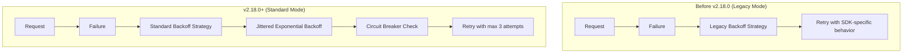

---
tags:
  - domain/core
  - component/server
  - search
---
# S3 Repository

## Summary

OpenSearch v2.18.0 improves the S3 repository plugin with two key changes: switching the default retry mechanism from Legacy to Standard Mode for better reliability, and fixing SLF4J logging warnings that appeared on startup when the repository-s3 plugin was installed.

## Details

### What's New in v2.18.0

#### Standard Retry Mode for S3 Clients

The S3 repository plugin now uses AWS SDK's Standard retry mode instead of the Legacy mode. Standard mode provides:

- A recommended set of retry rules across AWS SDKs
- Automatic adjustment of retry counts to maximize availability and stability
- Safe usage in multi-tenant applications
- Jittered exponential backoff for failed requests
- Circuit-breaking to prevent retries during outages

The default maximum number of attempts with Standard mode is three, unless explicitly configured.

#### SLF4J Warning Fix

Fixed startup warnings that appeared when the repository-s3 plugin was installed:

```
[WARN ][stderr] SLF4J: Failed to load class "org.slf4j.impl.StaticLoggerBinder".
[WARN ][stderr] SLF4J: Defaulting to no-operation (NOP) logger implementation
[WARN ][stderr] SLF4J: See http://www.slf4j.org/codes.html#StaticLoggerBinder for further details.
```

This was resolved by adding the `log4j-slf4j-impl` runtime dependency to properly bridge SLF4J logging to Log4j.

### Technical Changes

#### Retry Strategy Changes



#### Code Changes

| File | Change |
|------|--------|
| `S3Service.java` | Added `RetryMode.STANDARD` to throttling backoff strategy |
| `S3AsyncService.java` | Added `RetryMode.STANDARD` to throttling backoff strategy |
| `build.gradle` | Added `log4j-slf4j-impl` runtime dependency |

#### New Dependencies

| Dependency | Version | Purpose |
|------------|---------|---------|
| `log4j-slf4j-impl` | 2.21.0 | SLF4J to Log4j bridge |

### Configuration

No new configuration options were added. The retry behavior change is automatic and uses the existing `max_retries` and `throttle_retries` settings:

| Setting | Description | Default |
|---------|-------------|---------|
| `max_retries` | Maximum number of retry attempts | 3 |
| `throttle_retries` | Whether to use throttling backoff strategy | `true` |

### Usage Example

```json
PUT _snapshot/my-s3-repo
{
  "type": "s3",
  "settings": {
    "bucket": "my-bucket",
    "base_path": "snapshots",
    "max_retries": 3
  }
}
```

### Migration Notes

- No action required - the retry mode change is automatic
- Existing S3 repository configurations continue to work
- Users may notice improved reliability during transient S3 failures

## Limitations

- The Standard retry mode has a default maximum of 3 attempts
- Adaptive retry mode is not supported (only Standard and Legacy)

## References

### Documentation
- [AWS SDK Retry Behavior](https://docs.aws.amazon.com/sdkref/latest/guide/feature-retry-behavior.html): AWS documentation on retry modes
- [Register Snapshot Repository](https://docs.opensearch.org/2.18/api-reference/snapshots/create-repository/): OpenSearch S3 repository documentation

### Pull Requests
| PR | Description |
|----|-------------|
| [#15978](https://github.com/opensearch-project/OpenSearch/pull/15978) | Change default retry mechanism of S3 clients to Standard Mode |
| [#16194](https://github.com/opensearch-project/OpenSearch/pull/16194) | Fix warnings from SLF4J on startup when repository-s3 is installed |

### Issues (Design / RFC)
- [Issue #15397](https://github.com/opensearch-project/OpenSearch/issues/15397): Add jitter to downloads from remote store
- [Issue #16152](https://github.com/opensearch-project/OpenSearch/issues/16152): SLF4J warnings when adding repository-s3

## Related Feature Report

- Full feature documentation
