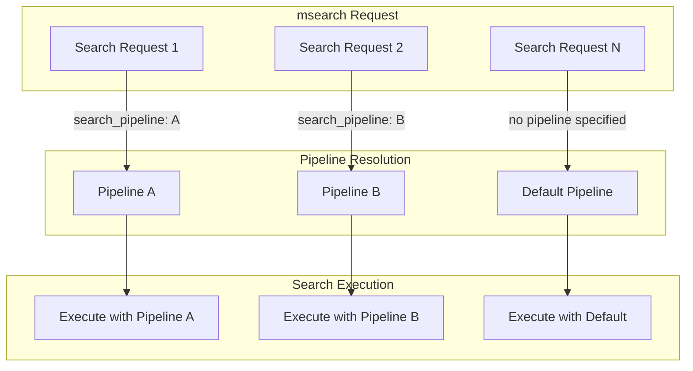

---
tags:
  - indexing
  - search
---

# Search Pipeline: msearch API Support

## Summary

OpenSearch v2.18.0 adds support for specifying search pipelines in the Multi-Search (msearch) API. Previously, search pipelines could only be used with single search requests or by setting a default pipeline on an index. This enhancement enables users to specify different search pipelines for each search request within a multi-search batch, providing greater flexibility for hybrid search and other pipeline-based search scenarios.

## Details

### What's New in v2.18.0

This release introduces the ability to pass a `search_pipeline` parameter directly in the request body of each search within an msearch request. This is particularly valuable for hybrid search use cases where different normalization strategies may be needed for different queries.

### Technical Changes

#### Architecture Changes



#### Modified Components

| Component | Description |
|-----------|-------------|
| `SearchSourceBuilder` | Added `searchPipeline` field and `pipeline()` method to support pipeline specification in request body |
| `MultiSearchRequest` | Modified to extract pipeline from `SearchSourceBuilder` and set on `SearchRequest` |
| `RestSearchAction` | Updated to use pipeline from source if not specified in query parameter |

#### New Configuration

| Setting | Description | Default |
|---------|-------------|---------|
| `search_pipeline` (request body) | Pipeline name to use for this specific search request | None |

### Usage Example

```json
GET /_msearch
{ "index": "test"}
{ "query": { "match_all": {} }, "from": 0, "size": 10, "search_pipeline": "my_pipeline"}
{ "index": "test-1", "search_type": "dfs_query_then_fetch"}
{ "query": { "match_all": {} }, "search_pipeline": "my_pipeline1" }
```

Each search request in the batch can specify its own pipeline, enabling:
- Different normalization strategies for different queries
- Mixed hybrid and traditional search in a single batch
- A/B testing of search pipelines

### Migration Notes

No migration required. This is a backward-compatible enhancement. Existing msearch requests without `search_pipeline` continue to work as before, using the index's default pipeline if configured.

## Limitations

- The `search_pipeline` parameter in the request body is only supported in OpenSearch 2.18.0 and later
- When both query parameter and request body specify a pipeline, the query parameter takes precedence

## References

### Documentation
- [Documentation PR #8372](https://github.com/opensearch-project/documentation-website/pull/8372): Public documentation
- [Using a Search Pipeline](https://docs.opensearch.org/2.18/search-plugins/search-pipelines/using-search-pipeline/): Official documentation
- [Search Pipelines Overview](https://docs.opensearch.org/2.18/search-plugins/search-pipelines/index/): Search pipeline concepts

### Blog Posts
- [Hybrid Search Blog](https://opensearch.org/blog/hybrid-search/): Hybrid search with normalization processor

### Pull Requests
| PR | Description |
|----|-------------|
| [#15923](https://github.com/opensearch-project/OpenSearch/pull/15923) | Added support for msearch API to pass search pipeline name |

### Issues (Design / RFC)
- [Issue #15748](https://github.com/opensearch-project/OpenSearch/issues/15748): Feature request for search-pipeline in Multi-Search API

## Related Feature Report

- [Full feature documentation](../../../features/opensearch/search-pipeline.md)
