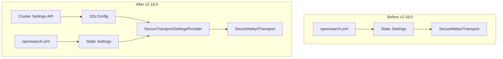

---
tags:
  - security
---

# Secure Transport Settings

## Summary

This release adds a new method to the `SecureTransportSettingsProvider` interface that allows plugins to provide dynamic `SecureTransportParameters`. This fixes a regression introduced in v2.14 where the SSL dual mode setting (`plugins.security_config.ssl_dual_mode_enabled`) was not being propagated dynamically from cluster settings to the transport layer.

## Details

### What's New in v2.18.0

The `SecureTransportSettingsProvider` interface now includes a `parameters()` method that returns dynamic transport parameters. This enables security plugins to feed dynamically updated settings (like SSL dual mode) to the OpenSearch core, rather than relying solely on static node settings from `opensearch.yml`.

### Technical Changes

#### Architecture Changes



#### New Components

| Component | Description |
|-----------|-------------|
| `SecureTransportParameters` | New interface for dynamic transport parameters |
| `DefaultSecureTransportParameters` | Default implementation reading from static settings |
| `parameters()` method | New method in `SecureTransportSettingsProvider` interface |

#### API Changes

New method added to `SecureTransportSettingsProvider`:

```java
default Optional<SecureTransportParameters> parameters(Settings settings) {
    return Optional.of(new DefaultSecureTransportParameters(settings));
}

@ExperimentalApi
interface SecureTransportParameters {
    boolean dualModeEnabled();
}
```

### Usage Example

Dynamically update SSL dual mode setting via cluster settings API:

```bash
curl -XPUT https://localhost:9200/_cluster/settings \
  -k -H "Content-Type: application/json" \
  -d '{"persistent": {"plugins.security_config.ssl_dual_mode_enabled": false}}'
```

With this fix, the setting change is now properly propagated to the transport layer, allowing new nodes to join the cluster with the updated SSL configuration.

### Migration Notes

- No migration required for users
- Plugin developers implementing `SecureTransportSettingsProvider` can override the `parameters()` method to provide custom dynamic parameters
- The default implementation maintains backward compatibility by reading from static node settings

## Limitations

- The `SecureTransportParameters` interface is marked as `@ExperimentalApi`
- Currently only exposes `dualModeEnabled()` parameter

## References

### Documentation
- [TLS Configuration Documentation](https://docs.opensearch.org/2.18/security/configuration/tls/): Official TLS configuration guide
- [PR #16387](https://github.com/opensearch-project/OpenSearch/pull/16387): Main implementation
- [Security PR #4820](https://github.com/opensearch-project/security/pull/4820): Security plugin companion PR
- [Security PR #4119](https://github.com/opensearch-project/security/pull/4119): Original change that introduced the regression

### Pull Requests
| PR | Description |
|----|-------------|
| [#16387](https://github.com/opensearch-project/OpenSearch/pull/16387) | Add method to return dynamic SecureTransportParameters from SecureTransportSettingsProvider interface |
| [#4820](https://github.com/opensearch-project/security/pull/4820) | Companion PR: Ensure dual mode enabled flag from cluster settings can get propagated to core |

## Related Feature Report

- [Full feature documentation](../../../../features/opensearch/opensearch-secure-transport-settings.md)
