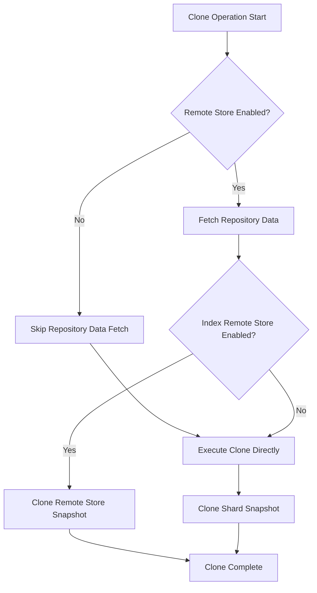

---
tags:
  - indexing
  - performance
---

# Snapshot Restore Enhancements

## Summary

OpenSearch v2.18.0 introduces two significant enhancements to snapshot operations: the ability to rename aliases during snapshot restore and performance optimizations for clone operations on incremental full cluster snapshots. These improvements provide greater flexibility when restoring snapshots to the same cluster and improve clone performance for document replication clusters.

## Details

### What's New in v2.18.0

#### 1. Alias Renaming During Snapshot Restore

A new pair of parameters has been added to the snapshot restore API that allows renaming aliases during restore, similar to the existing index renaming capability:

| Parameter | Description |
|-----------|-------------|
| `rename_alias_pattern` | Regular expression to match aliases for renaming. Use capture groups `()` to reuse portions of the alias name. |
| `rename_alias_replacement` | Replacement pattern for matched aliases. Use `$0` for entire match or `$1`, `$2`, etc. for capture groups. |

This feature enables restoring snapshots into the same cluster as temporary separate indexes for research and debugging without alias conflicts.

#### 2. Clone Operation Optimization

The snapshot clone operation has been optimized for document replication (doc-rep) clusters. Previously, the clone operation required fetching repository data (index-N file) for each shard, which caused performance degradation when the index-N file exceeded 512KB. The optimization skips this unnecessary repository data fetch for doc-rep clusters since they only support full cluster incremental snapshots.

### Technical Changes

#### New API Parameters

The `RestoreSnapshotRequest` class now includes:

```java
private String renameAliasPattern;
private String renameAliasReplacement;
```

#### Usage Example

```json
POST /_snapshot/my_repository/my_snapshot/_restore
{
  "indices": "my_index",
  "rename_pattern": "(.+)",
  "rename_replacement": "restored_$1",
  "rename_alias_pattern": "(.+)",
  "rename_alias_replacement": "restored_alias_$1",
  "include_aliases": true
}
```

This restores `my_index` as `restored_my_index` and renames all its aliases with the `restored_alias_` prefix.

#### Clone Optimization Logic



### Migration Notes

- The new alias renaming parameters are optional and backward compatible
- Existing restore operations continue to work without modification
- Clone operations automatically benefit from the optimization without configuration changes

## Limitations

- Alias renaming uses Java regex pattern matching; complex patterns may have performance implications
- If two or more aliases are renamed to the same name, they will be merged
- Clone optimization only applies to document replication clusters (not remote store enabled clusters)

## References

### Documentation
- [Documentation](https://docs.opensearch.org/2.18/tuning-your-cluster/availability-and-recovery/snapshots/snapshot-restore/): Snapshot restore API reference
- [Documentation PR #8544](https://github.com/opensearch-project/documentation-website/pull/8544): Documentation update
- [API Spec PR #615](https://github.com/opensearch-project/opensearch-api-specification/pull/615): API specification update

### Pull Requests
| PR | Description |
|----|-------------|
| [#16292](https://github.com/opensearch-project/OpenSearch/pull/16292) | Add support for renaming aliases during snapshot restore |
| [#16296](https://github.com/opensearch-project/OpenSearch/pull/16296) | Optimise clone operation for incremental full cluster snapshots |

### Issues (Design / RFC)
- [Issue #15632](https://github.com/opensearch-project/OpenSearch/issues/15632): Feature request for alias renaming
- [Issue #16295](https://github.com/opensearch-project/OpenSearch/issues/16295): Clone operation optimization request

## Related Feature Report

- [Full feature documentation](../../../features/opensearch/opensearch-snapshot-restore-enhancements.md)
