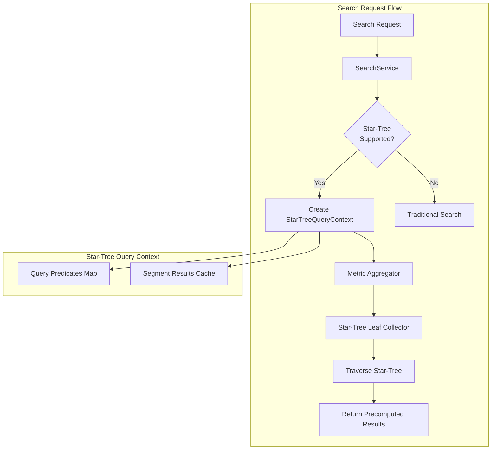

# Star Tree Index

## Summary

OpenSearch v2.18.0 introduces the initial experimental release of star-tree index, a multi-field index designed to accelerate aggregation queries. Inspired by Apache Pinot, star-tree index precomputes aggregations during indexing, storing results in a hierarchical tree structure that enables sub-millisecond query latency even on datasets with hundreds of millions of documents. This release adds support for metric aggregations (sum, min, max, avg, value_count) with optional numeric term queries.

## Details

### What's New in v2.18.0

This release introduces the foundational star-tree search capability:

- **Metric aggregation support**: Sum, min, max, avg, and value_count aggregations can now leverage star-tree index for faster computation
- **Term query support**: Numeric field term queries can be combined with metric aggregations
- **Match-all query support**: Aggregations without query filters automatically use star-tree optimization
- **Multi-aggregation optimization**: Multiple aggregations in a single request share star-tree traversal results via caching
- **Automatic query routing**: OpenSearch automatically detects and routes eligible queries to star-tree index without query syntax changes

### Technical Changes

#### Architecture Changes



#### New Components

| Component | Description |
|-----------|-------------|
| `StarTreeQueryHelper` | Utility class for building star-tree queries and validating aggregation support |
| `StarTreeQueryContext` | Holds star-tree field info, query predicates, and cached segment results |
| `StarTreeFilter` | Traverses star-tree structure and returns matching document IDs as FixedBitSet |
| `MetricAggregatorFactory` | Base class for metric aggregator factories supporting star-tree |

#### New Configuration

| Setting | Description | Default |
|---------|-------------|---------|
| `indices.composite_index.star_tree.enabled` | Enable star-tree search optimization | `true` |

#### API Changes

No API changes required. Star-tree optimization is automatically applied to eligible queries.

### Usage Example

```json
// Index with star-tree configuration
PUT logs
{
  "settings": {
    "index.number_of_shards": 1,
    "index.composite_index": true,
    "index.append_only.enabled": true
  },
  "mappings": {
    "composite": {
      "request_aggs": {
        "type": "star_tree",
        "config": {
          "ordered_dimensions": [
            { "name": "status" },
            { "name": "port" }
          ],
          "metrics": [
            { "name": "size", "stats": ["sum", "avg"] },
            { "name": "latency", "stats": ["avg", "max", "min"] }
          ]
        }
      }
    },
    "properties": {
      "status": { "type": "integer" },
      "port": { "type": "integer" },
      "size": { "type": "integer" },
      "latency": { "type": "scaled_float", "scaling_factor": 10 }
    }
  }
}
```

```json
// Query automatically uses star-tree when eligible
POST /logs/_search
{
  "size": 0,
  "query": {
    "term": { "status": 200 }
  },
  "aggs": {
    "avg_latency": { "avg": { "field": "latency" } },
    "total_size": { "sum": { "field": "size" } }
  }
}
```

### Migration Notes

To use star-tree index:

1. Enable the experimental feature flag: `opensearch.experimental.feature.composite_index.star_tree.enabled=true`
2. Set `indices.composite_index.star_tree.enabled` to `true` in cluster settings
3. Create indexes with `index.composite_index: true` and star-tree mapping configuration
4. Ensure `doc_values` is enabled for dimension and metric fields

## Limitations

- Only suitable for immutable datasets (updates/deletions not reflected in star-tree)
- Cannot be removed once created; requires reindex to disable
- Only numeric field term queries supported (keyword fields not yet supported)
- Multi-values/array values not supported
- Only metric aggregations supported (no bucket aggregations yet)
- High cardinality dimensions increase storage and query latency

## References

### Documentation
- [Documentation](https://docs.opensearch.org/2.18/search-plugins/star-tree-index/): Official star-tree index documentation
- [Field Type Documentation](https://docs.opensearch.org/2.18/field-types/supported-field-types/star-tree/): Star-tree field type reference

### Blog Posts
- [Blog: The power of star-tree indexes](https://opensearch.org/blog/the-power-of-star-tree-indexes-supercharging-opensearch-aggregations/): Performance analysis and use cases

### Pull Requests
| PR | Description |
|----|-------------|
| [#15289](https://github.com/opensearch-project/OpenSearch/pull/15289) | Add support for metric aggregations with/without term query |

### Issues (Design / RFC)
- [Issue #15257](https://github.com/opensearch-project/OpenSearch/issues/15257): Star-tree search tracking issue

## Related Feature Report

- [Full feature documentation](../../../../features/opensearch/star-tree-index.md)
