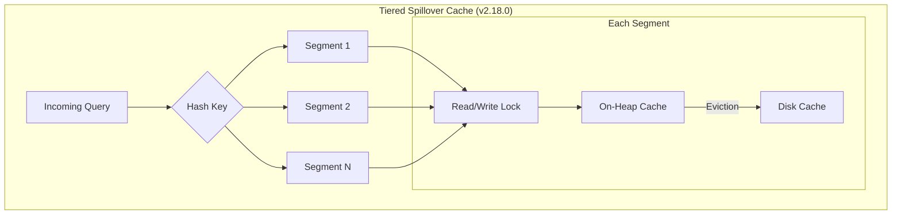

# Tiered Caching - Segmented Cache Changes

## Summary

This release introduces segmented cache architecture to the tiered spillover cache, significantly improving performance for concurrent read/write operations. Previously, the tiered cache used a single global read/write lock, which created a bottleneck. The new segmented approach distributes cache operations across multiple segments, each with its own lock, enabling higher throughput.

## Details

### What's New in v2.18.0

The tiered spillover cache now supports segmentation, addressing critical performance issues identified in benchmarks:

1. **Segmented Cache Architecture**: The cache is divided into multiple segments (default based on CPU cores), each with its own read/write lock
2. **Improved Concurrency**: Multiple writers can operate simultaneously on different segments
3. **Query Recomputation Outside Lock**: Cache miss handling no longer blocks other threads during query recomputation
4. **New Configuration Settings**: Segment count and per-tier size settings for fine-tuning

### Technical Changes

#### Architecture Changes



#### New Components

| Component | Description |
|-----------|-------------|
| `TieredSpilloverCacheSegment` | Individual cache segment with its own read/write lock for concurrency |
| `tieredSpilloverCacheSegments[]` | Array of segments that distribute cache operations |
| `CompletableFuture` map | Handles concurrent requests for the same key to ensure single load |

#### New Configuration

| Setting | Description | Default |
|---------|-------------|---------|
| `indices.requests.cache.tiered_spillover.segments` | Number of cache segments | `2^(ceil(log2(CPU_CORES * 1.5)))` |
| `indices.requests.cache.tiered_spillover.onheap.store.size` | On-heap cache size | 1% of heap |
| `indices.requests.cache.tiered_spillover.disk.store.size` | Disk cache size | 1 GB |

Valid segment count values: 1, 2, 4, 8, 16, 32, 64, 128, 256 (must be power of 2 up to 256)

### Usage Example

```yaml
# opensearch.yml - Enable tiered caching with custom segments
indices.requests.cache.store.name: tiered_spillover
indices.requests.cache.tiered_spillover.onheap.store.name: opensearch_onheap
indices.requests.cache.tiered_spillover.disk.store.name: ehcache_disk

# Configure segment count (power of 2, up to 256)
indices.requests.cache.tiered_spillover.segments: 16

# Configure cache sizes
indices.requests.cache.tiered_spillover.onheap.store.size: 2%
indices.requests.cache.tiered_spillover.disk.store.size: 5gb
```

### Performance Improvements

The segmented architecture addresses two key performance issues:

1. **Single Lock Bottleneck**: Previously, only one thread could write to the cache at a time. Now, multiple threads can write to different segments concurrently.

2. **Query Recomputation Blocking**: Previously, cache misses triggered query recomputation under the write lock, blocking all other operations. Now, a `CompletableFuture` map ensures only one thread loads a given key while others wait without holding locks.

## Limitations

- Segment count must be a power of 2 (1, 2, 4, 8, 16, 32, 64, 128, or 256)
- Per-segment size must be greater than 0 bytes
- Minimum disk cache size is 10 MB
- Still experimental - not recommended for production use

## Related PRs

| PR | Description |
|----|-------------|
| [#16047](https://github.com/opensearch-project/OpenSearch/pull/16047) | Segmented cache changes for tiered caching |

## References

- [Issue #13989](https://github.com/opensearch-project/OpenSearch/issues/13989): Performance improvement for TieredCaching
- [Tiered Cache Documentation](https://docs.opensearch.org/2.18/search-plugins/caching/tiered-cache/)
- [Tiered Caching Blog](https://opensearch.org/blog/tiered-cache/)

## Related Feature Report

- [Full feature documentation](../../../../features/opensearch/tiered-caching.md)
