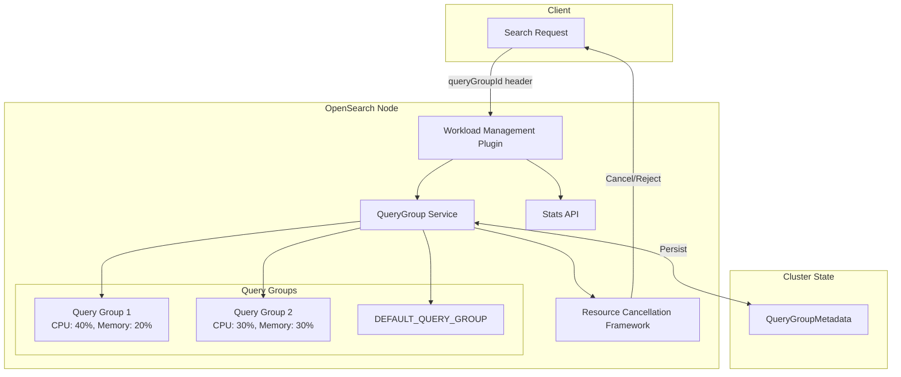

---
tags:
  - observability
  - search
---

# Workload Management

## Summary

Workload Management (WLM) is a new feature in OpenSearch v2.18.0 that enables tenant-level admission control and reactive query management. It allows system administrators to group search traffic into query groups with defined resource limits (CPU, memory), preventing resource overuse by specific requests and ensuring fair resource distribution across the cluster.

## Details

### What's New in v2.18.0

This release introduces the complete Workload Management framework including:

- **Query Group resource cancellation framework** - Core mechanism for canceling queries that exceed resource limits
- **QueryGroup Stats API** - New `GET /_wlm/stats` endpoint for monitoring query group metrics
- **WLM resiliency orchestrator** - Query Sandboxing service for enforcing resource limits
- **QueryGroup persistence** - Query groups are now durable across cluster restarts via ClusterState
- **Enhanced rejection mechanism** - Improved rejection logic for soft query groups when nodes are in duress
- **REST API bug fixes** - Fixed CRUD APIs to properly extend TransportClusterManagerNodeAction

### Technical Changes

#### Architecture



#### New Components

| Component | Description |
|-----------|-------------|
| `QueryGroupService` | Orchestrates query sandboxing and resource enforcement |
| `QueryGroupMetadata` | Persistable metadata stored in ClusterState |
| `ResourceCancellationFramework` | Cancels queries exceeding resource limits |
| `WLM Stats API` | Provides per-node query group statistics |
| `QueryGroup CRUD APIs` | Create, read, update, delete query groups |

#### New Configuration

| Setting | Description | Default |
|---------|-------------|---------|
| `wlm.query_group.mode` | Operating mode: `disabled`, `enabled`, `monitor_only` | `monitor_only` |
| `wlm.query_group.duress_streak` | Threshold before node is marked as "in duress" | - |
| `wlm.query_group.enforcement_interval` | Monitoring interval for resource checks | - |
| `wlm.query_group.node.memory_rejection_threshold` | Memory threshold for request rejection | - |
| `wlm.query_group.node.cpu_rejection_threshold` | CPU threshold for request rejection | - |
| `wlm.query_group.node.memory_cancellation_threshold` | Memory threshold for node duress | - |
| `wlm.query_group.node.cpu_cancellation_threshold` | CPU threshold for node duress | - |

#### API Changes

**Install Plugin:**
```bash
./bin/opensearch-plugin install workload-management
```

**Create Query Group:**
```json
PUT _wlm/query_group
{
  "name": "analytics",
  "resiliency_mode": "enforced",
  "resource_limits": {
    "cpu": 0.4,
    "memory": 0.2
  }
}
```

**Use Query Group in Search:**
```
GET testindex/_search
Host: localhost:9200
Content-Type: application/json
queryGroupId: preXpc67RbKKeCyka72_Gw

{
  "query": {
    "match": {
      "field_name": "value"
    }
  }
}
```

**Get Stats:**
```
GET _wlm/stats
```

### Usage Example

```json
// Create a query group with enforced resource limits
PUT _wlm/query_group
{
  "name": "analytics",
  "resiliency_mode": "enforced",
  "resource_limits": {
    "cpu": 0.4,
    "memory": 0.2
  }
}

// Response
{
  "_id": "preXpc67RbKKeCyka72_Gw",
  "name": "analytics",
  "resiliency_mode": "enforced",
  "resource_limits": {
    "cpu": 0.4,
    "memory": 0.2
  },
  "updated_at": 1726270184642
}
```

### Resiliency Modes

| Mode | Behavior |
|------|----------|
| `enforced` | Queries are canceled/rejected when resource limits are exceeded |
| `soft` | Queries may be rejected when node is in duress |
| `monitor_only` | Resources are monitored but queries are not canceled/rejected |

## Limitations

- The sum of resource limits for a single resource type (CPU or memory) across all query groups must not exceed 1.0
- Rejection threshold for a resource should always be lower than the cancellation threshold
- Only users with administrator-level permissions can create and update query groups
- Feature requires installing the `workload-management` plugin

## References

### Documentation
- [Workload Management Documentation](https://docs.opensearch.org/2.18/tuning-your-cluster/availability-and-recovery/workload-management/wlm-feature-overview/)
- [Query Group Lifecycle API](https://docs.opensearch.org/2.18/tuning-your-cluster/availability-and-recovery/workload-management/query-group-lifecycle-api/)

### Pull Requests
| PR | Description |
|----|-------------|
| [#15651](https://github.com/opensearch-project/OpenSearch/pull/15651) | Add cancellation framework changes in WLM |
| [#15777](https://github.com/opensearch-project/OpenSearch/pull/15777) | QueryGroup Stats API logic |
| [#15925](https://github.com/opensearch-project/OpenSearch/pull/15925) | Add WLM resiliency orchestrator (QueryGroup Service) |
| [#15955](https://github.com/opensearch-project/OpenSearch/pull/15955) | Add integration tests for WLM CRUD APIs |
| [#16370](https://github.com/opensearch-project/OpenSearch/pull/16370) | Make QueryGroups durable |
| [#16417](https://github.com/opensearch-project/OpenSearch/pull/16417) | Improve rejection logic for WLM |
| [#16422](https://github.com/opensearch-project/OpenSearch/pull/16422) | WLM create/update REST API bug fix |

### Issues (Design / RFC)
- [RFC #12342](https://github.com/opensearch-project/OpenSearch/issues/12342): Search Query Sandboxing: User Experience

## Related Feature Report

- [Full feature documentation](../../../features/opensearch/opensearch-workload-management.md)
