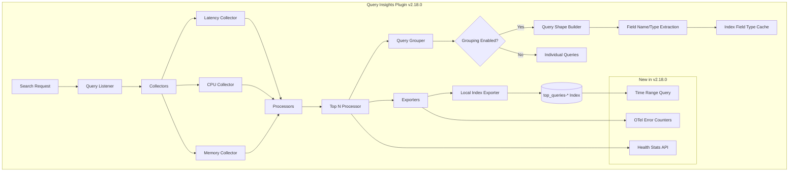

# Query Insights Enhancements

## Summary

OpenSearch v2.18.0 introduces significant enhancements to the Query Insights plugin, including a new Health Stats API for monitoring plugin health, OpenTelemetry error metrics counters for observability, improved query shape grouping with field name and type support, historical query retrieval with time range parameters, and cache management improvements for field type mappings.

## Details

### What's New in v2.18.0

This release focuses on three major areas:

1. **Health Stats API & Error Metrics**: New API endpoint and OpenTelemetry counters for monitoring plugin health
2. **Query Shape Enhancements**: Field name and type support for more accurate query grouping
3. **Historical Query Retrieval**: Time range parameters for querying historical top N queries

### Technical Changes

#### Architecture Changes



#### New Components

| Component | Description |
|-----------|-------------|
| `HealthStatsAction` | Transport action for health stats API |
| `HealthStatsResponse` | Response model containing thread pool info and query stats |
| `QueryInsightsHealthStats` | Data model for health statistics |
| `IndexFieldTypeCache` | Cache for storing index field type mappings |
| `ClusterStateListener` | Listener for invalidating cache on index changes |

#### New Configuration

| Setting | Description | Default |
|---------|-------------|---------|
| `search.insights.top_queries.grouping.attributes.field_name` | Include field names in query shape for grouping | `true` |
| `search.insights.top_queries.grouping.attributes.field_type` | Include field types in query shape for grouping | `true` |

#### API Changes

**Health Stats API (New)**

```bash
GET /_insights/health_stats
```

Response:
```json
{
  "node_id": {
    "ThreadPoolInfo": {
      "query_insights_executor": {
        "type": "scaling",
        "core": 1,
        "max": 5,
        "keep_alive": "5m",
        "queue_size": 2
      }
    },
    "QueryRecordsQueueSize": 2,
    "TopQueriesHealthStats": {
      "latency": {
        "TopQueriesHeapSize": 5,
        "QueryGroupCount_Total": 0,
        "QueryGroupCount_MaxHeap": 0
      }
    }
  }
}
```

**Top N Queries with Time Range (Enhanced)**

```bash
GET /_insights/top_queries?from=2024-08-25T15:00:00.000Z&to=2024-08-30T17:00:00.000Z
```

### Usage Example

**Enable query grouping with field name and type:**
```bash
PUT _cluster/settings
{
  "persistent": {
    "search.insights.top_queries.latency.enabled": true,
    "search.insights.top_queries.group_by": "SIMILARITY",
    "search.insights.top_queries.grouping.attributes.field_name": true,
    "search.insights.top_queries.grouping.attributes.field_type": true,
    "search.insights.top_queries.exporter.type": "local_index"
  }
}
```

**Query shape output with field types:**
```
bool []
  must:
    match [name, text]
    range [age, integer]
aggregation:
  terms [age, integer]
    aggregation:
      max [join_date, date]
sort:
  desc [join_date, date]
```

**Check plugin health:**
```bash
GET /_insights/health_stats
```

**Retrieve historical queries:**
```bash
GET /_insights/top_queries?from=2024-10-01T00:00:00.000Z&to=2024-10-31T23:59:59.000Z
```

### Migration Notes

- The default values for `field_name` and `field_type` grouping attributes are now `true` (previously `false`)
- Existing query grouping configurations will automatically include field names and types
- To maintain previous behavior, explicitly set these settings to `false`

## Limitations

- Health Stats API returns per-node statistics; aggregation across cluster must be done client-side
- OpenTelemetry metrics require proper OTel collector configuration to be collected
- Field type cache may consume additional memory for clusters with many indexes

## Related PRs

| PR | Description |
|----|-------------|
| [#84](https://github.com/opensearch-project/query-insights/pull/84) | Support time range parameter for historical top N queries |
| [#111](https://github.com/opensearch-project/query-insights/pull/111) | Refactor query shape field data maps with WithFieldName interface |
| [#120](https://github.com/opensearch-project/query-insights/pull/120) | Add data models for health stats API |
| [#122](https://github.com/opensearch-project/query-insights/pull/122) | Create health_stats API for query insights |
| [#124](https://github.com/opensearch-project/query-insights/pull/124) | Add OpenTelemetry counters for error metrics |
| [#135](https://github.com/opensearch-project/query-insights/pull/135) | Add grouping settings for query field name and type |
| [#140](https://github.com/opensearch-project/query-insights/pull/140) | Add field type to query shape |
| [#142](https://github.com/opensearch-project/query-insights/pull/142) | Add cache eviction and listener for invalidating index field type mappings |
| [#8627](https://github.com/opensearch-project/documentation-website/pull/8627) | Documentation for health_stats API and error metrics |

## References

- [Issue #9](https://github.com/opensearch-project/query-insights/issues/9): Enrich operational metrics in Query Insights
- [Issue #12](https://github.com/opensearch-project/query-insights/issues/12): Historical top N queries from local index
- [Issue #69](https://github.com/opensearch-project/query-insights/issues/69): Query shape field type RFC
- [Issue #109](https://github.com/opensearch-project/query-insights/issues/109): Refactor query shape field data maps
- [Query Insights Documentation](https://docs.opensearch.org/2.18/observing-your-data/query-insights/index/)
- [Query Insights Health Documentation](https://docs.opensearch.org/2.18/observing-your-data/query-insights/health/)

## Related Feature Report

- [Full feature documentation](../../../../features/query-insights/query-insights.md)
