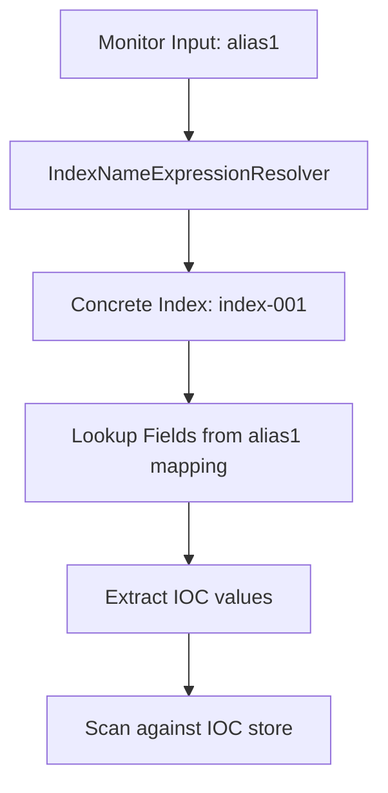

---
tags:
  - domain/security
  - component/server
  - indexing
  - search
  - security
---
# Security Analytics Correlation Bug Fixes

## Summary

This release fixes two bugs in the Security Analytics threat intelligence monitor functionality:

1. **Alias Resolution Fix**: Threat intel monitors now correctly work with index aliases by resolving them to concrete indices before scanning for IOCs
2. **Enum State Query Fix**: Fixed a query issue where the REFRESHING state was incorrectly used as an enum instead of its string value

## Details

### What's New in v2.18.0

These bug fixes address issues that prevented threat intelligence monitors from functioning correctly in certain scenarios.

### Technical Changes

#### Alias Resolution Fix (PR #1173)

The threat intel monitor's `per_ioc_type_scan_input_list` field contains a map of index to fields. When users specify an alias as the index input, the monitor needs to resolve it to concrete indices during execution.

**Problem**: When the monitor executed and processed documents from concrete indices, it couldn't find the field mappings because the mapping was stored under the alias name, not the concrete index name.

**Solution**: Added a new mapping (`concreteIndexToMonitorInputIndicesMap`) that resolves monitor input indices (which may be aliases) to their concrete indices. This allows the IOC scan service to correctly look up field mappings.



**Changed Components**:

| Component | Change |
|-----------|--------|
| `IocScanContext` | Added `concreteIndexToMonitorInputIndicesMap` field |
| `IoCScanService` | Updated to use concrete-to-alias mapping for field lookup |
| `TransportThreatIntelMonitorFanOutAction` | Injects `IndexNameExpressionResolver` and builds the mapping |
| `IndexUtils` | Added `getConcreteindexToMonitorInputIndicesMap()` utility method |

#### Enum State Query Fix (PR #1178)

**Problem**: When querying for threat intel source configs in REFRESHING state, the code was using the enum directly instead of its string value, causing the match query to fail.

**Solution**: Changed `REFRESHING` to `REFRESHING.toString()` in the query builder.

```java
// Before (incorrect)
stateQueryBuilder.should(QueryBuilders.matchQuery(stateFieldName, REFRESHING));

// After (correct)
stateQueryBuilder.should(QueryBuilders.matchQuery(stateFieldName, REFRESHING.toString()));
```

### Usage Example

Threat intel monitors now work correctly with aliases:

```json
POST _plugins/_security_analytics/threat_intel/monitors
{
    "name": "Threat intel monitor with alias",
    "schedule": {
        "period": {
            "interval": 1,
            "unit": "MINUTES"
        }
    },
    "enabled": true,
    "indices": [
        "my-logs-alias"  // Now correctly resolves to concrete indices
    ],
    "per_ioc_type_scan_input_list": [
        {
            "ioc_type": "ipv4-addr",
            "index_to_fields_map": {
                "my-logs-alias": ["src_ip", "dst_ip"]
            }
        }
    ],
    "triggers": [
        {
            "data_sources": ["my-logs-alias"],
            "name": "malicious-ip-trigger",
            "severity": "high"
        }
    ]
}
```

### Migration Notes

No migration required. These are bug fixes that improve existing functionality.

## Limitations

- When a concrete index resolves to multiple monitor input indices (aliases), the system picks one of them to get the field mappings

## References

### Documentation
- [Threat Intelligence Documentation](https://docs.opensearch.org/2.18/security-analytics/threat-intelligence/index/): Official docs
- [Monitor API](https://docs.opensearch.org/2.18/security-analytics/threat-intelligence/api/monitor/): API reference

### Pull Requests
| PR | Description |
|----|-------------|
| [#1180](https://github.com/opensearch-project/security-analytics/pull/1180) | Backport of #1173 and #1178 to 2.x |
| [#1173](https://github.com/opensearch-project/security-analytics/pull/1173) | Fix alias resolution in threat intel monitor |
| [#1178](https://github.com/opensearch-project/security-analytics/pull/1178) | Fix enum state query for REFRESHING state |

## Related Feature Report

- [Full feature documentation](../../../../features/security-analytics/security-analytics-threat-intelligence.md)
