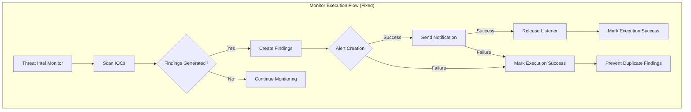

---
tags:
  - security
---

# Threat Intel Bug Fixes

## Summary

This release includes critical bug fixes for the Threat Intelligence feature in Security Analytics. The fixes address notification listener leaks, duplicate findings generation, and improved error handling in threat intel monitors. These improvements enhance the stability and reliability of threat intelligence monitoring.

## Details

### What's New in v2.18.0

This release focuses on stability improvements for threat intel monitors:

1. **Notification Listener Leak Fix**: Fixed a memory leak where notification listeners were not properly released after successful notification delivery
2. **Duplicate Findings Prevention**: Monitor execution now marks as successful when findings are generated, even if alert creation or notification fails, preventing duplicate findings
3. **Source Config Validation**: Added validation to prevent creation of source configs with missing required fields
4. **Improved Error Handling**: Better handling of partial failures during monitor execution

### Technical Changes

#### Architecture Changes

#### Bug Fixes

| Issue | Fix | Impact |
|-------|-----|--------|
| Listener leak on notification success | Added `listener.onResponse(null)` call after successful notification | Prevents memory leaks in long-running monitors |
| Duplicate findings on alert failure | Mark execution as succeeded when findings generated | Prevents repeated findings for same IOC matches |
| Duplicate findings on notification failure | Mark execution as succeeded when alerts generated | Moves marker forward in monitor metadata |
| Source config with null values | Added validation for required fields | Allows reading/deleting configs with null values |

#### Changed Components

| Component | Change |
|-----------|--------|
| `NotificationService` | Added listener callback on successful notification |
| `IoCScanService` | Changed error handling to mark execution success on partial failures |
| `SaIoCScanService` | Reordered alert save and notification send operations |
| `BaseEntityCrudService` | Improved error logging and listener failure handling |
| `SATIFSourceConfigDto` | Added validation for required fields (name, type, format, source, ioc_types) |

### Usage Example

No API changes are required. The fixes are internal improvements that automatically apply to existing threat intel monitors.

### Migration Notes

No migration required. Existing threat intel monitors will benefit from these fixes automatically after upgrading to v2.18.0.

## Limitations

- These fixes address stability issues but do not change the fundamental behavior of threat intel monitors
- Source configs with null values created before this fix can still be read and deleted but cannot be updated

## References

### Documentation
- [Threat Intelligence Documentation](https://docs.opensearch.org/2.18/security-analytics/threat-intelligence/index/): Official documentation

### Pull Requests
| PR | Description |
|----|-------------|
| [#1356](https://github.com/opensearch-project/security-analytics/pull/1356) | Fix notifications listener leak in threat intel monitor |
| [#1317](https://github.com/opensearch-project/security-analytics/pull/1317) | Threat intel monitor bug fixes (empty index sort, grouped listener) |
| [#1383](https://github.com/opensearch-project/security-analytics/pull/1383) | Fix search monitor query in update threat intel alert status API |
| [#1393](https://github.com/opensearch-project/security-analytics/pull/1393) | Add validation for threat intel source config |

### Issues (Design / RFC)
- [Issue #1319](https://github.com/opensearch-project/security-analytics/issues/1319): Threat intel monitor bug fixes tracking
- [Issue #1366](https://github.com/opensearch-project/security-analytics/issues/1366): Source config validation issue

## Related Feature Report

- [Full feature documentation](../../../features/security-analytics/security-analytics-threat-intelligence.md)
