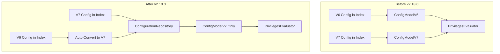

# Security Enhancements

## Summary

OpenSearch v2.18.0 includes multiple security plugin enhancements focused on audit logging improvements, configuration management, authentication, and backward compatibility fixes. Key additions include datastream support for audit logs, automatic V6 to V7 configuration conversion, circuit breaker override for security APIs, and improved error messaging for certificate issues.

## Details

### What's New in v2.18.0

#### Datastream Support for Audit Logs
The security plugin now supports writing audit logs to data streams using the `internal_opensearch_data_stream` storage type. This enables better lifecycle management and time-series optimization for audit data.

```yaml
# opensearch.yml
plugins.security.audit.type: internal_opensearch_data_stream
plugins.security.audit.config.data_stream.name: opensearch-security-auditlog
plugins.security.audit.config.data_stream.template.manage: true
plugins.security.audit.config.data_stream.template.number_of_shards: 1
plugins.security.audit.config.data_stream.template.number_of_replicas: 0
```

#### Auto-Convert V6 to V7 Configuration
The `ConfigurationRepository` now automatically converts V6 configuration instances (like `RoleV6`, `RoleMappingsV6`) to V7 format at runtime. This eliminates duplicate privilege evaluation logic and enables type-safe `SecurityDynamicConfiguration<>` usage.



#### Circuit Breaker Override for Security APIs
Security APIs now include an override to prevent tripping the circuit breaker, ensuring security operations remain available even under memory pressure.

#### Improved Certificate Error Messages
When a node with an incorrectly configured certificate attempts to connect, the error message now provides clearer information about the exact cause of the failure.

### Technical Changes

#### New Configuration

| Setting | Description | Default |
|---------|-------------|---------|
| `plugins.security.audit.type` | Now supports `internal_opensearch_data_stream` | `internal_opensearch` |
| `plugins.security.audit.config.data_stream.name` | Name of the audit log data stream | `opensearch-security-auditlog` |
| `plugins.security.audit.config.data_stream.template.manage` | Whether OpenSearch manages the template | `true` |
| `plugins.security.audit.config.data_stream.template.number_of_shards` | Number of shards for the data stream | `1` |
| `plugins.security.audit.config.data_stream.template.number_of_replicas` | Number of replicas for the data stream | `0` |

#### New Index Permissions

| Permission | Description |
|------------|-------------|
| Remote index permissions for AD | Added index permissions for remote index access in Anomaly Detection |

### Usage Example

```yaml
# Enable datastream-based audit logging
plugins:
  security:
    audit:
      type: internal_opensearch_data_stream
      config:
        data_stream:
          name: security-audit-logs
          template:
            manage: true
            number_of_shards: 2
            number_of_replicas: 1
```

### Migration Notes

- **V6 Configuration**: Existing V6 configurations in the security index remain unchanged. The conversion happens at runtime only.
- **Audit Log Migration**: To switch to datastream-based audit logging, update `plugins.security.audit.type` to `internal_opensearch_data_stream`.
- **Rolling Upgrades**: The `ensureCustomSerialization` fix addresses header serialization issues during rolling upgrades from 2.11-2.13 to 2.14+.

## Limitations

- V6 configuration format can still be used for updates, but V7 format is recommended
- Datastream audit logs require OpenSearch 2.18.0+ on all nodes
- JWT authentication in MultipleAuthentication requires proper configuration of all auth backends

## Related PRs

| PR | Description |
|----|-------------|
| [#4756](https://github.com/opensearch-project/security/pull/4756) | Support datastreams as an AuditLog Sink |
| [#4753](https://github.com/opensearch-project/security/pull/4753) | Auto-convert V6 configuration to V7 (2.x only) |
| [#4779](https://github.com/opensearch-project/security/pull/4779) | Add circuit breaker override for security APIs |
| [#4819](https://github.com/opensearch-project/security/pull/4819) | Improve certificate error messages |
| [#4721](https://github.com/opensearch-project/security/pull/4721) | Add index permissions for remote index in AD |
| [#4741](https://github.com/opensearch-project/security/pull/4741) | Fix header serialization for rolling upgrades |
| [#4778](https://github.com/opensearch-project/security/pull/4778) | Fix env var password hashing for PBKDF2 |
| [#2107](https://github.com/opensearch-project/security/pull/2107) | Add JWT to MultipleAuthentication |
| [#4754](https://github.com/opensearch-project/security/pull/4754) | Fix rolesMappingConfiguration in tests |
| [#4726](https://github.com/opensearch-project/security/pull/4726) | Fix SSL exception handler in OpenSearchSecureSettingsFactory |

## References

- [Issue #4493](https://github.com/opensearch-project/security/issues/4493): V6/V7 configuration consolidation proposal
- [Issue #4687](https://github.com/opensearch-project/security/issues/4687): Circuit breaker issue with security APIs
- [Issue #4601](https://github.com/opensearch-project/security/issues/4601): Certificate error message improvement
- [Issue #3745](https://github.com/opensearch-project/security/issues/3745): Datastream support for audit logs
- [Issue #4494](https://github.com/opensearch-project/security/issues/4494): Header serialization issue during upgrades
- [Issue #4670](https://github.com/opensearch-project/security/issues/4670): Rolling upgrade serialization issue
- [Documentation: Audit Log Storage Types](https://docs.opensearch.org/2.18/security/audit-logs/storage-types/)

## Related Feature Report

- [Full feature documentation](../../../../features/security/security-plugin.md)
