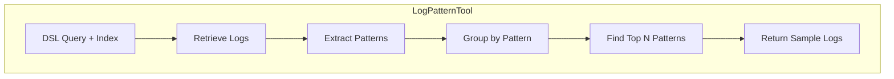

---
tags:
  - domain/ml
  - component/server
  - indexing
  - ml
  - observability
  - search
---
# ML Skills & Tools

## Summary

OpenSearch v2.18.0 introduces two enhancements to the Skills plugin: a new LogPatternTool for log pattern analysis and improvements to the CreateAnomalyDetectorTool with customizable prompts. These changes expand the capabilities of ML agents for observability and anomaly detection use cases.

## Details

### What's New in v2.18.0

#### 1. LogPatternTool (New)

A new tool that generates log patterns from DSL queries, enabling agents to identify common patterns in log data. This brings the log pattern analysis capability from Observability to DSL-based workflows.



**How it works:**
1. Retrieves logs from the specified index using the input DSL query
2. Extracts patterns by finding the string field with the longest value (or uses a specified pattern field)
3. Removes alphanumeric characters to create pattern signatures
4. Groups logs by their extracted patterns
5. Returns top N patterns with sample logs

#### 2. CreateAnomalyDetectorTool Enhancements

The CreateAnomalyDetectorTool now supports customizable prompts, allowing users to override the default LLM prompt for better control over anomaly detector suggestions.

### Technical Changes

#### New Components

| Component | Description |
|-----------|-------------|
| `LogPatternTool` | Generates log patterns from DSL queries |
| `LogPatternTool.Factory` | Factory class for creating LogPatternTool instances |

#### New Configuration

| Setting | Description | Default |
|---------|-------------|---------|
| `top_n_pattern` | Number of top patterns to return | `3` |
| `sample_log_size` | Number of sample logs per pattern | `20` |
| `doc_size` | Number of logs to retrieve | `1000` |
| `pattern_field` | Field to extract patterns from | Auto-detected (longest string field) |
| `pattern` | Regex pattern for extraction | `[a-zA-Z0-9]` (removed) |
| `prompt` | Custom prompt for CreateAnomalyDetectorTool | Default model-specific prompt |

#### API Changes

**LogPatternTool Registration:**
```json
{
  "type": "LogPatternTool",
  "parameters": {
    "top_n_pattern": "3",
    "sample_log_size": "20",
    "doc_size": "100"
  }
}
```

**LogPatternTool Execution:**
```json
POST _plugins/_ml/agents/{agent_id}/_execute
{
  "parameters": {
    "selected_tools": ["LogPatternTool"],
    "top_n_pattern": "3",
    "sample_log_size": "20",
    "doc_size": 100,
    "index": "my-logs-index",
    "input": "{\"query\":{\"bool\":{\"filter\":[{\"range\":{\"timestamp\":{\"gte\":\"now-1h\"}}}]}}}"
  }
}
```

**CreateAnomalyDetectorTool with Custom Prompt:**
```json
{
  "type": "CreateAnomalyDetectorTool",
  "parameters": {
    "model_id": "<MODEL_ID>",
    "prompt": "Custom prompt for anomaly detector suggestions..."
  }
}
```

### Usage Example

**LogPatternTool Response:**
```json
[
  {
    "total count": 45,
    "pattern": " - - [] \"  /\" ",
    "sample logs": [
      {"timestamp": "2024-01-01T00:00:00Z", "message": "192.168.1.1 - - [01/Jan/2024] \"GET /api/users HTTP/1.1\" 200"},
      ...
    ]
  },
  {
    "total count": 23,
    "pattern": " - - [] \"  /\" ",
    "sample logs": [...]
  }
]
```

### Migration Notes

- LogPatternTool requires both `index` and `input` (DSL query) parameters at runtime
- The tool validates that the index parameter is provided and non-empty
- For CreateAnomalyDetectorTool, the `prompt` parameter is optional; if not provided, the default model-specific prompt is used

## Limitations

- LogPatternTool requires the index to contain string fields for pattern extraction
- Pattern extraction removes all alphanumeric characters by default, which may not suit all log formats
- Custom regex patterns must be valid Java regex expressions
- CreateAnomalyDetectorTool custom prompts must follow the expected output format for proper parsing

## References

### Documentation
- [CreateAnomalyDetectorTool Documentation](https://docs.opensearch.org/2.18/ml-commons-plugin/agents-tools/tools/create-anomaly-detector/): Official documentation
- [Agents and Tools](https://docs.opensearch.org/2.18/ml-commons-plugin/agents-tools/index/): ML Commons agents and tools overview

### Pull Requests
| PR | Description |
|----|-------------|
| [#413](https://github.com/opensearch-project/skills/pull/413) | Add LogPatternTool |
| [#399](https://github.com/opensearch-project/skills/pull/399) | Optimize default prompt and make prompt customizable for CreateAnomalyDetectorTool |

### Issues (Design / RFC)
- [Issue #337](https://github.com/opensearch-project/skills/issues/337): Create Anomaly Detector Tool feature request

## Related Feature Report

- Full feature documentation
