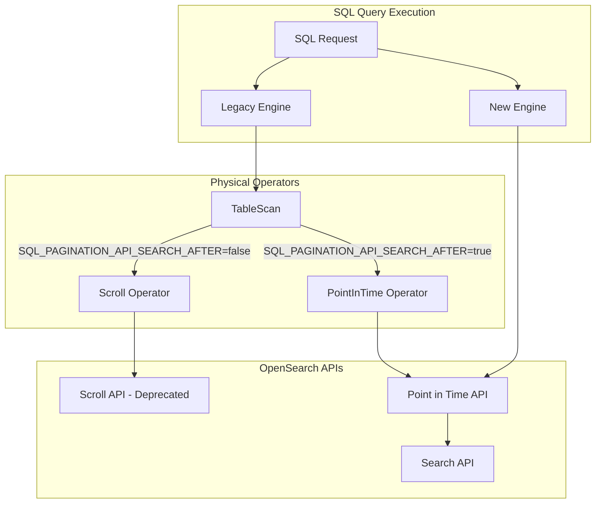

---
tags:
  - search
  - sql
---

# SQL PIT Refactor for Joins and Pagination

## Summary

This release refactors the SQL plugin to use Point in Time (PIT) API instead of the deprecated Scroll API for join queries and pagination. The change improves consistency and reliability of SQL query results by leveraging PIT's ability to maintain a fixed view of data during query execution.

## Details

### What's New in v2.18.0

The SQL plugin now uses Point in Time (PIT) API for:
- Join queries (table scans in legacy SQL engine)
- Pagination queries in the new SQL engine
- Cursor-based result retrieval

### Technical Changes

#### Architecture Changes



#### New Components

| Component | Description |
|-----------|-------------|
| `Paginate` | Abstract base class for pagination operators (Scroll and PIT) |
| `PointInTime` | Physical operator for PIT-based table scans in join queries |
| `OpenSearchQueryRequest` (enhanced) | Extended to support PIT-based pagination with `search_after` |

#### New Configuration

| Setting | Description | Default |
|---------|-------------|---------|
| `plugins.sql.pagination.api.search_after` | Enable PIT-based pagination instead of Scroll | `true` |

#### API Changes

The `OpenSearchClient` interface now includes PIT management methods:

```java
// Create PIT for given indices
String createPit(CreatePitRequest createPitRequest);

// Delete PIT
void deletePit(DeletePitRequest deletePitRequest);
```

### Key Implementation Details

#### Legacy Engine (Join Queries)

The `TableScan` logical operator now conditionally creates either a `Scroll` or `PointInTime` physical operator:

```java
@Override
public <T> PhysicalOperator[] toPhysical(Map<LogicalOperator, PhysicalOperator<T>> optimalOps) {
    if (LocalClusterState.state().getSettingValue(SQL_PAGINATION_API_SEARCH_AFTER)) {
        return new PhysicalOperator[] {new PointInTime(request, pageSize)};
    }
    return new PhysicalOperator[] {new Scroll(request, pageSize)};
}
```

#### New Engine (Pagination)

The `OpenSearchRequestBuilder` creates PIT-based requests when pagination is enabled:

```java
private OpenSearchRequest buildRequestWithPit(...) {
    if (pageSize == null) {
        if (startFrom + size > maxResultWindow) {
            String pitId = createPit(indexName, cursorKeepAlive, client);
            return new OpenSearchQueryRequest(indexName, sourceBuilder, 
                exprValueFactory, includes, cursorKeepAlive, pitId);
        }
        // Non-paginated request
        return new OpenSearchQueryRequest(indexName, sourceBuilder, exprValueFactory, includes);
    }
    // Paginated request with PIT
    String pitId = createPit(indexName, cursorKeepAlive, client);
    return new OpenSearchQueryRequest(indexName, sourceBuilder, 
        exprValueFactory, includes, cursorKeepAlive, pitId);
}
```

### Usage Example

SQL queries automatically use PIT when the setting is enabled (default):

```sql
-- Join query (uses PIT internally)
SELECT a.firstname, b.balance 
FROM accounts a 
JOIN transactions b ON a.account_id = b.account_id

-- Paginated query (uses PIT internally)
POST _plugins/_sql
{
  "query": "SELECT * FROM accounts",
  "fetch_size": 100
}
```

### Migration Notes

- The change is transparent to users - no query syntax changes required
- Existing cursors from Scroll-based pagination are not compatible with PIT-based pagination
- To revert to Scroll API, set `plugins.sql.pagination.api.search_after` to `false`

## Limitations

- PIT contexts consume cluster resources and have a configurable timeout
- In case of cluster or node failure, all PIT data is lost
- PIT-based pagination requires additional API calls to create/delete PIT contexts

## References

### Documentation
- [Point in Time Documentation](https://docs.opensearch.org/2.18/search-plugins/searching-data/point-in-time/): Official PIT documentation
- [PIT in SQL](https://docs.opensearch.org/2.18/search-plugins/searching-data/point-in-time/#pit-in-sql): SQL-specific PIT usage
- [SQL Pagination API](https://docs.opensearch.org/2.18/search-plugins/sql/sql-ppl-api/#paginating-results): Pagination documentation

### Pull Requests
| PR | Description |
|----|-------------|
| [#2981](https://github.com/opensearch-project/sql/pull/2981) | Add missing refactoring of Scroll to PIT API calls for Joins and Pagination query |

## Related Feature Report

- [Full feature documentation](../../../../features/sql/sql-pit-refactor.md)
