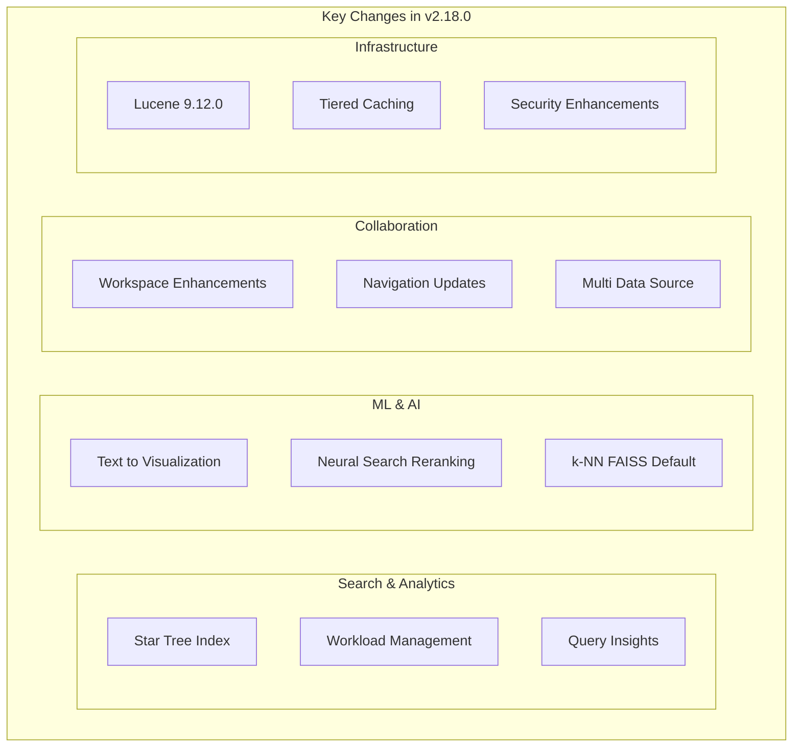

---
tags:
  - dashboards
  - indexing
  - k-nn
  - ml
  - neural-search
  - performance
  - search
  - security
---

# OpenSearch v2.18.0 Release Summary

## Summary

OpenSearch 2.18.0 delivers significant enhancements for building ML-powered applications, improving search performance, and enabling better team collaboration. Key highlights include the experimental star-tree index for sub-millisecond aggregations, workload management for tenant-level resource control, enhanced workspace collaboration features in Dashboards, and major k-NN performance improvements with FAISS as the new default engine.

## Highlights

## New Features

| Feature | Description | Report |
|---------|-------------|--------|
| Star Tree Index | Experimental multi-field index for sub-millisecond aggregation queries with precomputed results | Details |
| Workload Management | Tenant-level admission control with CPU/memory limits, query sandboxing, and QueryGroup Stats API | Details |
| Text to Visualization | AI-powered visualization generation from natural language queries using LLM agents | Details |
| ByFieldRerankProcessor | Second-level reranking based on document field values for improved search relevance | Details |
| Phone Analyzers | New `phone` and `phone-search` analyzers for global phone number parsing | Details |
| Paginated List APIs | New `_list/indices` and `_list/shards` APIs with pagination for large clusters | Details |
| Query Insights Health Stats API | New `/_insights/health_stats` endpoint for monitoring plugin health | Details |
| LogPatternTool | New ML skill for log pattern analysis in alerting summaries | Details |
| Offline Nodes Library | Core abstractions for running background tasks on dedicated offline nodes | Details |

## Improvements

| Area | Description | Report |
|------|-------------|--------|
| k-NN Default Engine | Changed default engine from NMSLIB to FAISS with better indexing throughput | Details |
| k-NN AVX512 Support | AVX512 SIMD acceleration for Faiss engine on compatible x64 processors | Details |
| Lucene 9.12.0 | New postings format, JDK 23 support, dynamic range facets, memory optimizations | Details |
| Tiered Caching | Segmented cache architecture for improved concurrent read/write performance | Details |
| Workspace Collaboration | Workspace-level UI settings, collaborator management, data connection integration, ACL auditor | Details |
| Navigation Updates | Flattened navigation, persistent state, small screen support, global search bar | Details |
| Query Insights Grouping | Field name and type support for more accurate query similarity grouping | Details |
| ML Inference Processor | Search extension output support, query string in input_map, MLToolSpec config field | Details |
| Batch Job Management | Rate limiting, connector credentials, model group access control for batch operations | Details |
| Security Audit Logs | Datastream support for audit logs with better lifecycle management | Details |
| Hybrid Query Rescorer | Standard OpenSearch rescore functionality now works with hybrid queries | Details |
| Doc-Level Monitor | Separate query indices for external monitors, optimized query index lifecycle | Details |
| Discover Enhancements | Data summary panel, PPL/SQL query options, autocomplete improvements | Details |

## Bug Fixes

| Fix | Description | PR |
|-----|-------------|-----|
| Nested Aggregations | Fix infinite loop in nested aggregations with deep-level nested objects | Details |
| Wildcard Query | Fix escaped wildcard character handling and case-insensitive queries | Details |
| Flat Object Field | Fix infinite loop when flat_object field contains invalid token types | Details |
| k-NN Memory Release | Add DocValuesProducers for proper memory release when closing indexes | Details |
| Neural Search Order | Fix incorrect document order for nested aggregations in hybrid query | Details |
| ML Commons Stability | Fix model stuck in deploying state during node crash/cluster restart | Details |
| Security System Index | Fix bug where admin could read system index | Details |
| SQL Pagination | Fix SQL pagination with `pretty` parameter and PIT refactor issues | Details |
| Alerting Query Index | Fix query index shard settings and auto-expand replicas | Details |
| Workspace UI | 13 bug fixes for workspace UI/UX, page crashes, and permissions | Details |

## Breaking Changes

| Change | Migration | Report |
|--------|-----------|--------|
| k-NN Default Engine | New indexes use FAISS by default; specify `"engine": "nmslib"` to continue using NMSLIB | Details |
| Query Insights Grouping | Field name/type grouping now enabled by default; set to `false` to maintain previous behavior | Details |
| Identity Feature Flag | Experimental identity feature flag removed; authentication moved to plugins | Details |

## Experimental Features

| Feature | Description | Report |
|---------|-------------|--------|
| Star Tree Index | Multi-field index for accelerated aggregations (requires feature flag) | Details |
| Discover Updates | Enhanced query experience with PPL/SQL support, improved data selector | Details |
| Text to Visualization | Natural language to visualization generation | Details |
| User Personal Settings | Scoped uiSettings with User Settings page | Details |

## Dependencies

Notable dependency updates in this release:

| Dependency | Version | Notes |
|------------|---------|-------|
| Apache Lucene | 9.12.0 | New postings format, JDK 23 support |
| Netty | 4.1.114 | Network layer updates |
| gRPC | 1.68.0 | RPC framework update |
| Protobuf | 3.25.5 | Serialization library |
| Gradle | 8.10.2 | Build system update |
| Jackson | 2.18.0 | JSON processing |
| commons-io | 2.14.0 | CVE-2024-47554 fix |

## References

- [Official Release Notes](https://github.com/opensearch-project/opensearch-build/blob/main/release-notes/opensearch-release-notes-2.18.0.md)
- [OpenSearch 2.18.0 Release Page](https://opensearch.org/versions/opensearch-2-18-0.html)
- [Feature Reports](features/)
