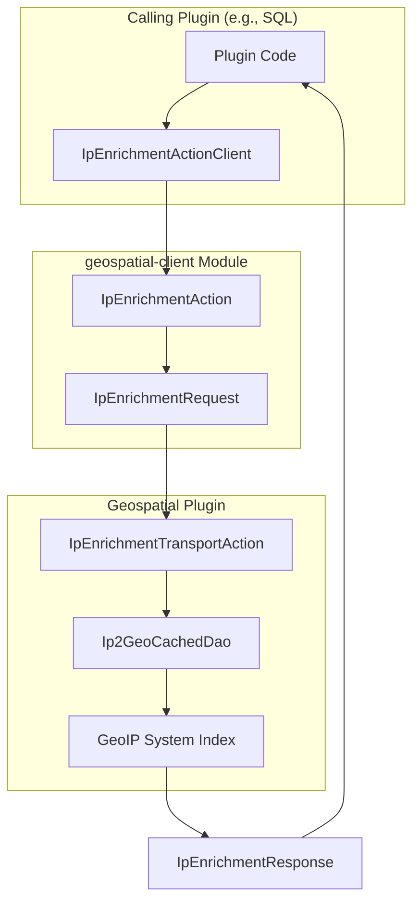

---
tags:
  - geospatial
---
# Geospatial Client Module

## Summary

OpenSearch v2.19.0 introduces a new `geospatial-client` Java artifact that enables cross-plugin IP enrichment. This standalone module allows other OpenSearch plugins to leverage the Geospatial plugin's IP-to-geolocation functionality without reimplementing the conversion logic.

## Details

### What's New in v2.19.0

The `geospatial-client` module provides a standardized interface for IP enrichment across the OpenSearch plugin ecosystem. Previously, IP-to-geolocation conversion was only available during document ingestion within the Geospatial plugin itself. This new module exposes the functionality as a registered transport action, enabling plugins like SQL to perform IP enrichment in PPL commands.

### Architecture



### Components

| Component | Description |
|-----------|-------------|
| `IpEnrichmentActionClient` | Facade class for other plugins to call IP enrichment |
| `IpEnrichmentAction` | ActionType registered on OpenSearch for inter-cluster transport calls |
| `IpEnrichmentRequest` | Request wrapper containing IP string and datasource name |
| `IpEnrichmentResponse` | Response wrapper containing geolocation data map |
| `IpEnrichmentTransportAction` | Transport action handler in Geospatial plugin |

### Usage Example

Other plugins can import the `geospatial-client` JAR and use the client:

```java
IpEnrichmentActionClient ipClient = new IpEnrichmentActionClient(client.getNodeClient());
try {
    Map<String, Object> geoLocationData = ipClient.getGeoLocationData("50.68.18.229", "my-datasource");
    // geoLocationData contains: city_name, country_name, location, etc.
} catch (Exception e) {
    // Handle enrichment failure
}
```

### API Design

Request parameters:
- `ipString`: IPv4 or IPv6 address in string format
- `datasourceName`: Name of the configured GeoIP datasource

Response:
- `Map<String, Object>`: Geolocation data including city, country, coordinates, etc.

### Technical Changes

- New Gradle module `geospatial-client` with standalone JAR publishing
- Transport action registered at `cluster:admin/geospatial/ipenrichment/get`
- Cross-classloader serialization support via `fromActionRequest()` and `fromActionResponse()` methods
- CI pipeline updated to publish JAR to `aws.oss.sonatype.org`

## Limitations

- Requires the Geospatial plugin to be installed and a datasource to be configured
- Synchronous API - callers must handle `ExecutionException` and `InterruptedException`
- Datasource must be valid and not expired (within 30-day update window)

## References

### Pull Requests
| PR | Description | Related Issue |
|----|-------------|---------------|
| [#700](https://github.com/opensearch-project/geospatial/pull/700) | New module `geospatial-client` for cross-plugin IP enrichment | [#698](https://github.com/opensearch-project/geospatial/issues/698) |
| [#706](https://github.com/opensearch-project/geospatial/pull/706) | CI pipeline update to publish geospatial-client JAR | [#698](https://github.com/opensearch-project/geospatial/issues/698) |
| [#701](https://github.com/opensearch-project/geospatial/pull/701) | GitHub CI build fix for Node.js deprecation | [opensearch-build#5178](https://github.com/opensearch-project/opensearch-build/issues/5178) |
| [#677](https://github.com/opensearch-project/geospatial/pull/677) | Use LockService from JobScheduler via Guice | [security#4439](https://github.com/opensearch-project/security/issues/4439) |

### Issues
- [#698](https://github.com/opensearch-project/geospatial/issues/698): RFC - Expose Geo2IP Enrichment feature to other plugins
