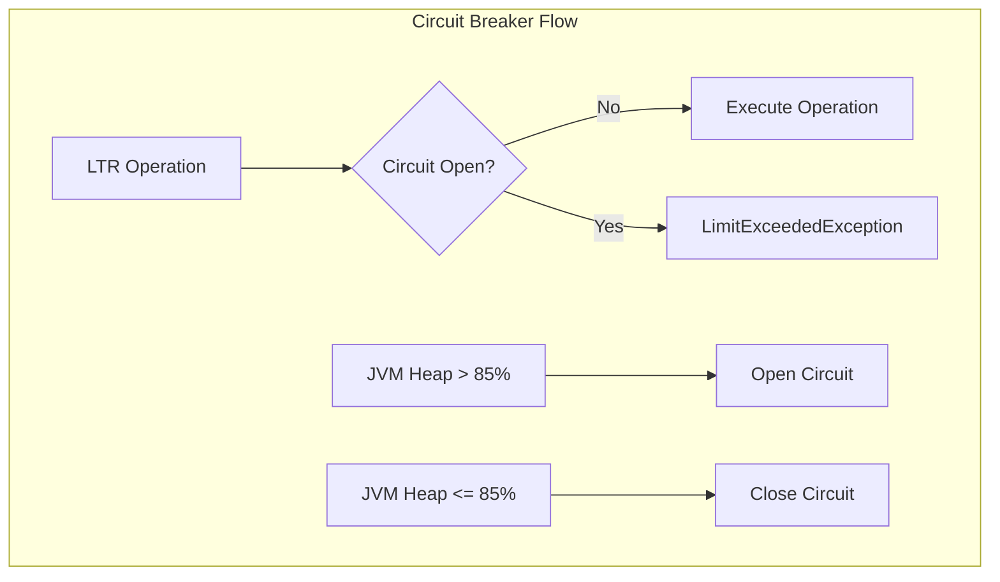

---
tags:
  - learning
---
# Learning to Rank

## Summary

OpenSearch v2.19.0 brings significant enhancements to the Learning to Rank (LTR) plugin, including plugin settings for enable/disable control, circuit breaker protection, stats API for monitoring, and security integration with predefined roles.

## Details

### What's New in v2.19.0

#### Plugin Settings
New cluster settings allow administrators to enable/disable the LTR plugin and circuit breaker at runtime:

| Setting | Description | Default |
|---------|-------------|---------|
| `ltr.plugin.enabled` | Enable/disable the LTR plugin | `true` |
| `ltr.breaker.enabled` | Enable/disable the circuit breaker | `true` |

When the plugin is disabled, all LTR REST endpoints and queries return an error message: "LTR plugin is disabled. To enable, update ltr.plugin.enabled to true".

#### Circuit Breaker
A memory-based circuit breaker protects the cluster from resource exhaustion during LTR operations:

- Monitors JVM heap usage with a default threshold of 85%
- Blocks feature set additions, model creation, and feature store updates when memory is constrained
- Throws `LimitExceededException` when the circuit is open



#### Stats API
New REST endpoint exposes plugin statistics for monitoring and debugging:

```
GET /_plugins/_ltr/stats
GET /_plugins/_ltr/stats/{stat}
GET /_plugins/_ltr/{nodeId}/stats
GET /_plugins/_ltr/{nodeId}/stats/{stat}
```

Available statistics:
- `plugin_status` - Plugin health status (cluster-level)
- `cache_stats` - Cache performance metrics (node-level)
- `stores` - Feature store information (cluster-level)
- `request_total_count` - Total request count (node-level)
- `request_error_count` - Error request count (node-level)

#### Security Integration
New predefined roles in the Security plugin for LTR access control:

| Role | Permissions |
|------|-------------|
| `ltr_read_access` | Read-only access to LTR stats, cache stats, and feature store listing |
| `ltr_full_access` | Full access to all LTR operations |

Cluster permissions added:
- `cluster:admin/ltr/caches/stats`
- `cluster:admin/ltr/featurestore/list`
- `cluster:admin/ltr/stats`
- `cluster:admin/ltr/*` (full access)

#### System Index Protection
The `.ltrstore*` indices are now registered as system indices, providing:
- Protection from accidental deletion
- Proper security context handling in REST handlers
- Test suite configuration for system index cleanup

### Technical Changes

#### New Components

| Component | Description |
|-----------|-------------|
| `LTRSettings` | Singleton class managing plugin settings with dynamic update support |
| `LTRCircuitBreakerService` | Service for registering and checking circuit breakers |
| `MemoryCircuitBreaker` | JVM heap-based circuit breaker implementation |
| `RestStatsLTRAction` | REST handler for stats API |
| `TransportLTRStatsAction` | Transport action for distributed stats collection |

#### Protected Operations
The following operations check plugin enabled status and circuit breaker:
- Feature set creation/update
- Model creation
- Feature store CRUD operations
- All LTR queries (SLTR, explorer, term stat)

## Limitations

- Circuit breaker only monitors JVM heap; no CPU-based breaker yet
- Stats are reset on node restart
- Security roles require Security plugin to be installed

## References

### Pull Requests
| PR | Description | Related Issue |
|----|-------------|---------------|
| [#76](https://github.com/opensearch-project/opensearch-learning-to-rank-base/pull/76) | Implemented LTR Settings for plugin enable/disable | [#75](https://github.com/opensearch-project/opensearch-learning-to-rank-base/issues/75) |
| [#71](https://github.com/opensearch-project/opensearch-learning-to-rank-base/pull/71) | Implemented circuit breaker | [#70](https://github.com/opensearch-project/opensearch-learning-to-rank-base/issues/70) |
| [#79](https://github.com/opensearch-project/opensearch-learning-to-rank-base/pull/79) | Collect stats for usage and health | [#78](https://github.com/opensearch-project/opensearch-learning-to-rank-base/issues/78) |
| [#89](https://github.com/opensearch-project/opensearch-learning-to-rank-base/pull/89) | Supplier plugin health and store usage refactoring | |
| [#90](https://github.com/opensearch-project/opensearch-learning-to-rank-base/pull/90) | Implemented REST endpoint for stats | [#87](https://github.com/opensearch-project/opensearch-learning-to-rank-base/issues/87) |
| [#125](https://github.com/opensearch-project/opensearch-learning-to-rank-base/pull/125) | Add .ltrstore* as system index | |
| [#5067](https://github.com/opensearch-project/security/pull/5067) | Added roles for LTR read and full access | |
| [#5070](https://github.com/opensearch-project/security/pull/5070) | Backport LTR roles to 2.x | |
