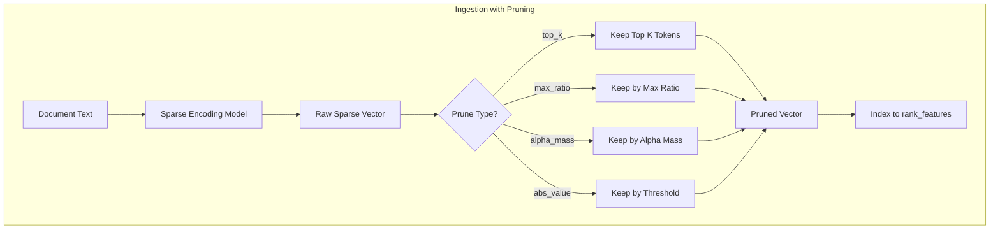

---
tags:
  - neural-search
---
# Neural Sparse Search Pruning

## Summary

OpenSearch v2.19.0 introduces pruning support for neural sparse search, enabling users to reduce index size and accelerate search speed with minimal impact on search relevance. Pruning removes low-weight tokens from sparse vectors during ingestion and search, addressing the long-tail distribution of token weights that can significantly increase storage requirements.

## Details

### What's New in v2.19.0

This release adds configurable pruning strategies to both the `sparse_encoding` ingest processor and the `neural_sparse_two_phase_processor` search pipeline processor.

### Pruning Strategies

Four pruning strategies are now available:

| Prune Type | Description | Valid Ratio Range |
|------------|-------------|-------------------|
| `top_k` | Keeps only the top K tokens with highest weights | Positive integer |
| `max_ratio` | Keeps tokens whose weight is within ratio of max weight | [0, 1) |
| `alpha_mass` | Keeps tokens whose cumulative sum is within ratio of total | [0, 1) |
| `abs_value` | Keeps tokens with weight above absolute threshold | Non-negative float |

### Architecture



### Configuration

#### Ingest Processor Configuration

```json
PUT /_ingest/pipeline/sparse-pipeline
{
  "processors": [
    {
      "sparse_encoding": {
        "model_id": "<model-id>",
        "field_map": {
          "text": "text_sparse"
        },
        "prune_type": "max_ratio",
        "prune_ratio": 0.1
      }
    }
  ]
}
```

#### Two-Phase Search Processor Configuration

```json
PUT /_search/pipeline/two-phase-pipeline
{
  "request_processors": [
    {
      "neural_sparse_two_phase_processor": {
        "enabled": true,
        "two_phase_parameter": {
          "prune_type": "max_ratio",
          "prune_ratio": 0.4,
          "expansion_rate": 5.0,
          "max_window_size": 10000
        }
      }
    }
  ]
}
```

### Technical Changes

#### New Classes
- `PruneType` enum: Defines pruning strategy types (`NONE`, `TOP_K`, `ALPHA_MASS`, `MAX_RATIO`, `ABS_VALUE`)
- `PruneUtils` utility class: Implements pruning algorithms and validation

#### Modified Components
- `SparseEncodingProcessor`: Added `prune_type` and `prune_ratio` parameters
- `SparseEncodingProcessorFactory`: Added validation for pruning configuration
- `NeuralSparseTwoPhaseProcessor`: Refactored to use `PruneUtils` for token splitting
- `NeuralSparseQueryBuilder`: Updated to support configurable prune types

### Performance Impact

Research indicates that using `max_ratio` with a value of `0.1` provides strong generalization:
- Reduces storage requirements by approximately 40%
- Incurs less than 1% loss in search relevance

## Limitations

- `prune_ratio` is required when `prune_type` is specified (except for `none`)
- Cannot specify `prune_ratio` without `prune_type`
- Pruning validation differs by type:
  - `top_k`: Must be a positive integer
  - `max_ratio` and `alpha_mass`: Must be in range [0, 1)
  - `abs_value`: Must be non-negative

## References

### Pull Requests
| PR | Description | Related Issue |
|----|-------------|---------------|
| [#988](https://github.com/opensearch-project/neural-search/pull/988) | Implement pruning for neural sparse ingestion pipeline and two-phase search processor | [#946](https://github.com/opensearch-project/neural-search/issues/946) |

### Documentation
- [Sparse Encoding Processor](https://docs.opensearch.org/2.19/ingest-pipelines/processors/sparse-encoding/)
- [Neural Sparse Search](https://docs.opensearch.org/2.19/vector-search/ai-search/neural-sparse-search/)
- [Neural Sparse Two-Phase Processor](https://docs.opensearch.org/2.19/search-plugins/search-pipelines/neural-sparse-query-two-phase-processor/)

### Issues (Design / RFC)
- [#946](https://github.com/opensearch-project/neural-search/issues/946): RFC - Implement pruning for neural sparse search
