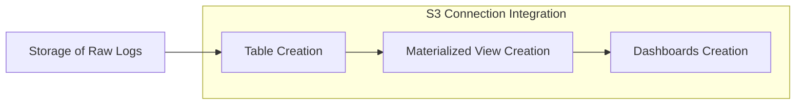

---
tags:
  - observability
---
# Observability SOP

## Summary

Added comprehensive Standard Operating Procedure (SOP) documentation for Integration and Vended Dashboards Setup in OpenSearch. This documentation provides step-by-step guidance for developers creating custom OpenSearch integrations and dashboards.

## Details

### What's New in v2.19.0

The PR adds extensive documentation covering the complete integration workflow:

1. **Integration Process Overview**: Explains the sequential steps from raw log storage through dashboard creation
2. **S3 Connection Integration**: Detailed setup for S3-based data sources
3. **Table Creation**: SQL examples for creating external tables with proper schema definitions
4. **Materialized View (MV) Creation**: Comprehensive guide for both full index and aggregated queries
5. **Dashboard Creation**: Step-by-step instructions for creating visualizations and index patterns
6. **Publishing to OpenSearch Catalog**: Guidelines for contributing integrations to the community

### Key Documentation Sections

| Section | Description |
|---------|-------------|
| General Principles | Field naming conventions and configuration alignment requirements |
| Table Creation | External table creation with schema matching raw data |
| MV Creation | Full index vs aggregated query approaches with trade-offs |
| Dashboard Creation | Index pattern setup and visualization configuration |
| Troubleshooting | Common issues and debugging strategies |

### Integration Workflow

### MV Query Types

The documentation covers two approaches for Materialized View creation:

**Full Index Query**
- Preserves all raw data details
- Suitable for detailed analysis and auditing
- Larger index size

**Aggregated Query**
- Uses time windowing (TUMBLE) for data summarization
- Reduces storage requirements
- Better for trend analysis and reporting

### Naming Conventions

The SOP establishes field naming standards:
- Dot-notation for hierarchical fields (e.g., `aws.vpc.srcaddr`)
- Descriptive prefixes for namespacing
- Consistent abbreviations (src, dst)

## Limitations

- Documentation is specific to S3-based integrations
- Aggregated MVs may not perform well with high-cardinality fields
- Requires proper IAM permissions for S3 access

## References

### Pull Requests
| PR | Description | Related Issue |
|----|-------------|---------------|
| [#2299](https://github.com/opensearch-project/dashboards-observability/pull/2299) | SOP for Integration and Vended Dashboards Setup | - |

### Documentation
- [OpenSearch Spark Documentation](https://github.com/opensearch-project/opensearch-spark/blob/main/docs/index.md)
- [OpenSearch Catalog Integration Guide](https://github.com/opensearch-project/opensearch-catalog/blob/main/docs/integrations/README.md)
- [Creating Dashboards in OpenSearch](https://opensearch.org/docs/latest/dashboards/dashboard/index/)
