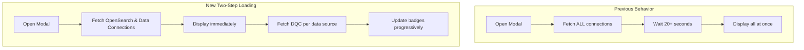

---
tags:
  - opensearch-dashboards
---
# Data Source Association

## Summary

This release introduces two-step loading for the "Associate data sources" modal in OpenSearch Dashboards workspaces. The enhancement addresses performance issues when data sources have numerous direct query connections, reducing initial load time from over 20 seconds to near-instant display.

## Details

### What's New in v2.19.0

The data source association modal now uses a progressive loading approach:

1. **Initial Load**: OpenSearch connections and data connections are displayed immediately
2. **Deferred Load**: Direct query connections are fetched asynchronously per data source
3. **Visual Feedback**: A "loading" badge appears while fetching related connections, replaced by "+N related" badge upon completion

### Technical Changes



### Implementation Details

| Component | Change |
|-----------|--------|
| `AssociationDataSourceModal` | Refactored to use two-step loading pattern |
| `fetchDirectQueryConnectionsByIDs` | New utility function for fetching DQC by data source IDs |
| `convertDataSourcesToOpenSearchAndDataConnections` | New utility to separate connection types |
| `handleDirectQueryConnections` | New callback for async DQC fetching |

### New Utility Functions

```typescript
// Fetch direct query connections for specific data source IDs
export const fetchDirectQueryConnectionsByIDs = async (
  dataSourceIds: string[],
  http: HttpSetup | undefined,
  notifications: NotificationsStart | undefined
) => {
  // Fetches and returns sorted direct query connections
};

// Separate data sources into OpenSearch connections and data connections
export const convertDataSourcesToOpenSearchAndDataConnections = (
  dataSources: DataSource[]
) => {
  return {
    openSearchConnections: DataSourceConnection[],
    dataConnections: DataSourceConnection[]
  };
};
```

### User Experience

- **OpenSearch Connections Mode**: Shows all OpenSearch data sources immediately; data connections also visible
- **Direct Query Connections Mode**: Shows only data sources with DQC; connections load progressively with "loading" badge

## Limitations

- Direct query connections are fetched sequentially per data source (parallel fetching with Promise.all)
- Badge updates may cause minor UI reflows as connections load
- Error handling shows toast notification if DQC fetch fails for any data source

## References

### Documentation
- [Create a Workspace](https://docs.opensearch.org/2.19/dashboards/workspace/create-workspace/): Workspace creation with data source association
- [Manage Workspaces](https://docs.opensearch.org/2.19/dashboards/workspace/manage-workspace/): Data source management in workspaces

### Pull Requests
| PR | Description | Related Issue |
|----|-------------|---------------|
| [#8999](https://github.com/opensearch-project/OpenSearch-Dashboards/pull/8999) | Add two-steps loading for associating data sources | - |
