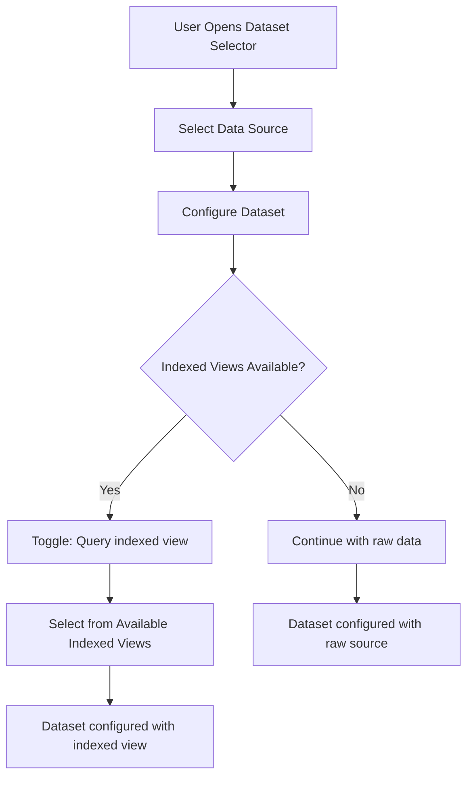

---
tags:
  - opensearch-dashboards
---
# Dataset Selector

## Summary

OpenSearch Dashboards v2.19.0 enhances the Dataset Selector with two key features: support for indexed views in the dataset selection workflow, and custom time filter logic based on dataset type. These changes enable users to query pre-indexed views for faster performance and allow dataset types to control how time filters are applied.

## Details

### What's New in v2.19.0

#### Indexed Views Framework

The Dataset Selector now supports selecting indexed views as an alternative to querying raw external data sources. Indexed views are OpenSearch indexes created from external sources (like S3) that provide faster query performance.



Key components added:
- `DatasetIndexedViewsService` interface for fetching indexed views
- `indexedViewsService` property on `DatasetTypeConfig`
- `sourceDatasetRef` property on `Dataset` to track the original source
- UI toggle "Query indexed view" in the Configurator

#### Custom Time Filter Logic

Dataset types can now override the date picker behavior per language using `languageOverrides`. This allows external data sources to handle time filtering through their own search strategies rather than the default client-side approach.

```typescript
// DatasetTypeConfig with language overrides
{
  id: 's3',
  title: 'S3',
  languageOverrides: {
    PPL: { hideDatePicker: false },  // Show date picker, but handle time filter in search strategy
    SQL: { hideDatePicker: false }
  },
  meta: {
    supportsTimeFilter: true
  }
}
```

The time filter is now passed to the search strategy via `timeRange` in the request body, allowing server-side time filtering.

### Technical Changes

#### New Interfaces

| Interface | Description |
|-----------|-------------|
| `DatasetIndexedView` | Represents an indexed view with `name` property |
| `DatasetIndexedViewsService` | Service for fetching indexed views and connected data sources |

#### Dataset Type Configuration

| Property | Description |
|----------|-------------|
| `languageOverrides` | Per-language configuration overrides |
| `languageOverrides[lang].hideDatePicker` | Override date picker visibility for specific language |
| `indexedViewsService` | Service for indexed view operations |

#### Dataset Properties

| Property | Description |
|----------|-------------|
| `sourceDatasetRef` | Reference to source dataset (id and type) when using indexed view |

#### Search Interceptor Changes

PPL and SQL search interceptors now:
1. Check for `languageOverrides[language].hideDatePicker === false`
2. Pass `timeRange` to the server when dataset handles time filtering
3. Skip client-side time filter injection when dataset handles it

### Banner Framework

A new framework allows dataset types to display contextual banners in the Discover results canvas. This can be used to:
- Show callouts for creating indexed views
- Provide entry points to switch between indexed views
- Display dataset-specific actions

The banner is rendered via `QueryEditorExtension.getBottomPanel()`.

## Limitations

- Indexed views framework requires dataset type to implement `indexedViewsService`
- Time filter override only works when `hideDatePicker: false` is explicitly set
- Banner framework requires query editor extension configuration

## References

### Pull Requests
| PR | Description | Related Issue |
|----|-------------|---------------|
| [#8851](https://github.com/opensearch-project/OpenSearch-Dashboards/pull/8851) | Indexed views framework - show indexed views in dataset selector and add banner framework | New feature |
| [#8932](https://github.com/opensearch-project/OpenSearch-Dashboards/pull/8932) | Support custom logic to insert time filter based on dataset type | Continues [#8917](https://github.com/opensearch-project/OpenSearch-Dashboards/pull/8917) |
