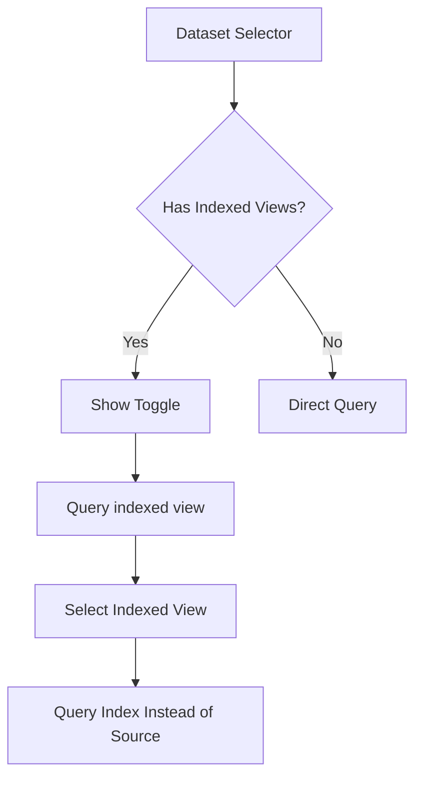

---
tags:
  - opensearch-dashboards
---
# Discover Enhancements

## Summary

OpenSearch Dashboards v2.19.0 introduces several enhancements to the Discover application, including an indexed views framework for the dataset selector, a banner framework for the results canvas, data2summary agent validation for the summary panel, and a framework for default query strings based on dataset and language combinations.

## Details

### What's New in v2.19.0

#### Indexed Views Framework

A new framework enables dataset types to provide indexed views in the dataset selector. Indexed views are OpenSearch indexes created for external sources like S3, allowing users to query pre-indexed data for improved performance.

Key components:
- `DatasetIndexedViewsService` interface for fetching indexed views
- `indexedViewsService` property in `DatasetTypeConfig`
- "Query indexed view" toggle in the dataset configurator
- Automatic data source connection resolution for indexed views

#### Results Canvas Banner Framework

A new extension point allows plugins to display banners at the top of the Discover results canvas. This framework supports:
- Dynamic banner rendering based on dataset type
- Actions related to the selected dataset (e.g., create indexed view prompts)
- Entry points for indexed view selection when querying external sources

#### Data2Summary Agent Check

The data summary panel now validates the presence of the `data2summary` agent before displaying. If a query assistant agent exists but no summary agent is configured, the summary panel will not be shown.

#### Default Query String Framework

A new framework allows dataset types to provide default query strings based on the dataset and language combination. If not provided by the dataset type, the system falls back to language service defaults.

### Technical Changes

| Component | Change |
|-----------|--------|
| `Dataset` type | Added `sourceDatasetRef` property for indexed view references |
| `DatasetTypeConfig` | Added `indexedViewsService` property |
| `QueryEditorExtension` | Added `getBottomPanel` method and `bottomPanelContainer` |
| `QueryEditorExtensionDependencies` | Added `query` and `fetchStatus` properties |
| Dataset Selector | Icon now resolves from `sourceDatasetRef.type` for indexed views |
| Configurator | Added indexed view selection UI with toggle switch |

### Components Added

| Component | Description |
|-----------|-------------|
| `DatasetIndexedViewsService` | Service interface for indexed view operations |
| `DatasetIndexedView` | Type representing an indexed view with name property |
| Bottom Panel Extension | New extension point below query editor |

## Limitations

- Indexed views framework requires dataset type configuration to implement `indexedViewsService`
- Banner framework is only available when query enhancements are enabled
- Data summary requires both query assistant and data2summary agents to be configured

## References

### Pull Requests
| PR | Description | Related Issue |
|----|-------------|---------------|
| [#8682](https://github.com/opensearch-project/OpenSearch-Dashboards/pull/8682) | Add data test subject for discover cypress test |   |
| [#8716](https://github.com/opensearch-project/OpenSearch-Dashboards/pull/8716) | Add data2summary agent check in data summary panel |   |
| [#8851](https://github.com/opensearch-project/OpenSearch-Dashboards/pull/8851) | Indexed views framework - banner and dataset selector |   |
| [#8896](https://github.com/opensearch-project/OpenSearch-Dashboards/pull/8896) | Framework for default query string using dataset and language |   |
