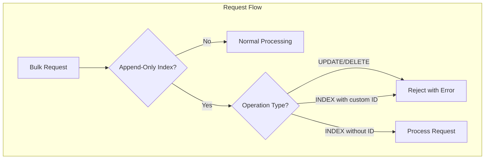

---
tags:
  - opensearch
---
# Append Only Indices

## Summary

OpenSearch 2.19.0 introduces append-only indices, a new index mode that disables update and delete operations on documents. This feature is designed for time-series use cases like logs, metrics, observability, and security events where documents are immutable after ingestion.

## Details

### What's New in v2.19.0

Append-only indices provide a way to enforce document immutability at the index level. When enabled, the index rejects:
- UPDATE operations
- DELETE operations
- UPSERT operations
- UPDATE BY QUERY operations
- DELETE BY QUERY operations
- INDEX operations with custom document IDs

### Configuration

Enable append-only mode using the `index.append_only.enabled` setting:

```json
PUT /my-index
{
  "settings": {
    "index.append_only.enabled": true
  }
}
```

| Setting | Type | Default | Description |
|---------|------|---------|-------------|
| `index.append_only.enabled` | Boolean | `false` | Enables append-only mode for the index. This is a final setting and cannot be changed after index creation. |

### Technical Changes

The implementation adds validation at multiple layers:



Key implementation details:
- `IndexMetadata.INDEX_APPEND_ONLY_ENABLED_SETTING`: New index-scoped setting with `Property.Final`
- `TransportBulkAction`: Validates operations before routing to shards
- `InternalEngine`: Handles retry scenarios for append-only indices without creating duplicate translog entries
- `AppendOnlyIndexOperationRetryException`: New exception type for retry handling

### Retry Handling

For append-only indices, the engine detects retry scenarios by checking if a document with the same auto-generated ID already exists. Instead of creating a duplicate, it returns the existing document's version, preventing duplicate entries during network retries.

## Limitations

- The `index.append_only.enabled` setting is final and cannot be changed after index creation
- Custom document IDs are not allowed; OpenSearch auto-generates IDs
- `_split` and `_shrink` APIs may have restrictions (planned for future enforcement)
- This is the initial implementation; future versions may add optimizations like:
  - Automated rollovers
  - Optimized merge policies
  - Integration with writable warm storage

## References

### Pull Requests

| PR | Description | Related Issue |
|----|-------------|---------------|
| [#17039](https://github.com/opensearch-project/OpenSearch/pull/17039) | Add support for append only indices | [#12886](https://github.com/opensearch-project/OpenSearch/issues/12886) |

### Related Issues

- [#12886](https://github.com/opensearch-project/OpenSearch/issues/12886) - RFC: Append-only Indices
