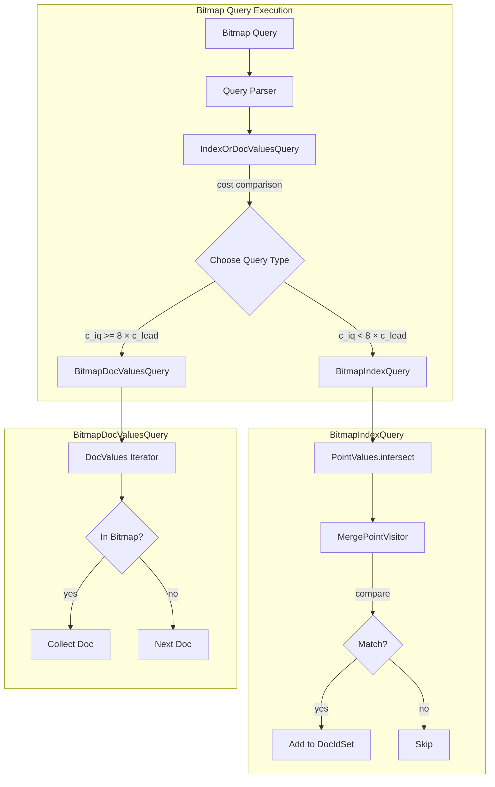

---
tags:
  - opensearch
---
# Bitmap Filtering Performance Improvement

## Summary

OpenSearch 2.19.0 introduces a new `BitmapIndexQuery` that significantly improves the performance of bitmap filtering operations. This enhancement addresses performance bottlenecks in the constructor and cost estimation of the previous `PointInSetQuery`-based implementation, providing faster query execution especially when combined with other filters.

## Details

### What's New in v2.19.0

The key improvement is a new specialized index query (`BitmapIndexQuery`) that replaces the previous `PointInSetQuery`-based implementation. This new query:

1. **Leverages point index structure**: Traverses the BKD tree (point values index) directly to find matching document IDs
2. **Supports IndexOrDocValuesQuery**: Enables runtime selection between index-based and doc-values-based execution
3. **Optimized cost estimation**: Uses bitmap cardinality with a 20x penalty factor for accurate cost estimation

### Architecture



### Components

| Component | Description |
|-----------|-------------|
| `BitmapIndexQuery` | New index-based query using point values traversal |
| `BitmapDocValuesQuery` | Existing doc-values-based query (unchanged) |
| `MergePointVisitor` | Visitor that merges bitmap values with point index |
| `BitmapIterator` | Iterator over encoded bitmap values with advance support |

### Performance Characteristics

| Scenario | Best Query Type | Reason |
|----------|-----------------|--------|
| Small bitmap (< 0.1% of docs) | BitmapIndexQuery | Index traversal faster for sparse matches |
| Large bitmap (> 1% of docs) | BitmapDocValuesQuery | Sequential scan more efficient |
| With selective filter | BitmapIndexQuery via IndexOrDocValuesQuery | Runtime cost comparison selects optimal path |

### Cost Estimation

The cost of `BitmapIndexQuery` is calculated as:

```
cost = bitmap.cardinality × 20
```

The 20x penalty factor was determined through benchmarking to ensure proper selection between index and doc-values queries in conjunction queries.

### Benchmark Results

Testing on a 100 million document index with 3 nodes:

| Query Size | Index Query | Doc Values Query | Improvement |
|------------|-------------|------------------|-------------|
| 10³ (0.001%) | ~50ms | ~200ms | 4x faster |
| 10⁴ (0.01%) | ~100ms | ~250ms | 2.5x faster |
| 10⁵ (0.1%) | ~200ms | ~300ms | 1.5x faster |
| 10⁶ (1%) | ~500ms | ~400ms | DV faster |

### Usage Example

No API changes required. The optimization is automatic when using bitmap filtering:

```json
POST products/_search
{
  "query": {
    "bool": {
      "filter": [
        {
          "term": { "category": "electronics" }
        },
        {
          "terms": {
            "product_id": ["<base64-encoded-bitmap>"],
            "value_type": "bitmap"
          }
        }
      ]
    }
  }
}
```

## Limitations

- Only applies to integer fields with point values (index enabled)
- Cost estimation heuristic may not be optimal for all data distributions
- Requires bitmap to be pre-computed and Base64 encoded

## References

### Pull Requests
| PR | Description | Related Issue |
|----|-------------|---------------|
| [#16936](https://github.com/opensearch-project/OpenSearch/pull/16936) | Improve performance of the bitmap filtering | [#16317](https://github.com/opensearch-project/OpenSearch/issues/16317) |

### Issues
- [#16317](https://github.com/opensearch-project/OpenSearch/issues/16317): Bitmap Filtering Performance Improvement - identified bottlenecks in PointInSetQuery

### Documentation
- [Terms Query - Bitmap Filtering](https://docs.opensearch.org/2.19/query-dsl/term/terms/#bitmap-filtering): Official documentation
- [Bitmap Filtering Blog](https://opensearch.org/blog/introduce-bitmap-filtering-feature/): Feature introduction and best practices
