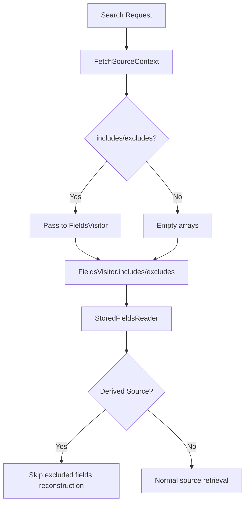

---
tags:
  - opensearch
---
# Fetch Source Context

## Summary

This enhancement propagates `sourceIncludes` and `sourceExcludes` fields from `FetchSourceContext` to `FieldsVisitor`, enabling downstream components to access source filtering information during document retrieval. This is a foundational change that supports the Derived Source feature by allowing the system to skip reconstruction of vector fields that will be excluded from the response.

## Details

### What's New in v2.19.0

The `FieldsVisitor` class now carries source include/exclude information from the search context, making it available to lower-level components during the fetch phase.

### Technical Changes

#### FieldsVisitor Enhancements

New constructors and accessor methods were added to `FieldsVisitor`:

| Method | Description |
|--------|-------------|
| `FieldsVisitor(boolean loadSource, String[] includes, String[] excludes)` | Constructor accepting source filtering parameters |
| `includes()` | Returns array of fields to include in source |
| `excludes()` | Returns array of fields to exclude from source |

#### FetchPhase Integration

The `FetchPhase.createStoredFieldsVisitor()` method now passes `FetchSourceContext` includes/excludes to the `FieldsVisitor`:

```java
return new FieldsVisitor(
    loadSource,
    context.hasFetchSourceContext() ? context.fetchSourceContext().includes() : null,
    context.hasFetchSourceContext() ? context.fetchSourceContext().excludes() : null
);
```

### Use Case: Derived Source Optimization

This change addresses an open question from the Derived Source RFC (k-NN #2377): how to avoid reconstructing vectors that will be filtered out anyway.

When a user excludes vector fields from the source:
```json
POST some_index/_search
{
  "_source": {
    "excludes": ["my_vector1"]
  }
}
```

The `FieldsVisitor` now carries this exclusion information, allowing derived source implementations to skip expensive vector reconstruction for excluded fields.

### Architecture



## Limitations

- This change only propagates the filtering information; actual filtering still occurs at higher levels
- The optimization benefit is realized when combined with Derived Source feature

## References

### Pull Requests

| PR | Description | Related Issue |
|----|-------------|---------------|
| [#17080](https://github.com/opensearch-project/OpenSearch/pull/17080) | Propagate includes and excludes from fetchSourceContext to FieldsVisitor | [k-NN #2377](https://github.com/opensearch-project/k-NN/issues/2377) |

### Related Issues

- [k-NN #2377](https://github.com/opensearch-project/k-NN/issues/2377) - RFC: Derived Source for Vectors

### Documentation

- [Source field](https://docs.opensearch.org/2.19/field-types/metadata-fields/source/) - OpenSearch documentation on _source field filtering
