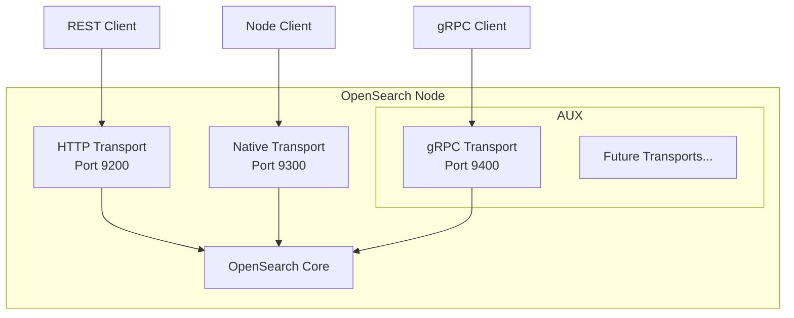

---
tags:
  - opensearch
---
# gRPC Transport

## Summary

OpenSearch v2.19.0 introduces a framework for auxiliary transports and an experimental gRPC transport plugin. This enables pluggable transport implementations that run in parallel to the existing HTTP and native transport servers, with gRPC as the first implementation. The gRPC transport provides a high-performance, binary-encoded communication protocol using protocol buffers.

## Details

### What's New in v2.19.0

**Auxiliary Transport Framework:**
A new pluggable framework allows multiple transport implementations to run alongside the default HTTP transport. Key components:

| Component | Description |
|-----------|-------------|
| `AuxTransport` | Abstract base class for auxiliary transports with lifecycle management |
| `NetworkPlugin.getAuxTransports()` | Plugin extension point to register auxiliary transports |
| `AUX_TRANSPORT_TYPES_SETTING` | Setting to enable specific auxiliary transports |

**Experimental gRPC Transport Plugin:**
The `transport-grpc` plugin implements gRPC as an auxiliary transport:

| Feature | Description |
|---------|-------------|
| gRPC Server | Netty4-based gRPC server implementation |
| Health Check | Built-in `grpc.health.v1.Health/Check` service |
| Service Discovery | Built-in `list` service for discovering available services |
| Default Port Range | `9400-9500` |

### Architecture



### Configuration

| Setting | Description | Default |
|---------|-------------|---------|
| `aux.transport.types` | List of auxiliary transports to enable | `[]` |
| `aux.transport.experimental-transport-grpc.port` | Port range for gRPC transport | `9400-9500` |

### Enabling gRPC Transport

Add to `opensearch.yml`:

```yaml
aux.transport.types: [experimental-transport-grpc]
aux.transport.experimental-transport-grpc.port: 9400-9500
```

Or run with the plugin installed:

```bash
./gradlew run -PinstalledPlugins="['transport-grpc']"
```

### Testing gRPC Services

Use `grpcurl` to interact with the gRPC server:

```bash
# List available services
grpcurl -plaintext localhost:9400 list

# Health check
grpcurl -plaintext localhost:9400 grpc.health.v1.Health/Check
```

### Technical Implementation

The implementation adds:

| File | Purpose |
|------|---------|
| `AuxTransport.java` | Abstract base class defining auxiliary transport lifecycle |
| `NetworkPlugin.java` | Extended with `getAuxTransports()` method |
| `GrpcPlugin.java` | Plugin entry point registering gRPC transport |
| `Netty4GrpcServerTransport.java` | gRPC server implementation using Netty4 |

Key settings defined in `AuxTransport`:

```java
public static final String AUX_SETTINGS_PREFIX = "aux.transport.";
public static final String AUX_TRANSPORT_TYPES_KEY = AUX_SETTINGS_PREFIX + "types";
public static final String AUX_PORT_DEFAULTS = "9400-9500";
```

## Limitations

- **Experimental status**: The gRPC transport is marked as experimental
- **Limited services**: Only health check and service discovery available in v2.19.0
- **No API endpoints**: Document and search APIs added in later versions (v3.0.0+)
- **Manual installation**: Requires explicit plugin installation and configuration

## References

### Pull Requests
| PR | Description | Related Issue |
|----|-------------|---------------|
| [#16534](https://github.com/opensearch-project/OpenSearch/pull/16534) | Introduce framework for auxiliary transports and experimental gRPC transport plugin | - |

### Related RFCs
- [opensearch-api-specification#677](https://github.com/opensearch-project/opensearch-api-specification/issues/677): Generation of protobuf files from API specification
- [opensearch-api-specification#653](https://github.com/opensearch-project/opensearch-api-specification/issues/653): Protobuf generation RFC
