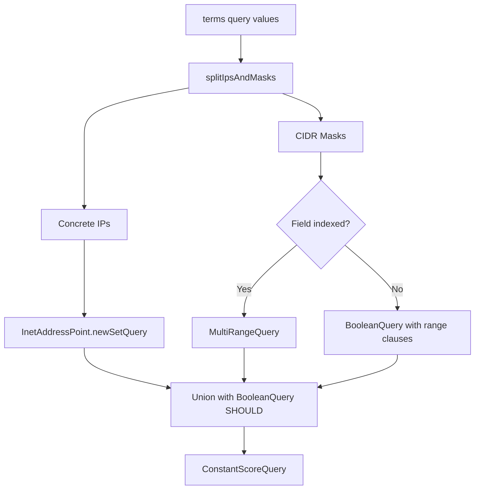

---
tags:
  - opensearch
---
# IP Field Terms Query

## Summary

Enhanced the `terms` query for indexed IP fields to support more than 1024 IP masks (CIDR notation values) by using Lucene's `MultiRangeQuery` instead of `BooleanQuery`. This removes the max clause count limitation that previously caused queries with many IP masks to fail.

## Details

### What's New in v2.19.0

Prior to this release, using a `terms` query on an IP field with more than 1024 CIDR notation values (e.g., `192.168.0.0/24`) would fail with a `TooManyClauses` error because each mask was converted to a clause in a `BooleanQuery`, which has a default limit of 1024 clauses.

This enhancement refactors the `IpFieldMapper` to:
1. Split input values into concrete IP addresses and CIDR masks
2. Handle concrete IPs using `InetAddressPoint.newSetQuery` (efficient point query)
3. Handle CIDR masks using `MultiRangeQuery` for indexed fields (no clause limit)
4. Fall back to `BooleanQuery` only for doc_values-only fields (still subject to clause limit)

### Technical Changes

The `IpFieldMapper.IpFieldType.termsQuery()` method was refactored:

| Component | Description |
|-----------|-------------|
| `splitIpsAndMasks()` | Separates input values into concrete IPs and CIDR masks |
| `convertIps()` | Creates efficient point/set queries for concrete IP addresses |
| `convertMasks()` | Creates `MultiRangeQuery` for indexed fields, range queries for doc_values |
| `MultiIpRangeQueryBuilder` | New inner class extending `MultiRangeQuery.Builder` for IP ranges |



### Query Behavior by Field Configuration

| Field Config | Concrete IPs | CIDR Masks | Clause Limit |
|--------------|--------------|------------|--------------|
| Indexed + doc_values | `IndexOrDocValuesQuery` | `MultiRangeQuery` | None |
| Indexed only | `InetAddressPoint.newSetQuery` | `MultiRangeQuery` | None |
| Doc_values only | `SortedSetDocValuesField.newSlowSetQuery` | `BooleanQuery` with range clauses | 1024 |

### Example

```json
GET logs/_search
{
  "query": {
    "terms": {
      "client_ip": [
        "192.168.1.0/24",
        "10.0.0.0/8",
        "172.16.0.0/12",
        "... more than 1024 CIDR masks ..."
      ]
    }
  }
}
```

This query now succeeds for indexed IP fields regardless of the number of CIDR masks.

## Limitations

- Doc_values-only IP fields (`index: false`) are still subject to the 1024 clause limit for CIDR masks
- The enhancement only applies to `terms` queries; other query types are unaffected
- Performance may vary based on the number and specificity of CIDR ranges

## References

### Pull Requests
| PR | Description | Related Issue |
|----|-------------|---------------|
| [#16391](https://github.com/opensearch-project/OpenSearch/pull/16391) | Support more than 1024 IP/masks with indexed field | [#16200](https://github.com/opensearch-project/OpenSearch/issues/16200) |

### Documentation
- [IP address field type](https://docs.opensearch.org/2.19/field-types/supported-field-types/ip/)
- [Terms query](https://docs.opensearch.org/2.19/query-dsl/term/terms/)

### Related Resources
- [Forum discussion: terms search gives error failed to create query maxclausecount is set to 1024](https://forum.opensearch.org/t/terms-search-gives-error-failed-to-create-query-maxclausecount-is-set-to-1024/21729/8)
