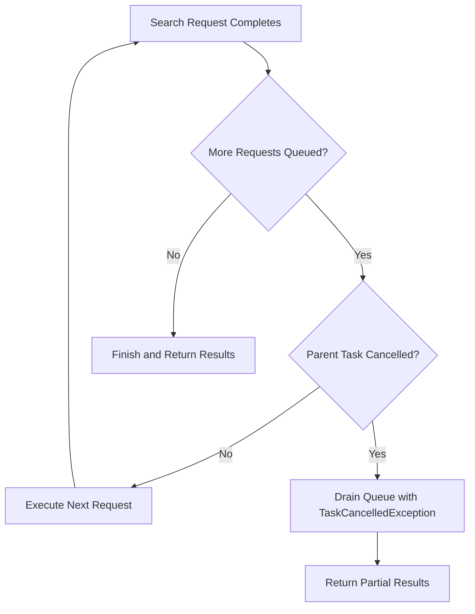

---
tags:
  - opensearch
---
# Multi-Search Request Cancellation Fix

## Summary

Fixed a bug where the `_msearch` API would continue executing queued search requests even after the parent task was cancelled. With this fix, OpenSearch now properly stops processing remaining search requests when the multi-search task is cancelled or times out.

## Details

### What's New in v2.19.0

The Multi-Search API executes multiple search requests concurrently up to `max_concurrent_searches`, queuing additional requests to run as earlier ones complete. Prior to this fix, if the parent `_msearch` task was cancelled (due to timeout or explicit cancellation), the queued requests would still be executed, causing:

1. Unnecessary resource consumption
2. `TaskCancelledException` errors with stack traces
3. "Zombie" `indices:data/read/msearch` tasks that never complete

### Technical Changes

The fix adds cancellation checking in `TransportMultiSearchAction`:

Key implementation details:
- Added `isCancelled()` method to check parent task status via `TaskManager`
- When cancellation detected, remaining queued requests are drained
- Each drained request receives a `TaskCancelledException` response
- Response counter is properly decremented to ensure clean completion

### Changed Files

| File | Change |
|------|--------|
| `TransportMultiSearchAction.java` | Added cancellation check and queue draining logic |

## Limitations

- Requests already in-flight when cancellation occurs will complete normally
- Only affects queued requests that haven't started execution

## References

### Pull Requests
| PR | Description | Related Issue |
|----|-------------|---------------|
| [#17005](https://github.com/opensearch-project/OpenSearch/pull/17005) | Stop processing search requests when _msearch is canceled | [#17004](https://github.com/opensearch-project/OpenSearch/issues/17004) |

### Issues
- [#17004](https://github.com/opensearch-project/OpenSearch/issues/17004): Bug report describing the cancellation handling issue
