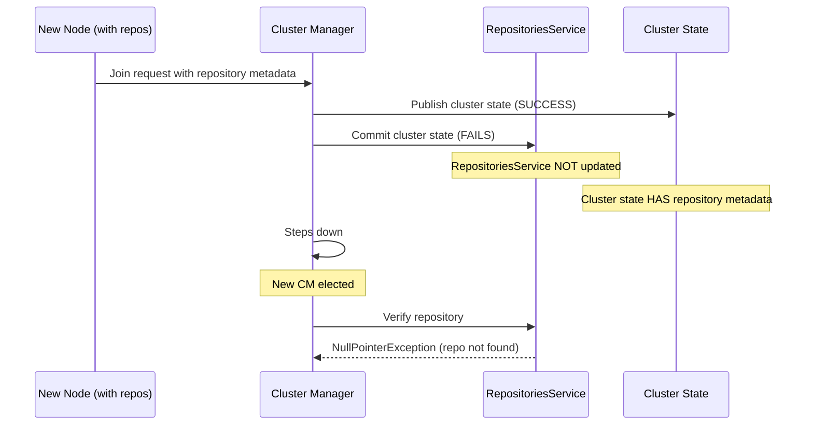

---
tags:
  - opensearch
---
# Remote Repository Validation

## Summary

This fix addresses a critical bug where NullPointerExceptions occurred during node joins when the RepositoriesService was not synchronized with the cluster state. The issue manifested when a cluster state publish operation succeeded but the commit operation failed, leaving the repository metadata in an inconsistent state.

## Details

### What's New in v2.19.0

The fix skips remote repository validations during node joins when the RepositoriesService is detected to be out of sync with the cluster state metadata.

### Problem Background

When a new node with repository metadata joins a cluster:

1. The cluster manager publishes an updated cluster state containing the new node and its repository metadata
2. If the publish succeeds but the commit fails (due to network disruption or leader term issues), the cluster state is updated but cluster-state appliers are not executed
3. This results in the RepositoriesService not being updated with the new repository information
4. When a new cluster manager is elected, it attempts to verify repository metadata but encounters a NullPointerException because the repository object doesn't exist in the RepositoriesService



### Technical Changes

The fix modifies `RemoteStoreNodeService.updateRepositoriesMetadata()` to catch `RepositoryMissingException` when checking if a repository exists in the RepositoriesService. When this exception is caught, the validation is skipped with a warning log:

```
Skipping repositories metadata checks: Remote repository [{name}] is in the cluster state 
but not present in the repository service.
```

Additionally, an assertion was added to `RepositoriesService.ensureValidSystemRepositoryUpdate()` to explicitly check that the repository object is not null before accessing its methods.

### Files Changed

| File | Change |
|------|--------|
| `RemoteStoreNodeService.java` | Added try-catch for `RepositoryMissingException` to skip validation when repo not in service |
| `RepositoriesService.java` | Added assertion to verify repository is not null |

## Limitations

- This is a defensive fix that handles the edge case gracefully rather than preventing the root cause
- The warning log should be monitored as it indicates a cluster state inconsistency occurred

## References

### Pull Requests

| PR | Description | Related Issue |
|----|-------------|---------------|
| [#16763](https://github.com/opensearch-project/OpenSearch/pull/16763) | Skip remote-repositories validations for node-joins when RepositoriesService is not in sync with cluster-state | [#16762](https://github.com/opensearch-project/OpenSearch/issues/16762) |
