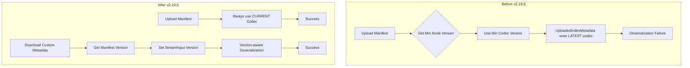

---
tags:
  - opensearch
---
# Remote State Manifest

## Summary

OpenSearch v2.19.0 includes deprecation changes to the remote cluster state manifest handling. These changes revert the minimum codec version upload logic and fix deserialization issues that caused cluster upgrade failures when upgrading from 2.16 or earlier to 2.17+.

## Details

### What's New in v2.19.0

Two key changes address remote cluster state manifest compatibility issues:

1. **Reverted Minimum Codec Version Upload Logic** (PR #16403): The logic that uploaded remote state manifests using the minimum codec version corresponding to the cluster's minimum node version has been reverted. The manifest now always uses `MANIFEST_CURRENT_CODEC_VERSION`.

2. **OpenSearch Version-Aware Deserialization** (PR #16494): Custom metadata deserialization now uses the OpenSearch version stored in the manifest to properly handle version-specific fields during cluster upgrades.

### Technical Changes

#### Problem Background

When upgrading clusters from 2.16 or earlier to 2.17+, new cluster manager nodes failed to join due to deserialization failures:

```
XContentParseException: [uploaded_index_metadata] unknown field [component_prefix]
```

The `component_prefix` field was added to `ClusterMetadataManifest.UploadedIndexMetadata` in version 2.15. In version 2.17, an enhancement (PR #15216) was added to support version upgrades by uploading manifests using the codec version corresponding to the minimum node version. However, `UploadedIndexMetadata` was still using the latest codec version, causing the `component_prefix` field to always be serialized even when older nodes couldn't deserialize it.

#### Solution



#### Key Code Changes

**RemoteManifestManager.java** - Always use current codec version:
```java
.codecVersion(ClusterMetadataManifest.MANIFEST_CURRENT_CODEC_VERSION)
```

**RemoteCustomMetadata.java** - Version-aware deserialization:
```java
this.customBlobStoreFormat = new ChecksumWritableBlobStoreFormat<>("custom", is -> {
    is.setVersion(version);
    return readFrom(is, namedWriteableRegistry, customType);
});
```

### Components Modified

| Component | Change |
|-----------|--------|
| `RemoteManifestManager` | Removed `codecVersion` parameter, always uses `MANIFEST_CURRENT_CODEC_VERSION` |
| `RemoteClusterStateService` | Removed codec version parameter from `writeFullMetadata()` |
| `GatewayMetaState` | Removed codec version calculation and parameter passing |
| `RemoteCustomMetadata` | Added version parameter for deserialization |
| `RemoteGlobalMetadataManager` | Passes manifest version to `RemoteCustomMetadata` |

## Limitations

- These changes are specifically for fixing upgrade compatibility issues
- Clusters must still follow proper rolling upgrade procedures
- The fix addresses custom metadata deserialization; other upgrade issues may require separate fixes

## References

### Pull Requests
| PR | Description | Related Issue |
|----|-------------|---------------|
| [#16403](https://github.com/opensearch-project/OpenSearch/pull/16403) | Revert uploading of remote cluster state manifest using min codec version | - |
| [#16494](https://github.com/opensearch-project/OpenSearch/pull/16494) | Add opensearch version info while deserialization | - |

### Related PRs
| PR | Description |
|----|-------------|
| [#15216](https://github.com/opensearch-project/OpenSearch/pull/15216) | Original enhancement to support version upgrade (reverted by #16403) |
