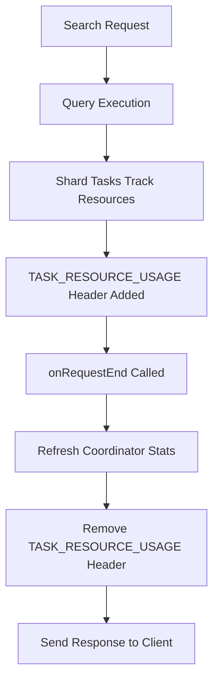

---
tags:
  - opensearch
---
# Search Response Headers

## Summary

This change removes the `TASK_RESOURCE_USAGE` header from HTTP search responses. The header was previously added to responses by the shard-level resource usage tracking feature introduced in v2.15.0, but it caused excessive headers to be sent to clients, potentially impacting latency.

## Details

### What's New in v2.19.0

The `TASK_RESOURCE_USAGE` header is now explicitly removed from search response headers before sending the response to the client. This header contained shard-level task resource usage information (CPU time, memory usage) that was intended for internal query-level resource tracking but was inadvertently exposed to clients.

### Technical Changes

The fix modifies the search request lifecycle to clean up internal headers:



Key changes:
- `SearchTaskRequestOperationsListener.onRequestEnd()` now calls `removeTaskResourceUsage()` after refreshing coordinator stats
- `SearchTaskRequestOperationsListener.onRequestFailure()` also removes the header on failures
- New `ThreadContext.removeResponseHeader()` method enables header removal
- New `TaskResourceTrackingService.removeTaskResourceUsage()` method encapsulates the cleanup

### Before/After Comparison

**Before (v2.15.0 - v2.18.x):**
```
HTTP/1.1 200 OK
TASK_RESOURCE_USAGE: {"action":"indices:data/read/search[phase/query]","taskId":898,"parentTaskId":865,"nodeId":"Ld-7uLOxQPOnDjnCnSuFRQ","taskResourceUsage":{"cpu_time_in_nanos":22979000,"memory_in_bytes":2000624}}
X-OpenSearch-Version: OpenSearch/3.0.0-SNAPSHOT (opensearch)
content-type: application/json; charset=UTF-8
```

**After (v2.19.0+):**
```
HTTP/1.1 200 OK
X-OpenSearch-Version: OpenSearch/3.0.0-SNAPSHOT (opensearch)
content-type: application/json; charset=UTF-8
```

### Files Changed

| File | Change |
|------|--------|
| `SearchTaskRequestOperationsListener.java` | Added header cleanup in `onRequestEnd()` and `onRequestFailure()` |
| `ThreadContext.java` | Added `removeResponseHeader()` method |
| `TaskResourceTrackingService.java` | Added `removeTaskResourceUsage()` method |

## Limitations

- The resource usage data is still collected internally for Query Insights and other monitoring features
- This change only affects the HTTP response headers sent to clients
- Internal cluster communication is not affected

## References

### Pull Requests
| PR | Description | Related Issue |
|----|-------------|---------------|
| [#16532](https://github.com/opensearch-project/OpenSearch/pull/16532) | Remove resource usages object from search response headers | - |
| [#13172](https://github.com/opensearch-project/OpenSearch/pull/13172) | Query-level resource usages tracking (original feature) | [#12399](https://github.com/opensearch-project/OpenSearch/issues/12399) |
