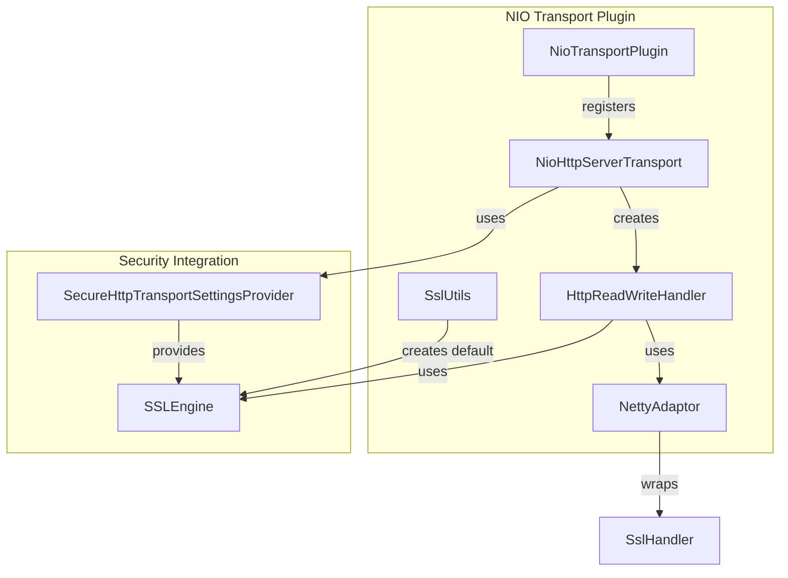

---
tags:
  - opensearch
---
# Security Transport NIO

## Summary

OpenSearch v2.19.0 adds secure HTTP transport support to the transport-nio plugin, enabling the security plugin to work with NIO-based HTTP transport. This allows users to configure `http.type: nio-http-transport-secure` for TLS/SSL-enabled HTTP connections using the NIO transport layer.

## Details

### What's New in v2.19.0

The transport-nio plugin now provides a secure HTTP transport variant (`nio-http-transport-secure`) that integrates with the OpenSearch security plugin. Previously, secure HTTP transport was only available through the Netty4 transport implementation.

### Technical Changes

The implementation adds SSL/TLS support to the NIO HTTP server transport through several key changes:

| Component | Change |
|-----------|--------|
| `NioHttpServerTransport` | Extended to accept `SecureHttpTransportSettingsProvider` for SSL configuration |
| `HttpReadWriteHandler` | Added SSL engine support with header verification and decompression handlers |
| `NettyAdaptor` | Modified to support SSL handler in the Netty pipeline |
| `NioTransportPlugin` | Registered new `nio-http-transport-secure` transport type |
| `SslUtils` | New utility class for creating default SSL engines |

### Configuration

To enable secure NIO HTTP transport, configure `opensearch.yml`:

```yaml
http.type: nio-http-transport-secure
```

The transport uses the security plugin's SSL configuration for certificate management.

### Architecture



### Key Implementation Details

1. **SSL Handler Integration**: The `NettyAdaptor` now accepts an optional `SslHandler` that is inserted into the Netty pipeline after the write captor
2. **Header Verification**: Support for custom header verifiers through `TransportAdapterProvider`
3. **Request Decompression**: Configurable decompressor providers for handling compressed requests
4. **Default SSL Engine**: `SslUtils` provides fallback SSL engine creation with TLSv1.3, TLSv1.2, and TLSv1.1 protocols

## Limitations

- This feature focuses on HTTP transport only; inter-node transport security continues to use existing mechanisms
- Requires the security plugin to be installed and configured for full TLS/SSL functionality

## References

### Pull Requests
| PR | Description | Related Issue |
|----|-------------|---------------|
| [#16474](https://github.com/opensearch-project/OpenSearch/pull/16474) | Ensure support of the transport-nio by security plugin (HTTP) | [#13245](https://github.com/opensearch-project/OpenSearch/issues/13245) |

### Related Issues
- [#13245](https://github.com/opensearch-project/OpenSearch/issues/13245) - [transport] Ensure support of the transport-nio by security plugin (HTTP)
- [#12903](https://github.com/opensearch-project/OpenSearch/issues/12903) - Parent issue for secure transport support

### Documentation
- [Network settings](https://docs.opensearch.org/2.19/install-and-configure/configuring-opensearch/network-settings/) - Transport configuration options
