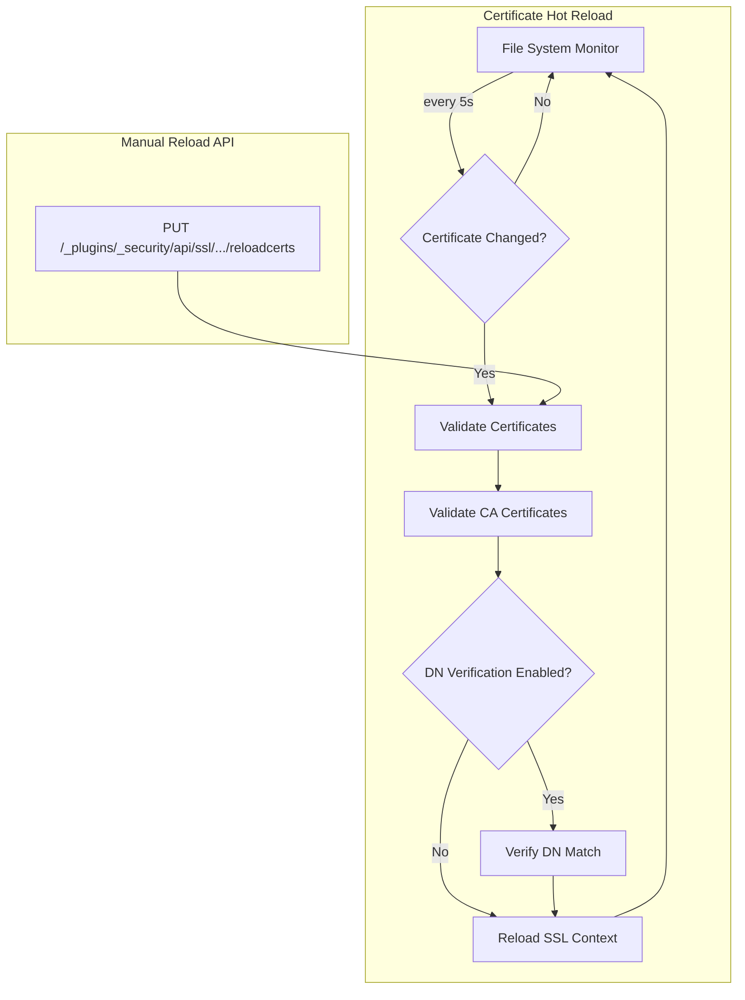

---
tags:
  - security
---
# Security Certificates

## Summary

OpenSearch v2.19.0 introduces significant enhancements to SSL/TLS certificate management in the Security plugin. The key improvements include automatic hot reloading of certificates from the file system, validation of authority certificates before SSL context reload, configurable DN verification during certificate hot reload, and bug fixes for JDK PKCS keystore/truststore configurations.

## Details

### What's New in v2.19.0

#### Certificate Hot Reload from File System

A new feature enables automatic hot reloading of TLS certificates by monitoring the file system. When enabled, OpenSearch monitors keystore resources every 5 seconds and automatically reloads certificates when changes are detected.

```yaml
# Enable automatic certificate hot reload
plugins.security.ssl.certificates_hot_reload.enabled: true
```

This addresses a limitation where the existing `PUT /_plugins/_security/api/ssl/{type}/reloadcerts` endpoint only reloaded certificates on the coordinator node, not across the entire cluster.

#### Configurable DN Verification for Hot Reload

Two new settings allow skipping Distinguished Name (DN) validation during certificate hot reload:

| Setting | Description | Default |
|---------|-------------|---------|
| `plugins.security.ssl.http.enforce_cert_reload_dn_verification` | Enforce DN verification for HTTP layer certificate reload | `true` |
| `plugins.security.ssl.transport.enforce_cert_reload_dn_verification` | Enforce DN verification for transport layer certificate reload | `true` |

When set to `false`, the DN validation (IssuerDN, SubjectDN, and SAN) is skipped during hot reload. This is useful for scenarios like Let's Encrypt certificate rotation where intermediate CAs may change.

```yaml
# Disable DN verification for certificate hot reload
plugins.security.ssl.http.enforce_cert_reload_dn_verification: false
plugins.security.ssl.transport.enforce_cert_reload_dn_verification: false
```

#### Authority Certificate Validation

Added validation of authority certificates prior to reloading the SSL context. This ensures that invalid or corrupted CA certificates are detected before they can cause SSL/TLS failures.

### Technical Changes

#### JDK PKCS Keystore/Truststore Fixes

- Set default value for key/trust store type as a constant for JDK PKCS setup
- Fixed SSL configuration issues for JDK PKCS setup that could cause initialization failures

### Architecture



## Limitations

- Hot reload monitoring interval is fixed at 5 seconds
- When DN verification is disabled, ensure proper security controls are in place as certificates from different CAs can be loaded
- The file system hot reload feature requires certificates to be stored in the OpenSearch config directory

## References

### Documentation
- [Configuring TLS Certificates](https://docs.opensearch.org/2.19/security/configuration/tls/): Official TLS configuration guide including hot reload settings

### Pull Requests
| PR | Description | Related Issue |
|----|-------------|---------------|
| [#4880](https://github.com/opensearch-project/security/pull/4880) | Add support for certificates hot reload | [#4427](https://github.com/opensearch-project/security/issues/4427) |
| [#4839](https://github.com/opensearch-project/security/pull/4839) | Allow skipping hot reload DN validation (backport) | [#4509](https://github.com/opensearch-project/security/issues/4509) |
| [#4862](https://github.com/opensearch-project/security/pull/4862) | Add validation of authority certificates (backport) | - |
| [#5003](https://github.com/opensearch-project/security/pull/5003) | Set default value for key/trust store type for JDK PKCS (backport) | - |
| [#5033](https://github.com/opensearch-project/security/pull/5033) | Fix SSL config for JDK PKCS setup (backport) | - |
