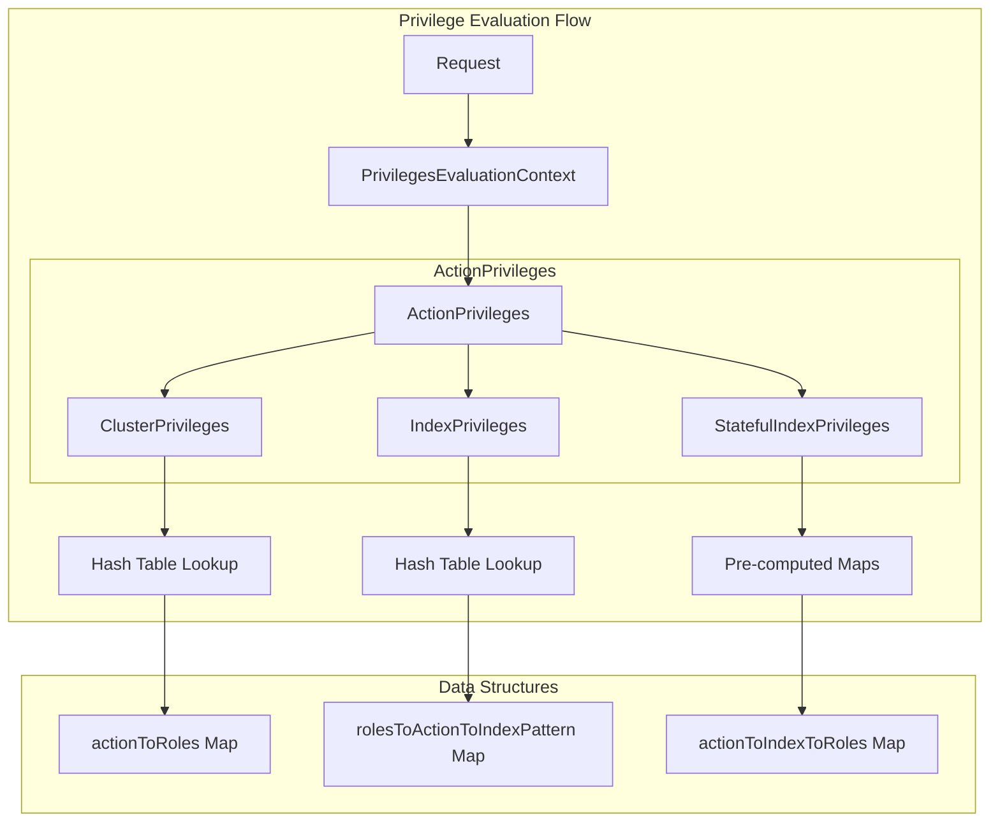

---
tags:
  - security
---
# Security Privilege Evaluation

## Summary

OpenSearch 2.19.0 introduces optimized privilege evaluation for action privileges, significantly improving performance for clusters with many indices. The new implementation uses hash-table-based data structures to achieve O(1) complexity for privilege checks, replacing the previous O(n²) algorithm that degraded performance as the number of indices grew.

## Details

### What's New in v2.19.0

The optimized privilege evaluation addresses a critical performance issue where the security layer's overhead increased quadratically with the number of indices in a cluster. Key improvements include:

1. **New ActionPrivileges Class**: Pre-computed, optimized data structures for checking action privileges
2. **Hash-Table Based Lookups**: Privilege checks now use O(1) hash table lookups instead of nested loops
3. **Denormalized Data Structures**: Role configurations are expanded into efficient lookup tables
4. **Feature Flag for Legacy Mode**: Setting `plugins.security.privileges_evaluation.use_legacy_impl` allows fallback to the old implementation

### Technical Changes

The implementation introduces several new components:

| Component | Description |
|-----------|-------------|
| `ActionPrivileges` | Main class for pre-computed privilege evaluation |
| `ClusterPrivileges` | Optimized cluster-level privilege checks |
| `IndexPrivileges` | Optimized index-level privilege checks |
| `StatefulIndexPrivileges` | Fully pre-computed index privilege maps based on cluster state |
| `IndexPattern` | Aggregates and segments index patterns for efficient matching |
| `PrivilegesEvaluationContext` | Request-scoped context with caching for privilege evaluation |

### Configuration

| Setting | Description | Default |
|---------|-------------|---------|
| `plugins.security.privileges_evaluation.use_legacy_impl` | Use legacy privilege evaluator | `false` |
| `plugins.security.privileges_evaluation.precomputed_privileges.max_heap_size` | Maximum heap for precomputed privileges | `10MB` |

### Performance Improvements

Benchmark results show significant throughput improvements:

- **100 indices**: Users with full privileges see minimal change; users with complex roles see noticeable improvement
- **300 indices**: 27% throughput improvement for bulk indexing operations
- **1,000 indices**: 79% throughput improvement for bulk indexing operations
- **3,000+ indices**: Performance remains stable instead of degrading quadratically

### Architecture

### Backward Compatibility

- The legacy implementation is preserved and can be enabled via configuration
- No changes to role configuration format required
- The undocumented `config.dynamic.multi_rolespan_enabled` option is no longer evaluated; behavior defaults to `true`

## Limitations

- This release only optimizes action privilege evaluation; DLS/FLS optimization is included in v3.0.0
- Dynamic index patterns (containing `${...}` variables) still require runtime evaluation
- Operations on non-existing indices (e.g., create index) cannot use pre-computed structures

## References

### Pull Requests
| PR | Description | Related Issue |
|----|-------------|---------------|
| [#4998](https://github.com/opensearch-project/security/pull/4998) | Optimized Privilege Evaluation: Action privileges ONLY, with feature flag | [#3870](https://github.com/opensearch-project/security/issues/3870) |
| [#4977](https://github.com/opensearch-project/security/pull/4977) | Refactor SafeSerializationUtils for better performance | - |
| [#4926](https://github.com/opensearch-project/security/pull/4926) | Optimize privilege evaluation for index permissions across '*' index pattern | - |

### Issues
- [#3870](https://github.com/opensearch-project/security/issues/3870): Optimized Privilege Evaluation (design RFC)

### Documentation
- [Blog: Performance optimizations for the OpenSearch security layer](https://opensearch.org/blog/performance-optimizations-for-the-opensearch-security-layer/)
