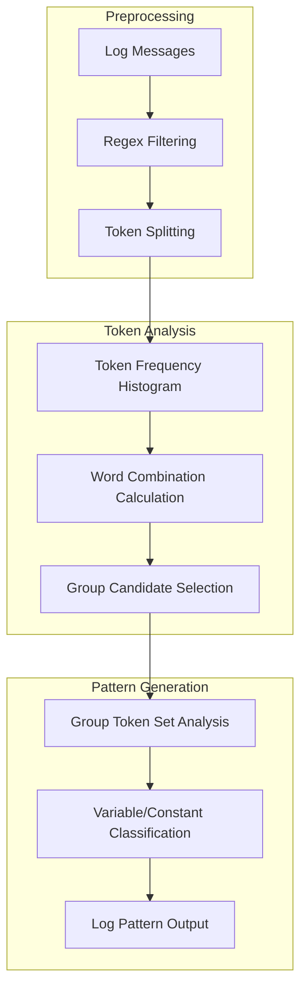

---
tags:
  - skills
---
# Skills Tools

## Summary

OpenSearch v2.19.0 introduces a significant improvement to the LogPatternTool with the implementation of the Brain algorithm for log pattern extraction. This enhancement provides more accurate log grouping compared to the previous simple character-based pattern extraction approach.

## Details

### What's New in v2.19.0

#### Brain Algorithm for LogPatternTool

The LogPatternTool has been upgraded to use the Brain algorithm, a cutting-edge log parsing algorithm that provides superior grouping accuracy for log pattern analysis.

**Key Improvements:**

| Aspect | Previous Approach | Brain Algorithm |
|--------|-------------------|-----------------|
| Pattern Extraction | Simple character removal (alphanumeric) | Token frequency-based pattern detection |
| Grouping Accuracy | Low (punctuation-based) | High (semantic grouping) |
| Variable Detection | Regex-based | Frequency threshold-based |
| Input Support | DSL only | DSL and PPL queries |

**Algorithm Overview:**



**New Parameters:**

| Parameter | Description | Default |
|-----------|-------------|---------|
| `ppl` | PPL query input (alternative to DSL) | - |
| `variable_count_threshold` | Threshold for variable token detection | 5 |

**Default Regex Filters:**

The Brain algorithm applies these default patterns to identify variables:
- IP addresses: `(/|)([0-9]+\.){3}[0-9]+(:[0-9]+|)(:|)`
- ISO datetime: `(\d{4}-\d{2}-\d{2})[T ]?(\d{2}:\d{2}:\d{2})...`
- Hex/numbers: `((0x|0X)[0-9a-fA-F]+)|[a-zA-Z]+\d+|...`

**Usage Example:**

```json
{
  "type": "LogPatternTool",
  "parameters": {
    "index": "logs-*",
    "input": "{\"query\": {\"match_all\": {}}}",
    "top_n_pattern": 3,
    "sample_log_size": 10
  }
}
```

**PPL Query Support:**

```json
{
  "type": "LogPatternTool",
  "parameters": {
    "index": "logs-*",
    "ppl": "source=logs-* | where level='ERROR'"
  }
}
```

### Technical Changes

1. **BrainLogParser Class**: New utility class implementing the Brain algorithm with:
   - Token frequency histogram calculation
   - Word combination candidate selection
   - Group-level token set analysis
   - Variable/constant token classification

2. **PPL Query Support**: LogPatternTool now accepts PPL queries via the `ppl` parameter, enabling more flexible log filtering before pattern analysis.

3. **Aggregation Removal**: DSL and PPL queries are automatically stripped of aggregation clauses to ensure raw log retrieval.

4. **Shared Utility**: `ToolHelper.getPPLTransportActionListener()` extracted for reuse across tools.

### Bug Fix

PR #458 fixes a compilation issue caused by changes in the Anomaly Detection plugin's API, updating the `SearchAnomalyDetectorsToolTests` to accommodate the new constructor signature.

## Limitations

- Brain algorithm has higher memory usage compared to the simple approach (up to 2x)
- PPL queries are automatically truncated at `| STATS` to remove aggregations
- Variable count threshold may need tuning for specific log formats

## References

### Pull Requests
| PR | Description | Related Issue |
|----|-------------|---------------|
| [#474](https://github.com/opensearch-project/skills/pull/474) | Log pattern tool improvement with Brain algorithm | [OpenSearch#16627](https://github.com/opensearch-project/OpenSearch/issues/16627) |
| [#458](https://github.com/opensearch-project/skills/pull/458) | Fix compilation issue caused by AD change | - |

### Related Resources
- [RFC: Log pattern support in OpenSearch](https://github.com/opensearch-project/OpenSearch/issues/16627): Design discussion for Brain algorithm
- [Brain Algorithm Paper](https://ieeexplore.ieee.org/document/10109145): Academic reference for the algorithm
