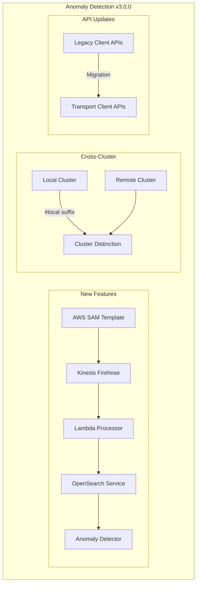

# Anomaly Detection

## Summary

OpenSearch v3.0.0 brings several improvements to the Anomaly Detection plugin, including a new AWS SAM template for WAF log analysis, enhanced cross-cluster support with better local/remote cluster distinction, and compatibility updates for OpenSearch 3.0.0 breaking changes including Java Agent migration and API updates.

## Details

### What's New in v3.0.0

#### AWS SAM Template for WAF Log Analysis

A new AWS SAM (Serverless Application Model) template enables automated anomaly detection for AWS WAF logs using Amazon OpenSearch Service. This template provisions all necessary resources to set up anomaly detection for WAF logs using the Random Cut Forest (RCF) algorithm.

#### Cross-Cluster Improvements

Enhanced handling of local and remote clusters when they share the same name by adding a `#local` suffix to distinguish local cluster indices. The `#` character is invalid in cluster names, preventing naming conflicts.

#### OpenSearch 3.0.0 Compatibility

Multiple breaking changes were addressed to ensure compatibility with OpenSearch 3.0.0:

- **Client API Migration**: Moved from `org.opensearch.client.*` to `org.opensearch.transport.client.*`
- **Cluster Manager Terminology**: Renamed `masterNodeId` to `clusterManagerNodeId`
- **API Changes**: Updated `getTotalHits().value` to `getTotalHits().value()`
- **Java Agent Migration**: Replaced SecurityManager usage with Java Agent for security checks

### Technical Changes

#### Architecture Changes



#### New Components

| Component | Description |
|-----------|-------------|
| AWS SAM Template | CloudFormation template for WAF log anomaly detection |
| Kinesis Firehose | Streams WAF logs to OpenSearch |
| Lambda Processor | Transforms and processes WAF log data |
| `#local` Suffix | Distinguishes local cluster when names match remote |

#### API Changes

| Old API | New API |
|---------|---------|
| `org.opensearch.client.Client` | `org.opensearch.transport.client.Client` |
| `org.opensearch.client.node.NodeClient` | `org.opensearch.transport.client.node.NodeClient` |
| `org.opensearch.client.ClusterAdminClient` | `org.opensearch.transport.client.ClusterAdminClient` |
| `org.opensearch.client.AdminClient` | `org.opensearch.transport.client.AdminClient` |
| `org.opensearch.client.IndicesAdminClient` | `org.opensearch.transport.client.IndicesAdminClient` |
| `getTotalHits().value` | `getTotalHits().value()` |
| `masterNodeId` | `clusterManagerNodeId` |

### Usage Example

#### WAF Log Anomaly Detection Setup

Deploy the AWS SAM template to set up WAF log analysis:

```bash
# Deploy the SAM template
sam deploy --guided

# The template provisions:
# - Kinesis Firehose delivery stream
# - Lambda function for log processing
# - OpenSearch domain configuration
# - IAM roles and policies
```

#### Cross-Cluster Configuration

When configuring detectors across clusters with the same name:

```json
{
  "name": "cross-cluster-detector",
  "indices": [
    "remote_cluster:index_name",
    "local_index_name"
  ],
  "category_field": ["ip"]
}
```

The plugin automatically adds `#local` to local cluster indices to distinguish them from remote clusters with the same name.

### Migration Notes

For users upgrading from OpenSearch 2.x:

1. **No user-facing API changes** - The client API migrations are internal to the plugin
2. **Cross-cluster detectors** - Existing detectors continue to work; the `#local` suffix is handled automatically
3. **SecurityManager deprecation** - No action required; the plugin now uses Java Agent internally

## Limitations

- AWS SAM template is specific to AWS WAF logs and Amazon OpenSearch Service
- Cross-cluster detection requires proper cluster connectivity and permissions
- The `#local` suffix is internal and should not be used in user configurations

## References

### Documentation
- [Anomaly Detection Documentation](https://docs.opensearch.org/3.0/observing-your-data/ad/index/): Official OpenSearch anomaly detection docs
- [Anomaly Detection API](https://docs.opensearch.org/3.0/observing-your-data/ad/api/): API reference

### Blog Posts
- [AWS Blog: Analyze AWS WAF logs using Amazon OpenSearch Service](https://aws.amazon.com/blogs/security/analyze-aws-waf-logs-using-amazon-opensearch-service-anomaly-detection-built-on-random-cut-forests/): Blog post for WAF log analysis

### Pull Requests
| PR | Description |
|----|-------------|
| [#1460](https://github.com/opensearch-project/anomaly-detection/pull/1460) | Add AWS SAM template for WAF log analysis and anomaly detection |
| [#1446](https://github.com/opensearch-project/anomaly-detection/pull/1446) | Distinguish local cluster when local name is same as remote |
| [#1424](https://github.com/opensearch-project/anomaly-detection/pull/1424) | Fix breaking changes for 3.0.0 release |
| [#1450](https://github.com/opensearch-project/anomaly-detection/pull/1450) | Fix build due to phasing off SecurityManager usage in favor of Java Agent |
| [#1456](https://github.com/opensearch-project/anomaly-detection/pull/1456) | Add integtest.sh to specifically run integTestRemote task |
| [#1441](https://github.com/opensearch-project/anomaly-detection/pull/1441) | Adding dual cluster arg to gradle run |

### Issues (Design / RFC)
- [OpenSearch Issue #3351](https://github.com/opensearch-project/OpenSearch/issues/3351): Breaking changes tracking

## Related Feature Report

- [Full feature documentation](../../../features/anomaly-detection/anomaly-detection.md)
