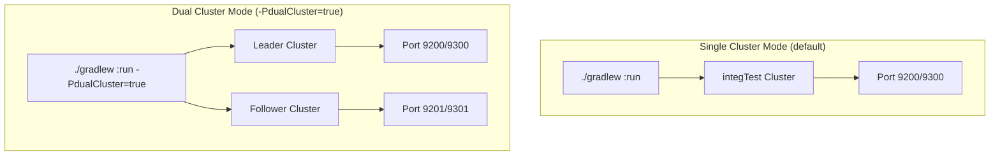

# Dual Cluster Gradle Run

## Summary

This release adds the ability to run the Anomaly Detection plugin locally with two separate OpenSearch clusters using a single Gradle command. This enhancement enables developers to easily test cross-cluster features such as cross-cluster replication and remote cluster configurations without manual cluster setup.

## Details

### What's New in v3.0.0

PR #1441 introduces a new Gradle property `-PdualCluster=true` that launches two independent single-node clusters:
- **Leader cluster**: HTTP port 9200, Transport port 9300
- **Follower cluster**: HTTP port 9201, Transport port 9301

Both clusters are automatically configured with the Anomaly Detection and Job Scheduler plugins installed.

### Technical Changes

#### Architecture Changes



#### New Components

| Component | Description |
|-----------|-------------|
| `leaderCluster` | Test cluster configured with `node.attr.cluster_role=leader` |
| `followCluster` | Test cluster configured with `node.attr.cluster_role=follower` |
| `configureClusterPlugins()` | Refactored helper function for plugin configuration |

#### New Configuration

| Setting | Description | Default |
|---------|-------------|---------|
| `-PdualCluster` | Gradle property to enable dual cluster mode | `false` |
| `node.attr.cluster_role` | Custom node attribute identifying cluster role | N/A |
| `path.repo` | Repository path for each cluster | `${buildDir}/{clusterName}/repo` |

#### System Properties (Dual Cluster Mode)

| Property | Description |
|----------|-------------|
| `tests.leader.cluster.name` | Name of the leader cluster |
| `tests.follow.cluster.name` | Name of the follower cluster |
| `tests.cluster.leader.http_hosts` | HTTP endpoints for leader cluster |
| `tests.cluster.follow.http_hosts` | HTTP endpoints for follower cluster |
| `tests.cluster.leader.transport_hosts` | Transport endpoints for leader cluster |
| `tests.cluster.follow.transport_hosts` | Transport endpoints for follower cluster |

### Usage Example

```bash
# Launch dual clusters for cross-cluster testing
./gradlew :run -PdualCluster=true

# Output shows both clusters:
# Leader cluster running at HTTP: localhost:9200, Transport: localhost:9300
# Follower cluster running at HTTP: localhost:9201, Transport: localhost:9301
```

### Additional Changes

- Added `dependabot/**` branch to changelog verifier ignore list
- Removed deprecated `ACTIONS_ALLOW_USE_UNSECURE_NODE_VERSION` environment variable from labeler workflow
- Code refactoring to extract common plugin configuration into `configureClusterPlugins()` function

## Limitations

- Both clusters run on localhost only
- Security plugin configuration is shared between clusters when enabled
- Backport to 2.x branch failed due to merge conflicts (requires manual backport)

## References

### Documentation
- [DEVELOPER_GUIDE.md](https://github.com/opensearch-project/anomaly-detection/blob/main/DEVELOPER_GUIDE.md): Updated developer documentation
- [PR #1441](https://github.com/opensearch-project/anomaly-detection/pull/1441): Main implementation

### Pull Requests
| PR | Description |
|----|-------------|
| [#1441](https://github.com/opensearch-project/anomaly-detection/pull/1441) | Adding dual cluster arg to gradle run |
| [#1442](https://github.com/opensearch-project/anomaly-detection/pull/1442) | Backport to 2.x (includes #1441) |

## Related Feature Report

- [Full feature documentation](../../../../features/anomaly-detection/dual-cluster-development.md)
