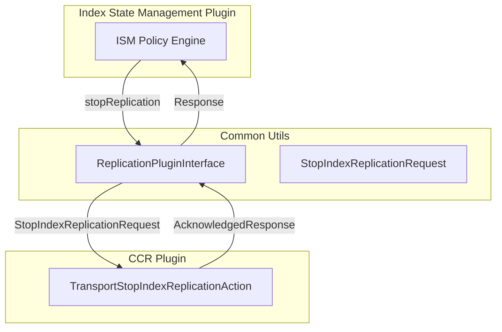

---
tags:
  - domain/core
  - component/server
  - indexing
  - security
---
# Common Utils Bugfixes and Enhancements

## Summary

OpenSearch v3.0.0 includes several important updates to the common-utils library: fixes for split package imports related to `org.opensearch.transport`, proper escaping/unescaping of pipe characters in user information stored in ThreadContext, and new replication (CCR) plugin interfaces to enable integration between Index State Management (ISM) and Cross-Cluster Replication plugins.

## Details

### What's New in v3.0.0

#### 1. Split Package Import Fixes (PR #790)

Updated import statements across multiple files to accommodate the split of the `org.opensearch.transport` package in OpenSearch core. The `NodeClient` and `Client` classes were moved from `org.opensearch.client` to `org.opensearch.transport.client`.

**Changed Files:**
- `AlertingPluginInterface.kt`
- `NotificationsPluginInterface.kt`
- `SecureClientWrapper.kt`
- Related test files

**Import Changes:**
```kotlin
// Before
import org.opensearch.client.node.NodeClient
import org.opensearch.client.Client

// After
import org.opensearch.transport.client.node.NodeClient
import org.opensearch.transport.client.Client
```

#### 2. Pipe Character Escaping in UserInfo (PR #801)

Fixed an issue where usernames, backend roles, roles, or tenant names containing pipe (`|`) characters would cause parsing failures. The pipe character is used as a delimiter in the ThreadContext user info string format.

**Problem:**
When OIDC providers send usernames with pipe characters (e.g., `idp-provider|email@test.com|tenant-account-id|user-id`), OpenSearch would throw:
```
java.lang.IllegalStateException: Username cannot have '|' in the security plugin.
```

**Solution:**
- Added `Utils.java` class with `escapePipe()` and `unescapePipe()` methods
- Modified `InjectSecurity.java` to escape pipe characters when setting user info
- Modified `User.java` to unescape pipe characters when parsing user info
- Uses backslash escaping: `|` becomes `\|`

**New Components:**

| Component | Description |
|-----------|-------------|
| `Utils.escapePipe()` | Escapes pipe characters by replacing `\|` with `\\|` |
| `Utils.unescapePipe()` | Unescapes pipe characters by replacing `\\|` with `\|` |

#### 3. Replication Plugin Interface (PR #667)

Added new interfaces and classes to enable the Index State Management (ISM) plugin to invoke stop-replication actions from the Cross-Cluster Replication (CCR) plugin.

**Background:**
- ISM plugin needs to manage CCR follower indices (e.g., delete them after a retention period)
- CCR makes follower indices read-only, preventing direct deletion
- ISM needs to invoke stop-replication before deleting follower indices

**New Components:**

| Component | Description |
|-----------|-------------|
| `ReplicationPluginInterface` | Transport action interface for CCR plugin |
| `ReplicationActions` | Action names and types for stop replication |
| `StopIndexReplicationRequest` | Request class for stopping index replication |



### Usage Example

**Escaping pipe characters in user info:**
```java
// When setting user info with pipe characters
User user = new User("Bob|test-pipe", backendRoles, roles, attrs, "tenant1");
injectSecurity.injectUserInfo(user);
// ThreadContext contains: "Bob\|test-pipe|backendRole1,backendRole2|role1,role2|tenant1"

// When parsing user info
String userString = threadContext.getTransient(OPENSEARCH_SECURITY_USER_INFO_THREAD_CONTEXT);
User parsedUser = User.parse(userString);
// parsedUser.getName() returns: "Bob|test-pipe"
```

**Using replication interface from ISM:**
```kotlin
// Stop replication on a follower index
val request = StopIndexReplicationRequest("follower-index-001")
ReplicationPluginInterface.stopReplication(client, request, object : ActionListener<AcknowledgedResponse> {
    override fun onResponse(response: AcknowledgedResponse) {
        // Replication stopped, can now delete the index
    }
    override fun onFailure(e: Exception) {
        // Handle failure
    }
})
```

## Limitations

- The pipe escaping solution uses backslash as the escape character, which may conflict if backslashes are present in usernames
- The replication interface requires both ISM and CCR plugins to be installed

## References

### Documentation
- [PR #17272](https://github.com/opensearch-project/OpenSearch/pull/17272): Related OpenSearch core transport package split

### Pull Requests
| PR | Description |
|----|-------------|
| [#667](https://github.com/opensearch-project/common-utils/pull/667) | Adding replication (CCR) plugin interface and classes |
| [#790](https://github.com/opensearch-project/common-utils/pull/790) | Fix imports related to split package of org.opensearch.transport |
| [#801](https://github.com/opensearch-project/common-utils/pull/801) | Escape/Unescape pipe UserInfo in ThreadContext |

### Issues (Design / RFC)
- [Issue #2756](https://github.com/opensearch-project/security/issues/2756): Username cannot have '|' in the security plugin
- [Issue #726](https://github.com/opensearch-project/index-management/issues/726): Manage CCR follower indices with ISM

## Related Feature Report

- Full feature documentation
