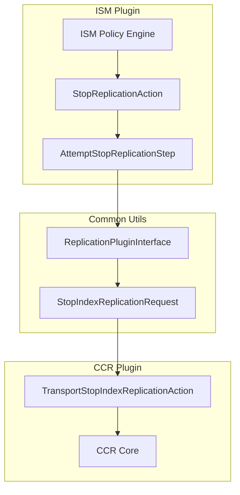

# Cross-Cluster Replication (CCR)

## Summary

OpenSearch v3.0.0 introduces ISM-CCR integration, enabling Index State Management (ISM) policies to manage Cross-Cluster Replication (CCR) follower indices. The key addition is a new `stop_replication` action that allows ISM to automatically stop replication on follower indices, solving the problem of managing CCR follower index lifecycle through ISM policies.

## Details

### What's New in v3.0.0

#### ISM-CCR Integration

Previously, CCR follower indices could not be properly managed by ISM policies because CCR makes follower indices read-only. Operations like deletion would fail with:

```
index [follower-000001] blocked by: [FORBIDDEN/1000/index read-only(cross-cluster-replication)]
```

The v3.0.0 release adds a new `stop_replication` action to ISM that invokes the CCR stop-replication API, allowing follower indices to be unfollowed before other lifecycle operations.

#### Technical Changes



#### New Components

| Component | Repository | Description |
|-----------|------------|-------------|
| `StopReplicationAction` | index-management | ISM action to stop replication |
| `StopReplicationActionParser` | index-management | Parser for the stop_replication action |
| `AttemptStopReplicationStep` | index-management | Step that executes stop replication |
| `ValidateStopReplication` | index-management | Validation for stop_replication action |
| `ReplicationPluginInterface` | common-utils | Interface for cross-plugin communication |
| `StopIndexReplicationRequest` | common-utils | Request object for stop replication |
| `ReplicationActions` | common-utils | Action type definitions |

#### Build Updates

The CCR plugin was updated to support modern build tooling:
- Gradle upgraded to 8.10.2
- JDK 23 support added

### Usage Example

```json
{
  "policy": {
    "description": "Manage CCR follower indices",
    "default_state": "replicating",
    "states": [
      {
        "name": "replicating",
        "actions": [],
        "transitions": [
          {
            "state_name": "unfollow",
            "conditions": {
              "min_index_age": "7d"
            }
          }
        ]
      },
      {
        "name": "unfollow",
        "actions": [
          {
            "stop_replication": {}
          }
        ],
        "transitions": [
          {
            "state_name": "delete",
            "conditions": {
              "min_index_age": "1d"
            }
          }
        ]
      },
      {
        "name": "delete",
        "actions": [
          {
            "delete": {}
          }
        ]
      }
    ],
    "ism_template": {
      "index_patterns": ["follower-*"],
      "priority": 1
    }
  }
}
```

### Migration Notes

To use the new `stop_replication` action:

1. Ensure the CCR plugin is installed on the follower cluster
2. Update ISM policies for follower indices to include `stop_replication` before `delete` actions
3. The action requires no parameters - it automatically detects the index from the managed index context

## Limitations

- The `stop_replication` action only works on indices that are actively being replicated
- If called on a non-replicated index, the action will fail with an error message
- The action is not idempotent - calling it on an already-stopped replication will fail

## References

### Documentation
- [Cross-cluster replication documentation](https://docs.opensearch.org/3.0/tuning-your-cluster/replication-plugin/index/): Official CCR documentation
- [ISM documentation](https://docs.opensearch.org/3.0/im-plugin/ism/index/): Index State Management documentation

### Blog Posts
- [OpenSearch 1.1.0 CCR announcement](https://opensearch.org/blog/launch-announcement-1-1/): Original CCR introduction

### Pull Requests
| PR | Repository | Description |
|----|------------|-------------|
| [#667](https://github.com/opensearch-project/common-utils/pull/667) | common-utils | Adding replication (CCR) plugin interface and classes |
| [#1198](https://github.com/opensearch-project/index-management/pull/1198) | index-management | Adding unfollow action in ISM to invoke stop replication for CCR |
| [#1496](https://github.com/opensearch-project/cross-cluster-replication/pull/1496) | cross-cluster-replication | Update CCR with Gradle 8.10.2 and support JDK23 |

### Issues (Design / RFC)
- [Issue #726](https://github.com/opensearch-project/index-management/issues/726): Original feature request for managing CCR follower indices

## Related Feature Report

- [Full feature documentation](../../../../features/cross-cluster-replication/cross-cluster-replication.md)
