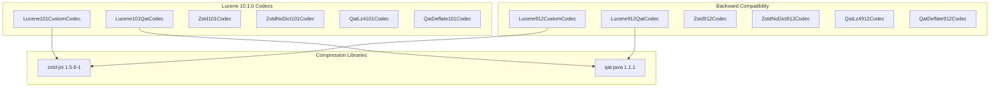

---
tags:
  - indexing
  - ml
---

# Custom Codecs Bugfixes

## Summary

OpenSearch 3.0.0 brings critical updates to the Custom Codecs plugin to support the Lucene 10.1.0 upgrade and the transition from SecurityManager to Java Agent. These changes include new Lucene 101-based codec implementations, ZSTD library updates enabling QAT-accelerated ZSTD compression, and build system fixes for Java Agent compatibility.

## Details

### What's New in v3.0.0

#### Lucene 10.1.0 Codec Migration

The plugin migrates from Lucene 9.12 to Lucene 10.1.0 codecs:

- **New codec classes**: `Lucene101CustomCodec`, `Lucene101QatCodec`, `Zstd101Codec`, `ZstdNoDict101Codec`, `QatLz4101Codec`, `QatDeflate101Codec`
- **Backward compatibility**: Previous Lucene 9.12 codecs moved to `backward_codecs/lucene912/` package for reading existing indexes
- **API changes**: Updated to use `ByteBuffersDataInput.length()` instead of deprecated `size()` method

#### ZSTD Library Upgrade

Bumped `zstd-jni` from 1.5.5-5 to 1.5.6-1:

- Adds support for custom sequence producers
- Enables future QAT-accelerated ZSTD compression (`qat_zstd`)
- Maintains backward compatibility with existing ZSTD-compressed indexes

#### Java Agent Migration

Two-phase migration from SecurityManager to Java Agent:

1. **PR #235**: Initial fix adding manual agent configuration to build.gradle
2. **PR #237**: Replaced manual configuration with `opensearch.java-agent` Gradle plugin

### Technical Changes

#### Architecture Changes



#### New Components

| Component | Description |
|-----------|-------------|
| `Lucene101CustomCodec` | Base codec for ZSTD compression on Lucene 10.1.0 |
| `Lucene101CustomStoredFieldsFormat` | Stored fields format for Lucene 10.1.0 |
| `Lucene101QatCodec` | Base codec for QAT hardware acceleration on Lucene 10.1.0 |
| `Lucene101QatStoredFieldsFormat` | QAT stored fields format for Lucene 10.1.0 |
| `Zstd101Codec` | ZSTD with dictionary for Lucene 10.1.0 |
| `ZstdNoDict101Codec` | ZSTD without dictionary for Lucene 10.1.0 |
| `QatLz4101Codec` | QAT LZ4 for Lucene 10.1.0 |
| `QatDeflate101Codec` | QAT DEFLATE for Lucene 10.1.0 |

#### Backward Compatibility Components

| Component | Location | Purpose |
|-----------|----------|---------|
| `Lucene912CustomCodec` | `backward_codecs/lucene912/` | Read existing Lucene 9.12 ZSTD indexes |
| `Lucene912QatCodec` | `backward_codecs/lucene912/` | Read existing Lucene 9.12 QAT indexes |
| `Zstd912Codec` | `backward_codecs/lucene912/` | Backward compat ZSTD codec |
| `ZstdNoDict912Codec` | `backward_codecs/lucene912/` | Backward compat ZSTD no-dict codec |
| `QatLz4912Codec` | `backward_codecs/lucene912/` | Backward compat QAT LZ4 codec |
| `QatDeflate912Codec` | `backward_codecs/lucene912/` | Backward compat QAT DEFLATE codec |

#### Build Configuration Changes

```groovy
// Before (PR #235 - manual agent configuration)
configurations {
  agent
}
dependencies {
  agent "org.opensearch:opensearch-agent-bootstrap:${opensearch_version}"
  agent "org.opensearch:opensearch-agent:${opensearch_version}"
  agent "net.bytebuddy:byte-buddy:${versions.bytebuddy}"
}
task prepareAgent(type: Copy) {
  from(configurations.agent)
  into "$buildDir/agent"
}
tasks.withType(Test) {
  dependsOn prepareAgent
  jvmArgs += ["-javaagent:" + project.layout.buildDirectory.file("agent/opensearch-agent-${opensearch_version}.jar").get()]
}

// After (PR #237 - using Gradle plugin)
apply plugin: 'opensearch.java-agent'
```

### Migration Notes

- **No user action required**: Codec selection (`zstd`, `zstd_no_dict`, `qat_lz4`, `qat_deflate`) remains unchanged
- **Automatic backward compatibility**: Existing indexes compressed with Lucene 9.12 codecs can still be read
- **New indexes**: Will use Lucene 10.1.0 codec implementations automatically

## Limitations

- Backward compatibility codecs are read-only; new segments use Lucene 10.1.0 codecs
- QAT-accelerated ZSTD (`qat_zstd`) not yet available despite library support

## References

### Documentation
- [Index Codecs Documentation](https://docs.opensearch.org/3.0/im-plugin/index-codecs/): Official documentation
- [Custom Codecs Repository](https://github.com/opensearch-project/custom-codecs): Source code
- [OpenSearch PR #17900](https://github.com/opensearch-project/OpenSearch/pull/17900): Java Agent Gradle plugin in core OpenSearch
- [zstd-jni 1.5.6-1 Release](https://github.com/luben/zstd-jni/releases/tag/v1.5.6-1): ZSTD library release notes

### Pull Requests
| PR | Description |
|----|-------------|
| [#228](https://github.com/opensearch-project/custom-codecs/pull/228) | Upgrade to Lucene 10.1.0 and introduce new Codec implementation |
| [#232](https://github.com/opensearch-project/custom-codecs/pull/232) | Bump ZSTD lib version to 1.5.6-1 |
| [#235](https://github.com/opensearch-project/custom-codecs/pull/235) | Fix build due to phasing off SecurityManager in favor of Java Agent |
| [#237](https://github.com/opensearch-project/custom-codecs/pull/237) | Add java agent plugin (replaces manual configuration) |

## Related Feature Report

- [Full feature documentation](../../../features/custom-codecs/custom-codecs.md)
