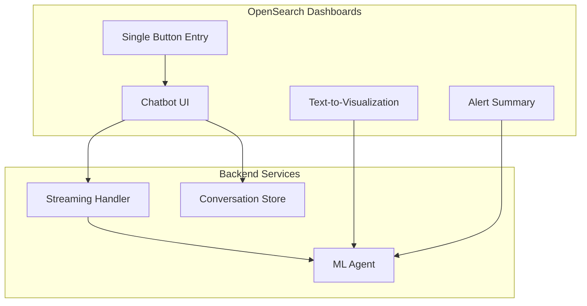

# AI Assistant / Chatbot

## Summary

OpenSearch Dashboards v3.0.0 introduces significant enhancements to the AI Assistant (Chatbot) feature, including a redesigned UI, streaming output support, improved text-to-visualization capabilities, and a simplified single-button entry point. These changes improve the user experience for interacting with AI-powered assistants directly within OpenSearch Dashboards.

## Details

### What's New in v3.0.0

The AI Assistant received major updates across UI/UX, functionality, and developer experience:

1. **Redesigned Chatbot UI** - Updated visual design with edge-to-edge responses, new loading states, and primary color backgrounds
2. **Streaming Output Support** - Real-time response streaming for improved perceived performance
3. **Single Button Entry Point** - Simplified chatbot access with a unified button interface
4. **Text-to-Visualization Enhancements** - Auto-generation on page mount, auto-suggested aggregations, and improved error handling
5. **Conversation Management** - Auto-load last conversation, scroll-based conversation loading
6. **Alert Summary Improvements** - Redesigned popover styling and positioning

### Technical Changes

#### Architecture Changes



#### New Components

| Component | Description |
|-----------|-------------|
| Streaming Output Handler | Processes real-time response chunks from ML agents |
| Single Button Entry | Unified chatbot access point in the header |
| Auto Aggregation Suggester | Automatically suggests aggregations for text-to-visualization |
| Conversation Scroll Loader | Lazy-loads conversation history on scroll |

#### New Configuration

| Setting | Description | Default |
|---------|-------------|---------|
| `assistant.chat.enabled` | Enable/disable the chatbot feature | `false` |
| `assistant.next.enabled` | Enable experimental features like text-to-visualization | `false` |

### Usage Example

Enable the AI Assistant in `opensearch_dashboards.yml`:

```yaml
assistant.chat.enabled: true
assistant.next.enabled: true
```

Configure the root agent:

```json
PUT .plugins-ml-config/_doc/os_chat
{
    "type": "os_chat_root_agent",
    "configuration": {
        "agent_id": "your_root_agent_id"
    }
}
```

### Migration Notes

- The chatbot entry point has changed from multiple buttons to a single unified button
- The `os_insight` agent has been removed; use `data2summary` agent instead
- UI styling has been updated; custom CSS overrides may need adjustment

## Limitations

- Streaming output requires OpenSearch Dashboards PR #9647 for pure HTTP fetch response support
- Text-to-visualization requires PPL queries with aggregations
- The experimental badge has been removed from natural language visualization

## Related PRs

| PR | Description |
|----|-------------|
| [#398](https://github.com/opensearch-project/dashboards-assistant/pull/398) | Expose chatEnabled flag to capabilities |
| [#435](https://github.com/opensearch-project/dashboards-assistant/pull/435) | Update chatbot UI to align with new look |
| [#436](https://github.com/opensearch-project/dashboards-assistant/pull/436) | Add data to summary response post processing |
| [#438](https://github.com/opensearch-project/dashboards-assistant/pull/438) | Add flag to control conversation list display |
| [#439](https://github.com/opensearch-project/dashboards-assistant/pull/439) | Auto-load last conversation on chatbot open |
| [#452](https://github.com/opensearch-project/dashboards-assistant/pull/452) | Remove os_insight agent |
| [#485](https://github.com/opensearch-project/dashboards-assistant/pull/485) | Add error handling for chatbot loading |
| [#493](https://github.com/opensearch-project/dashboards-assistant/pull/493) | Support streaming output |
| [#505](https://github.com/opensearch-project/dashboards-assistant/pull/505) | Generate visualization on t2v page mount |
| [#514](https://github.com/opensearch-project/dashboards-assistant/pull/514) | Add auto aggregation suggest for t2v |
| [#540](https://github.com/opensearch-project/dashboards-assistant/pull/540) | Change chatbot entry point to single button |

## References

- [OpenSearch Assistant Documentation](https://docs.opensearch.org/3.0/dashboards/dashboards-assistant/index/)
- [Build Your Own Chatbot Tutorial](https://docs.opensearch.org/3.0/tutorials/gen-ai/chatbots/build-chatbot/)
- [OpenSearch Assistant Toolkit](https://docs.opensearch.org/3.0/ml-commons-plugin/opensearch-assistant/)
- [Issue #387](https://github.com/opensearch-project/dashboards-assistant/issues/387): Streaming output feature request

## Related Feature Report

- [Full feature documentation](../../../features/dashboards-assistant/ai-assistant-chatbot.md)
