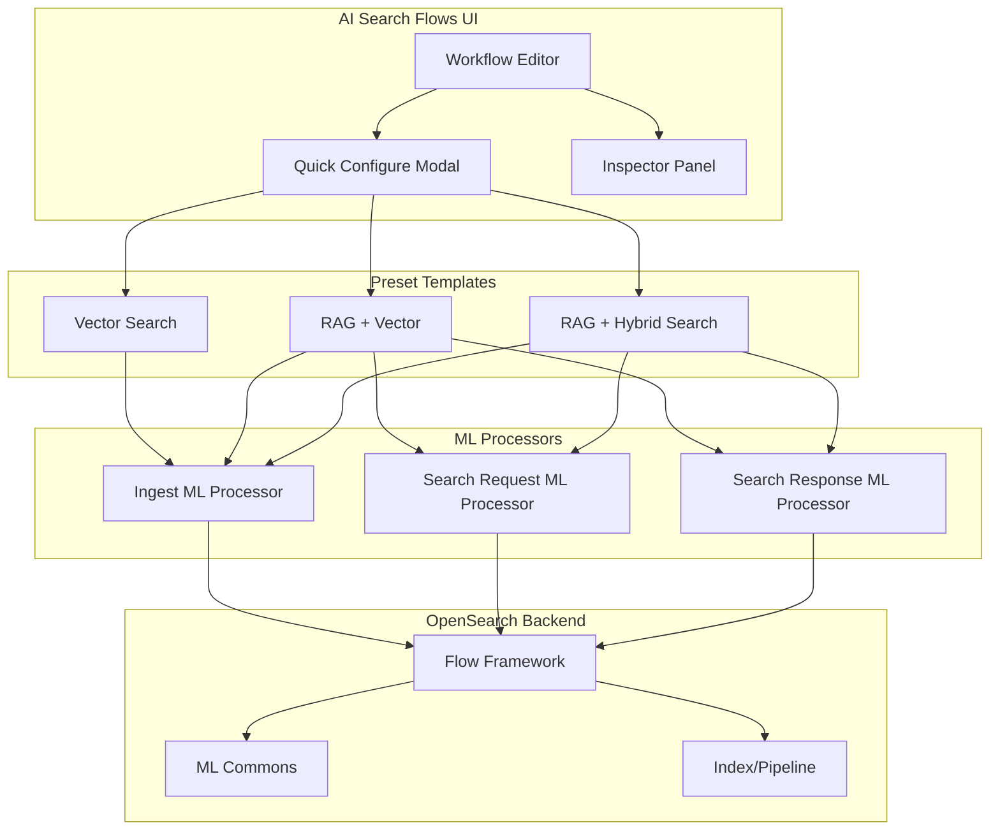

---
tags:
  - domain/ml
  - component/dashboards
  - dashboards
  - indexing
  - k-nn
  - ml
  - search
---
# AI Search Flows

## Summary

OpenSearch v3.0.0 introduces significant enhancements to the AI Search Flows plugin (formerly "OpenSearch Flow"), providing a visual UI designer for building AI-powered search workflows in OpenSearch Dashboards. This release focuses on improving the RAG (Retrieval-Augmented Generation) preset experience, simplifying ML processor configuration, and rebranding the plugin to "AI Search Flows" for better clarity.

## Details

### What's New in v3.0.0

The AI Search Flows plugin received 20 enhancements in this release, focusing on:

1. **Plugin Rebranding**: Renamed from "OpenSearch Flow" to "AI Search Flows"
2. **RAG Preset Improvements**: Simplified RAG presets leveraging `ext.ml_inference` result storing
3. **ML Processor Form Simplification**: Streamlined forms when model interfaces are defined
4. **New Presets**: Added RAG + hybrid search preset combining vector and keyword search
5. **UX Improvements**: Better state persistence, processor reordering, and model configuration

### Technical Changes

#### Architecture Changes



#### Key Enhancements

| Enhancement | Description | PR |
|-------------|-------------|-----|
| Plugin Rename | Updated visible name to "AI Search Flows" | [#662](https://github.com/opensearch-project/dashboards-flow-framework/pull/662), [#664](https://github.com/opensearch-project/dashboards-flow-framework/pull/664) |
| RAG Preset Simplification | Leverages `ext.ml_inference` for result storing, removes workaround collapse processor | [#610](https://github.com/opensearch-project/dashboards-flow-framework/pull/610) |
| RAG + Hybrid Search | New preset combining RAG with hybrid (match + knn) queries | [#665](https://github.com/opensearch-project/dashboards-flow-framework/pull/665) |
| ML Processor Form Simplification | Read-only inputs/outputs when model interface is defined | [#676](https://github.com/opensearch-project/dashboards-flow-framework/pull/676) |
| Legacy Preset Integration | Legacy presets work with quick-configure fields | [#602](https://github.com/opensearch-project/dashboards-flow-framework/pull/602) |
| Processor Reordering | Added icons to reorder processors up and down | [#690](https://github.com/opensearch-project/dashboards-flow-framework/pull/690) |
| State Persistence | Query state persists across Inspector tab switches | [#671](https://github.com/opensearch-project/dashboards-flow-framework/pull/671) |
| Optional Model Inputs | Support for optional model input parameters | [#701](https://github.com/opensearch-project/dashboards-flow-framework/pull/701) |

#### New Features

| Feature | Description |
|---------|-------------|
| Bulk API Details | Added popover with bulk API example and documentation links | [#610](https://github.com/opensearch-project/dashboards-flow-framework/pull/610) |
| ML Outputs Tab | Dedicated tab for displaying ML inference results | [#610](https://github.com/opensearch-project/dashboards-flow-framework/pull/610) |
| Model Suggestions Popover | Links to suggested models displayed in popover | [#625](https://github.com/opensearch-project/dashboards-flow-framework/pull/625) |
| Presets Dropdown | Query preset dropdown in Inspector panel | [#671](https://github.com/opensearch-project/dashboards-flow-framework/pull/671) |
| Form Caching | ML transform form state cached across type switches | [#678](https://github.com/opensearch-project/dashboards-flow-framework/pull/678) |

### Usage Example

The new RAG + Hybrid Search preset can be configured with minimal clicks:

1. Select "RAG with Hybrid Search" preset
2. Configure embedding model and LLM in quick-configure modal
3. Import sample data
4. Build and run ingestion
5. Test search with automatic query rewriting to hybrid (match + knn)

```json
{
  "query": {
    "hybrid": {
      "queries": [
        {
          "match": {
            "text_field": {
              "query": "search term"
            }
          }
        },
        {
          "knn": {
            "embedding_field": {
              "vector": "${embedding}",
              "k": 10
            }
          }
        }
      ]
    }
  }
}
```

### Migration Notes

- The plugin URL remains unchanged to prevent build/registration issues
- Only user-facing text has been updated from "OpenSearch Flow" to "AI Search Flows"
- Existing workflows continue to work without modification

## Limitations

- ML processor forms require models with defined interfaces for simplified configuration
- Datasource version must be available for simulate API calls ([#657](https://github.com/opensearch-project/dashboards-flow-framework/pull/657))

## References

### Documentation
- [AI Search Flows Documentation](https://docs.opensearch.org/3.0/vector-search/ai-search/workflow-builder/)
- [Creating AI Search Workflows Tutorial](https://docs.opensearch.org/3.0/tutorials/gen-ai/ai-search-flows/building-flows/)
- [dashboards-flow-framework Repository](https://github.com/opensearch-project/dashboards-flow-framework)

### Pull Requests
| PR | Description |
|----|-------------|
| [#602](https://github.com/opensearch-project/dashboards-flow-framework/pull/602) | Integrate legacy presets with quick-configure fields |
| [#610](https://github.com/opensearch-project/dashboards-flow-framework/pull/610) | Simplify RAG presets, add bulk API details |
| [#617](https://github.com/opensearch-project/dashboards-flow-framework/pull/617) | Improve RAG preset experience |
| [#622](https://github.com/opensearch-project/dashboards-flow-framework/pull/622) | Update model options and callout |
| [#625](https://github.com/opensearch-project/dashboards-flow-framework/pull/625) | Added popover to display links to suggested models |
| [#632](https://github.com/opensearch-project/dashboards-flow-framework/pull/632) | Implicitly update input maps on non-expanded queries |
| [#633](https://github.com/opensearch-project/dashboards-flow-framework/pull/633) | Show interim JSON provision flow even if provisioned |
| [#649](https://github.com/opensearch-project/dashboards-flow-framework/pull/649) | Add functional buttons in form headers, fix query parse bug |
| [#657](https://github.com/opensearch-project/dashboards-flow-framework/pull/657) | Block simulate API calls if datasource version is missing |
| [#660](https://github.com/opensearch-project/dashboards-flow-framework/pull/660) | Update default queries, quick config fields, misc updates |
| [#662](https://github.com/opensearch-project/dashboards-flow-framework/pull/662) | Update visible plugin name to 'AI Search Flows' |
| [#664](https://github.com/opensearch-project/dashboards-flow-framework/pull/664) | Update plugin name and rearrange Try AI Search Flows card |
| [#665](https://github.com/opensearch-project/dashboards-flow-framework/pull/665) | Add new RAG + hybrid search preset |
| [#670](https://github.com/opensearch-project/dashboards-flow-framework/pull/670) | Update new index mappings if selecting from existing index |
| [#671](https://github.com/opensearch-project/dashboards-flow-framework/pull/671) | Persist state across Inspector tab switches; add presets dropdown |
| [#676](https://github.com/opensearch-project/dashboards-flow-framework/pull/676) | Simplify ML processor form when interface is defined |
| [#678](https://github.com/opensearch-project/dashboards-flow-framework/pull/678) | Cache form across ML transform types |
| [#690](https://github.com/opensearch-project/dashboards-flow-framework/pull/690) | Adding icons to reorder processors up and down |
| [#701](https://github.com/opensearch-project/dashboards-flow-framework/pull/701) | Support optional model inputs |
| [#702](https://github.com/opensearch-project/dashboards-flow-framework/pull/702) | Support whitespace for string constant; support ext toggling on ML resp processors |

## Related Feature Report

- [Full feature documentation](../../../../features/dashboards-flow-framework/dashboards-flow-framework-ai-search-flows.md)
