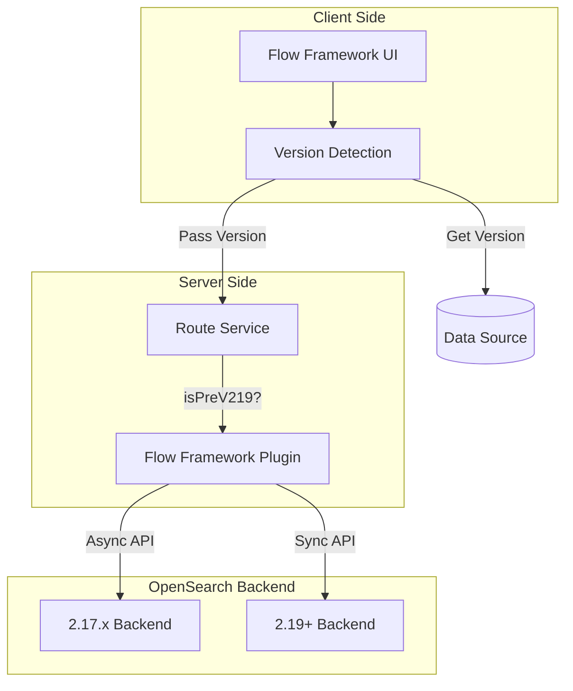

---
tags:
  - dashboards
  - ml
  - search
---

# Dashboards BWC

## Summary

This bugfix adds backward compatibility (BWC) support for OpenSearch 2.17 data sources in the Dashboards Flow Framework plugin. It ensures that users connecting to older OpenSearch backends (2.17.x) can still use the Flow Framework UI, even though some newer API features are only available in 2.19+.

## Details

### What's New in v3.0.0

The Dashboards Flow Framework plugin integrated with new backend API enhancements in PRs #591 and #598 that are only available in OpenSearch 2.19+:
- Synchronous provisioning with configurable timeout
- Verbose pipeline search (`verbose_pipeline=true`)

This BWC fix adds conditional logic to detect the data source version and execute appropriate APIs based on semver checks.

### Technical Changes

#### Architecture Changes



#### Key Changes

| Component | Change |
|-----------|--------|
| `getEffectiveVersion()` | Moved to shared utils for reuse across components |
| `provisionWorkflow` | Conditionally uses async or sync provisioning based on version |
| `updateAndReprovisionWorkflow` | Added async variant for pre-2.19 backends |
| `searchIndex` | Omits `verbose_pipeline` parameter for pre-2.19 backends |
| Template conversion | Added NPE checks for model fields in legacy processors |

#### New API Endpoints

| Endpoint | Pre-2.19 | 2.19+ |
|----------|----------|-------|
| Provision | `/_provision` (async) | `/_provision?wait_for_completion_timeout=10s` (sync) |
| Update & Reprovision | `?reprovision=true` (async) | `?reprovision=true&wait_for_completion_timeout=10s` (sync) |
| Search | Standard search | Search with `verbose_pipeline=true` |

### Usage Example

The version detection happens automatically when a data source is selected:

```typescript
// Version is fetched from data source saved object
const version = await getEffectiveVersion(dataSourceId);

// Conditional API execution
if (semver.lt(version, '2.19.0')) {
  // Use async provisioning, wait manually
  await callWithRequest('flowFramework.provisionWorkflowAsync', { workflow_id });
  await sleep(1000); // Manual wait for async completion
} else {
  // Use sync provisioning with timeout
  await callWithRequest('flowFramework.provisionWorkflow', { workflow_id });
}
```

### Migration Notes

No migration required. The plugin automatically detects the backend version and uses appropriate APIs.

## Limitations

- Pre-2.19 backends use async provisioning with manual polling, which may result in slightly delayed UI state updates
- Verbose pipeline errors are not available for pre-2.19 backends
- Some workflow templates may not be available for pre-2.19 data sources

## References

### Documentation
- [PR #612](https://github.com/opensearch-project/dashboards-flow-framework/pull/612): Main BWC implementation
- [PR #591](https://github.com/opensearch-project/dashboards-flow-framework/pull/591): Synchronous provisioning integration
- [PR #598](https://github.com/opensearch-project/dashboards-flow-framework/pull/598): Verbose pipeline error handling
- [Flow Framework Plugin](https://github.com/opensearch-project/flow-framework): Backend plugin

### Pull Requests
| PR | Description |
|----|-------------|
| [#612](https://github.com/opensearch-project/dashboards-flow-framework/pull/612) | Support 2.17 BWC with latest backend integrations |
| [#591](https://github.com/opensearch-project/dashboards-flow-framework/pull/591) | Integrate with synchronous provisioning feature |
| [#598](https://github.com/opensearch-project/dashboards-flow-framework/pull/598) | Add fine-grained error handling with verbose pipeline |

## Related Feature Report

- [Full feature documentation](../../../features/dashboards-flow-framework/dashboards-flow-framework-backward-compatibility.md)
