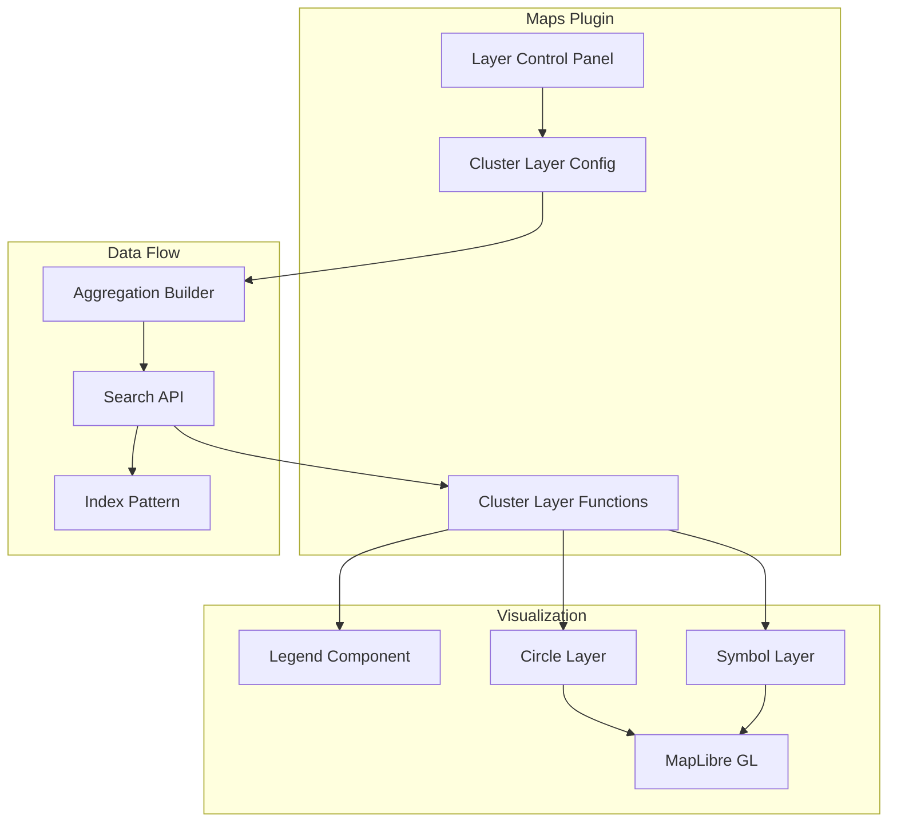

# Maps & Geospatial

## Summary

OpenSearch Dashboards Maps v3.0.0 introduces the **Cluster Layer**, a new data layer type that groups geospatial documents into clusters using bucket aggregations. This feature enables users to visualize large datasets more effectively by showing data density rather than individual points. The release also includes bug fixes for layer configuration panel styling and data label overlap issues.

## Details

### What's New in v3.0.0

#### Cluster Layer Feature

The Cluster Layer is a new layer type in OpenSearch Dashboards Maps that aggregates geospatial data points into clusters based on proximity. This addresses the challenge of visualizing large datasets where individual points would overlap and become indistinguishable.

Key capabilities:
- **Geospatial Aggregation Types**: Supports three aggregation methods:
  - Geohash grid (precision 1-12)
  - Geotile grid (precision 0-29)
  - Geohex grid (precision 0-15, using H3 library)
- **Metric Aggregations**: Count, Average, Sum, Max, Min
- **Dynamic Precision**: Option to change precision based on map zoom level
- **Geocentroid Support**: Place markers at the centroid of clustered points
- **Multi-data Source Support**: Works with multiple data sources
- **Legend Integration**: Dynamic legend showing value ranges with gradient colors

### Technical Changes

#### Architecture Changes



#### New Components

| Component | Description |
|-----------|-------------|
| `ClusterLayerFunctions` | Core rendering logic for cluster layers |
| `ClusterLayerConfigPanel` | Configuration UI with Data, Style, and Settings tabs |
| `ClusterLayerSource` | Data source configuration including index pattern, cluster, metric, and filter sections |
| `ClusterLayerStyle` | Style configuration for fill color, border, and gradient palettes |
| `MapsLegend` | Legend component showing color ranges for gradient fills |
| `buildAgg` | Aggregation query builder for cluster layers |

#### New Configuration

| Setting | Description | Default |
|---------|-------------|---------|
| `cluster.agg` | Geoaggregation type (geohash_grid, geotile_grid, geohex_grid) | `geohash_grid` |
| `cluster.precision` | Aggregation precision level | `2` |
| `cluster.changePrecision` | Auto-adjust precision on zoom | `false` |
| `cluster.useCentroid` | Use geocentroid for marker placement | `false` |
| `metric.agg` | Metric aggregation type | `count` |
| `style.fillType` | Fill type (solid, gradient) | `gradient` |
| `style.palette` | Color palette for gradient | `blue` |

### Usage Example

To add a Cluster Layer:

1. Open Maps visualization
2. Click "Add layer" → "Data layer" → "Cluster"
3. Configure the Data tab:
   - Select an index pattern
   - Choose geoaggregation type and geospatial field
   - Configure metric aggregation
4. Configure the Style tab:
   - Choose fill type (solid or gradient)
   - Select color palette
   - Set border color and thickness
5. Click "Update" to apply

```json
// Example cluster layer configuration
{
  "type": "cluster",
  "source": {
    "indexPatternId": "flights-*",
    "cluster": {
      "agg": "geohash_grid",
      "field": "DestLocation",
      "precision": 5,
      "changePrecision": true,
      "useCentroid": true
    },
    "metric": {
      "agg": "count"
    }
  },
  "style": {
    "fillType": "gradient",
    "palette": "blue",
    "borderColor": "#000000",
    "borderThickness": 1
  }
}
```

### Bug Fixes

#### Layer Config Panel Background Color (#704)
Fixed inconsistent grey background in document layer configuration panels caused by EuiCollapsibleNavGroup's default styling. Added CSS override to make backgrounds transparent.

#### Data Label Overlap (#718)
Fixed overlapping data labels on map layers introduced in #703. Reverted the `text-allow-overlap` setting to prevent label collision when displaying many documents.

## Limitations

- Geohex grid aggregation only supports `geo_point` fields (not `geo_shape`)
- Geocentroid option is disabled for `geo_shape` field types
- Maximum border thickness is 100px

## Related PRs

| PR | Description |
|----|-------------|
| [#703](https://github.com/opensearch-project/dashboards-maps/pull/703) | Introduce cluster layer in maps-dashboards |
| [#704](https://github.com/opensearch-project/dashboards-maps/pull/704) | Fix layer config panel background color inconsistency |
| [#718](https://github.com/opensearch-project/dashboards-maps/pull/718) | Fix overlapping data labels on map layer |
| [#423](https://github.com/opensearch-project/dashboards-maps/pull/423) | Original cluster layer contribution (superseded by #703) |

## References

- [Issue #250](https://github.com/opensearch-project/dashboards-maps/issues/250): Feature request for cluster layer
- [Using Maps Documentation](https://docs.opensearch.org/3.0/dashboards/visualize/maps/): Official maps documentation
- [Geohash Grid Aggregation](https://docs.opensearch.org/3.0/aggregations/bucket/geohash-grid/): Geohash aggregation reference
- [Geotile Grid Aggregation](https://docs.opensearch.org/3.0/aggregations/bucket/geotile-grid/): Geotile aggregation reference
- [Geohex Grid Aggregation](https://docs.opensearch.org/3.0/aggregations/bucket/geohex-grid/): Geohex aggregation reference

## Related Feature Report

- [Full feature documentation](../../../features/dashboards-maps/maps-geospatial.md)
