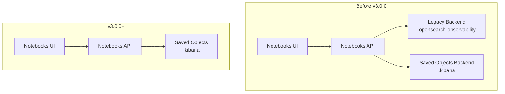

# Observability Notebooks - Legacy Support Removal

## Summary

OpenSearch Dashboards 3.0.0 removes support for legacy notebooks stored in the `.opensearch-observability` index. This is a breaking change that requires users to migrate their notebooks to the new storage system (`.kibana` index) before upgrading. The change simplifies the notebooks architecture by consolidating storage to a single location and removes approximately 1,000 lines of legacy backend code.

## Details

### What's New in v3.0.0

The legacy notebooks feature has been completely removed from the dashboards-observability plugin. Key changes include:

- **Storage consolidation**: Only notebooks stored in the `.kibana` index (introduced in v2.17) are now supported
- **Legacy backend removal**: The `DefaultBackend` class and related adaptor code have been removed
- **API simplification**: Legacy notebook API endpoints have been removed
- **Migration endpoint removal**: The `/note/migrate` endpoint is no longer available

### Technical Changes

#### Architecture Changes



#### Removed Components

| Component | Description |
|-----------|-------------|
| `server/adaptors/notebooks/default_backend.ts` | Legacy backend implementation for `.opensearch-observability` index |
| `server/adaptors/notebooks/notebook_adaptor.ts` | Interface definition for notebook backends |
| `server/adaptors/notebooks/index.ts` | Backend export module |
| Legacy API routes | Routes for `/note`, `/paragraph`, etc. that used legacy backend |

#### Removed API Endpoints

| Endpoint | Method | Description |
|----------|--------|-------------|
| `${NOTEBOOKS_API_PREFIX}/` | GET | Fetch all legacy notebooks |
| `${NOTEBOOKS_API_PREFIX}/note/{noteId}` | GET | Get legacy notebook paragraphs |
| `${NOTEBOOKS_API_PREFIX}/note` | POST | Add legacy notebook |
| `${NOTEBOOKS_API_PREFIX}/note/rename` | PUT | Rename legacy notebook |
| `${NOTEBOOKS_API_PREFIX}/note/clone` | POST | Clone legacy notebook |
| `${NOTEBOOKS_API_PREFIX}/note/{noteList}` | DELETE | Delete legacy notebooks |
| `${NOTEBOOKS_API_PREFIX}/note/addSampleNotebooks` | POST | Add sample notebooks to legacy storage |
| `${NOTEBOOKS_API_PREFIX}/note/migrate` | POST | Migrate notebook from legacy to saved objects |
| `${NOTEBOOKS_API_PREFIX}/paragraph/*` | Various | Legacy paragraph operations |

### Migration Notes

Users must migrate their notebooks before upgrading to v3.0.0:

1. **Upgrade to v2.17 or later** (but before v3.0.0)
2. **Identify legacy notebooks**: Legacy notebooks are stored in `.opensearch-observability` index
3. **Migrate notebooks**: Use the migration functionality available in v2.17-v2.19 to move notebooks to `.kibana` index
4. **Verify migration**: Ensure all notebooks are accessible after migration
5. **Upgrade to v3.0.0**: Once migration is complete, proceed with the upgrade

### Code Changes

The main code change in `main.tsx` simplifies the `fetchNotebooks` function:

```typescript
// Before: Fetched from both legacy and saved objects storage
fetchNotebooks = () => {
  return Promise.all([
    this.props.http.get(`${NOTEBOOKS_API_PREFIX}/savedNotebook`),
    this.props.http.get(`${NOTEBOOKS_API_PREFIX}/`),
  ]).then(([savedNotebooksResponse, secondResponse]) => {
    const combinedData = {
      data: [...savedNotebooksResponse.data, ...secondResponse.data],
    };
    this.setState(combinedData);
  });
};

// After: Only fetches from saved objects storage
fetchNotebooks = () => {
  return this.props.http
    .get(`${NOTEBOOKS_API_PREFIX}/savedNotebook`)
    .then((savedNotebooksResponse) => {
      this.setState({ data: savedNotebooksResponse.data });
    });
};
```

## Limitations

- **No backward compatibility**: Legacy notebooks cannot be accessed after upgrading to v3.0.0
- **No automatic migration**: Users must manually migrate notebooks before upgrading
- **Data loss risk**: Notebooks not migrated before upgrade will be inaccessible

## Related PRs

| PR | Description |
|----|-------------|
| [#2406](https://github.com/opensearch-project/dashboards-observability/pull/2406) | Remove support for legacy notebooks |

## References

- [Issue #2350](https://github.com/opensearch-project/dashboards-observability/issues/2350): Deprecation notice for legacy notebooks
- [Issue #2311](https://github.com/opensearch-project/dashboards-observability/issues/2311): Parent issue for notebooks migration
- [Breaking Changes Documentation](https://docs.opensearch.org/3.0/breaking-changes/): Official v3.0.0 breaking changes
- [Notebooks Documentation](https://docs.opensearch.org/3.0/observing-your-data/notebooks/): Current notebooks feature documentation
- [Blog: Feature Deep Dive - OpenSearch Dashboards Notebooks](https://opensearch.org/blog/feature-highlight-opensearch-dashboards-notebooks/): Feature overview

## Related Feature Report

- [Full feature documentation](../../../../features/dashboards-observability/observability-notebooks.md)
