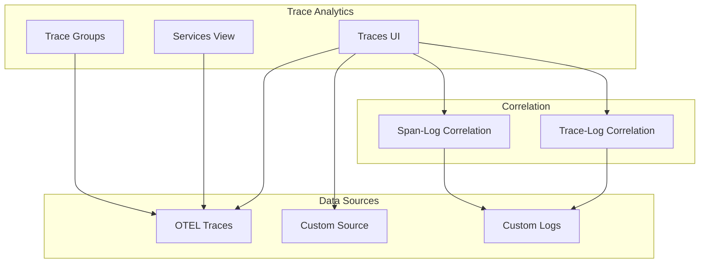

# Observability / Traces

## Summary

OpenSearch v3.0.0 brings significant enhancements to the Observability Traces feature in OpenSearch Dashboards. Key improvements include custom logs correlation for trace analytics, a new data grid-based traces table with improved pagination, OTEL format support with the new "attributes" field, trace-to-logs correlation with contextual action buttons, service view optimizations reducing query counts, and a new Amazon Network Firewall integration. These changes improve performance, usability, and flexibility for distributed tracing workflows.

## Details

### What's New in v3.0.0

#### Custom Logs Correlation
Users can now define custom log sources for correlating spans and services to logs, eliminating the need to set aliases on existing indices. This experimental feature enables flexible log correlation with different index naming conventions.

#### Data Grid Migration
The traces table has been migrated from a memory table to a custom data grid, providing:
- Pagination for span pages (reducing load time while allowing investigation of all records)
- User-adjustable column sizes
- "Load more" functionality to pull 500 additional traces at a time
- Proper pagination for spans with all hits retrieved before sorting

#### OTEL Format Support
Added support for the new OpenTelemetry format with the "attributes" field in trace columns, maintaining backward compatibility with the legacy `span.attributes` format.

#### Trace-to-Logs Correlation
New contextual action buttons enable quick navigation:
- View associated logs using trace ID
- View associated logs using span ID
- Updated mode picker with experimental badge
- Contextual action buttons on services table and flyout

#### Service View Optimizations
Reduced redundant queries by optimizing service map request handling:
- Service Content: 5 queries → 3 queries
- Service View: 7 queries → 5 queries
- Application Analytics Services: 5 queries → 3 queries
- Application Analytics Flyout: 11 queries → 7 queries

### Technical Changes

#### Architecture Changes

#### New Components
| Component | Description |
|-----------|-------------|
| Custom Logs Correlation | Configurable log source for trace correlation |
| Data Grid Table | Paginated traces table with column customization |
| Attributes Field Support | OTEL format compatibility layer |
| Amazon Network Firewall Integration | Pre-built dashboards and queries for AWS Network Firewall |

#### New Configuration
| Setting | Description | Default |
|---------|-------------|---------|
| Custom Log Source | User-defined log index for correlation | None |
| Database Selector | Database name for integration setup | `default` |
| Spans Limit | Maximum spans in trace view | 3000 |

### Usage Example

#### Custom Logs Correlation Setup
Navigate to Trace Analytics → Advanced Settings to configure custom log source:
1. Specify the log index pattern
2. Define the correlation field (e.g., `traceId`, `spanId`)
3. Select the target application (Explorer or Discover)

#### Viewing Correlated Logs
From the trace detail view:
1. Click "View Logs" button on a trace to see logs by trace ID
2. Click "View Logs" on a span to see logs by span ID
3. Logs open in the configured application with pre-filtered query

### Migration Notes

- The new data grid table replaces the memory table; no migration required
- Custom logs correlation is opt-in and does not affect existing workflows
- OTEL attributes field support is automatic with backward compatibility

## Limitations

- Custom logs correlation requires manual configuration of log index and correlation fields
- Discover may show errors when loading data from specific indexes using PPL (known issue)
- Sorting is disabled on attribute fields in the data grid

## References

### Documentation
- [Trace Analytics Documentation](https://docs.opensearch.org/3.0/observing-your-data/trace/index/): Official docs

### Pull Requests
| PR | Description |
|----|-------------|
| [#2375](https://github.com/opensearch-project/dashboards-observability/pull/2375) | Support custom logs correlation |
| [#2380](https://github.com/opensearch-project/dashboards-observability/pull/2380) | Database selector in "Set Up Integration" page |
| [#2383](https://github.com/opensearch-project/dashboards-observability/pull/2383) | Service Content/View Optimizations |
| [#2390](https://github.com/opensearch-project/dashboards-observability/pull/2390) | Traces - Custom source switch to data grid |
| [#2398](https://github.com/opensearch-project/dashboards-observability/pull/2398) | Trace to logs correlation, action icon updates |
| [#2403](https://github.com/opensearch-project/dashboards-observability/pull/2403) | Traces - Update custom source display, add toast |
| [#2407](https://github.com/opensearch-project/dashboards-observability/pull/2407) | Traces - Update custom source toast/error/sorting |
| [#2410](https://github.com/opensearch-project/dashboards-observability/pull/2410) | Adding Amazon Network Firewall Integration |
| [#2432](https://github.com/opensearch-project/dashboards-observability/pull/2432) | Traces - Add "attributes" field |
| [#1916](https://github.com/opensearch-project/dashboards-observability/pull/1916) | Fix build due to phasing off SecurityManager |
| [#2346](https://github.com/opensearch-project/dashboards-observability/pull/2346) | Traces/Services remove toast message on empty data |
| [#2351](https://github.com/opensearch-project/dashboards-observability/pull/2351) | Updated cache for the sub tree in Workbench |
| [#2353](https://github.com/opensearch-project/dashboards-observability/pull/2353) | Restore spans limit to 3000 in trace view |
| [#2368](https://github.com/opensearch-project/dashboards-observability/pull/2368) | Trace Groups Optimization - Remove duplicate filters |
| [#2369](https://github.com/opensearch-project/dashboards-observability/pull/2369) | Traces redirection while QA enabled |
| [#2392](https://github.com/opensearch-project/dashboards-observability/pull/2392) | Services to Traces - Flyout redirection |
| [#2397](https://github.com/opensearch-project/dashboards-observability/pull/2397) | Custom Traces - Sorting/Toast |
| [#2399](https://github.com/opensearch-project/dashboards-observability/pull/2399) | Traces table fix for invalid date |
| [#2437](https://github.com/opensearch-project/dashboards-observability/pull/2437) | Traces - Custom Traces mode pagination reset |

### Issues (Design / RFC)
- [Issue #2141](https://github.com/opensearch-project/dashboards-observability/issues/2141): Custom logs correlation feature request
- [Issue #2334](https://github.com/opensearch-project/dashboards-observability/issues/2334): Service Content/View Optimizations

## Related Feature Report

- [Full feature documentation](../../../features/dashboards-observability/observability-traces.md)
