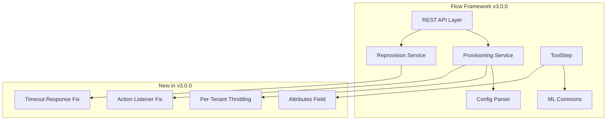

# Flow Framework Bugfixes

## Summary

OpenSearch 3.0.0 includes several important bugfixes and improvements for the Flow Framework plugin. These changes address issues with OpenSearch 3.0 compatibility, tenant-aware provisioning, REST API status codes, config parsing, synchronous workflow provisioning, reprovision timeout handling, and ToolStep attributes.

## Details

### What's New in v3.0.0

This release includes 7 PRs addressing compatibility, stability, and feature improvements:

1. **OpenSearch 3.0 Compatibility** - Updated plugin for breaking changes in OpenSearch 3.0
2. **Per-Tenant Provisioning Throttling** - New settings to control concurrent provisioning per tenant
3. **REST Status Code Corrections** - Fixed HTTP status codes for RBAC and provisioning errors
4. **Config Parser Fix** - Fixed tenant_id field handling in remote storage scenarios
5. **Synchronous Provisioning Fix** - Properly complete action listeners on failed provisioning
6. **Reprovision Timeout Fix** - Restored wait_for_completion_timeout response logic
7. **ToolStep Attributes** - Added new attributes field to MLToolSpec in ToolStep

### Technical Changes

#### Architecture Changes



#### New Configuration

| Setting | Description | Default |
|---------|-------------|---------|
| `plugins.flow_framework.max_tenant_provision` | Maximum concurrent provisions per tenant | Configurable |
| `plugins.flow_framework.max_tenant_reprovision` | Maximum concurrent reprovisions per tenant | Configurable |
| `plugins.flow_framework.max_tenant_deprovision` | Maximum concurrent deprovisions per tenant | Configurable |

#### Breaking Changes Fixed

| Change | Description |
|--------|-------------|
| `SearchResponse.TotalHits` | Value field is now private in OpenSearch 3.0 |
| `AcknowledgedResponse` | Package moved to new location |
| `o.o.client` | Moved to `o.o.transport.client` |

#### Bug Fixes

| Issue | Fix |
|-------|-----|
| Config parser fails with tenant_id | Added case to ignore tenant_id field during parsing |
| Action listener not completed | Complete listener on failed synchronous provisioning |
| Missing timeout response | Restored wait_for_completion_timeout response logic in reprovision |
| ToolStep missing attributes | Added optional "attributes" map to MLToolSpec |

### Usage Example

```bash
# Synchronous provisioning with timeout
POST /_plugins/_flow_framework/workflow/<workflow_id>/_provision?wait_for_completion_timeout=30s

# Reprovision with timeout (now returns workflowState when complete)
POST /_plugins/_flow_framework/workflow/<workflow_id>/_reprovision?wait_for_completion_timeout=30s

# Response includes workflowState when timeout is specified
{
  "workflow_id": "<workflow_id>",
  "state": "COMPLETED"
}
```

```yaml
# ToolStep with new attributes field
- id: create_tool
  type: create_tool
  user_inputs:
    name: my_tool
    type: MLModelTool
    attributes:
      key1: value1
      key2: value2
```

### Migration Notes

- No migration required for existing workflows
- Per-tenant throttling is automatically applied when tenant awareness is enabled
- Existing ToolStep configurations continue to work; attributes field is optional

## Limitations

- Per-tenant throttling requires tenant awareness to be enabled
- Config parser fix is specific to remote storage backends (e.g., DynamoDB)

## Related PRs

| PR | Description |
|----|-------------|
| [#1026](https://github.com/opensearch-project/flow-framework/pull/1026) | Fix breaking changes for 3.0.0 release |
| [#1074](https://github.com/opensearch-project/flow-framework/pull/1074) | Add per-tenant provisioning throttling |
| [#1083](https://github.com/opensearch-project/flow-framework/pull/1083) | Change REST status codes for RBAC and provisioning |
| [#1096](https://github.com/opensearch-project/flow-framework/pull/1096) | Fix Config parser does not handle tenant_id field |
| [#1098](https://github.com/opensearch-project/flow-framework/pull/1098) | Complete action listener on failed synchronous workflow provisioning |
| [#1107](https://github.com/opensearch-project/flow-framework/pull/1107) | Fix bug handleReprovision missing wait_for_completion_timeout response |
| [#1113](https://github.com/opensearch-project/flow-framework/pull/1113) | Add new attributes field to ToolStep |

## References

- [Issue #1095](https://github.com/opensearch-project/flow-framework/issues/1095): Config parser does not handle tenant_id field
- [Issue #1097](https://github.com/opensearch-project/flow-framework/issues/1097): Action Listener is not completed on failed synchronous provisioning
- [Issue #1106](https://github.com/opensearch-project/flow-framework/issues/1106): handleReprovision missing wait_for_completion_timeout response logic
- [Issue #1112](https://github.com/opensearch-project/flow-framework/issues/1112): ToolStep does not include new fields for MLToolSpec
- [Workflow Settings Documentation](https://docs.opensearch.org/3.0/automating-configurations/workflow-settings/)
- [Workflow APIs Documentation](https://docs.opensearch.org/3.0/automating-configurations/api/index/)

## Related Feature Report

- [Full feature documentation](../../../features/flow-framework/flow-framework.md)
