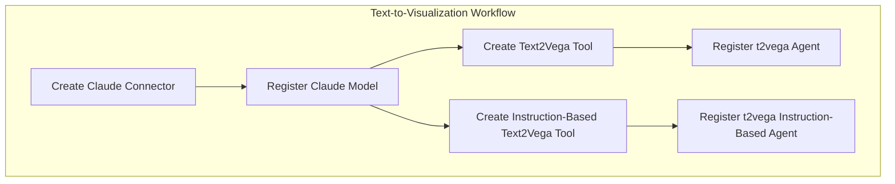

# Flow Framework Templates

## Summary

This bugfix adds sample templates for the text-to-visualization feature in Flow Framework. The templates enable the OpenSearch Dashboards Assistant to create visualizations from natural language instructions by configuring the necessary agents and tools.

## Details

### What's New in v3.0.0

PR #936 adds two new sample template files to the Flow Framework plugin:
- `text-to-visualization-claude.json`
- `text-to-visualization-claude.yml`

These templates automate the setup of all components required for the text-to-visualization feature in OpenSearch Dashboards.

### Technical Changes

#### Workflow Architecture



#### New Components

| Component | Description |
|-----------|-------------|
| `create_claude_connector` | Creates AWS Bedrock connector for Claude Haiku model |
| `register_claude_model` | Registers and deploys the Claude model |
| `create_t2vega_tool` | Creates MLModelTool with rule-based Vega-Lite generation prompts |
| `create_instruction_based_t2vega_tool` | Creates MLModelTool with example-based prompts for user instructions |
| `t2vega_agent` | Flow agent for rule-based visualization generation |
| `t2vega_instruction_based_agent` | Flow agent supporting user styling instructions |

#### Template Configuration

| Setting | Description | Default |
|---------|-------------|---------|
| `name` | Template name | Text to visualization agents |
| `use_case` | Template use case | REGISTER_AGENTS |
| `version.template` | Template version | 1.0.0 |
| `version.compatibility` | Compatible OpenSearch versions | 2.18.0, 3.0.0 |

#### Connector Configuration

The templates configure an AWS Bedrock connector for Claude Haiku:

| Parameter | Value |
|-----------|-------|
| `endpoint` | bedrock-runtime.us-east-1.amazonaws.com |
| `model` | anthropic.claude-3-haiku-20240307-v1:0 |
| `protocol` | aws_sigv4 |
| `max_tokens_to_sample` | 8000 |
| `temperature` | 0.0000 |

### Usage Example

To use these templates, provision the workflow via the Flow Framework API:

```bash
# Create workflow from template
POST /_plugins/_flow_framework/workflow
{
  "name": "Text to visualization agents",
  "description": "This template is to create all Agents required for text to visualization",
  "use_case": "REGISTER_AGENTS",
  ...
}

# Provision the workflow
POST /_plugins/_flow_framework/workflow/<workflow_id>/_provision
```

After provisioning, configure the root agent in the ML config index:

```bash
POST /.plugins-ml-config/_doc/os_text2vega
{
  "type": "os_chat_root_agent",
  "configuration": {
    "agent_id": "<ROOT_AGENT_ID>"
  }
}
```

### Migration Notes

- Requires AWS credentials with access to Amazon Bedrock
- The `assistant.text2viz.enabled: true` setting must be enabled in `opensearch_dashboards.yml`
- Templates are compatible with both OpenSearch 2.18.0 and 3.0.0

## Limitations

- Currently only supports Claude Haiku model via AWS Bedrock
- Requires valid AWS credentials (access_key, secret_key, session_token)
- The text-to-visualization feature is experimental

## References

### Documentation
- [Text to visualization documentation](https://docs.opensearch.org/3.0/dashboards/dashboards-assistant/text-to-visualization/)
- [Workflow templates documentation](https://docs.opensearch.org/3.0/automating-configurations/workflow-templates/)
- [Flow agents documentation](https://docs.opensearch.org/3.0/ml-commons-plugin/agents-tools/agents/flow/)

### Pull Requests
| PR | Description |
|----|-------------|
| [#936](https://github.com/opensearch-project/flow-framework/pull/936) | Add text to visualization agent template |

## Related Feature Report

- [Full feature documentation](../../../features/flow-framework/text-to-visualization-templates.md)
