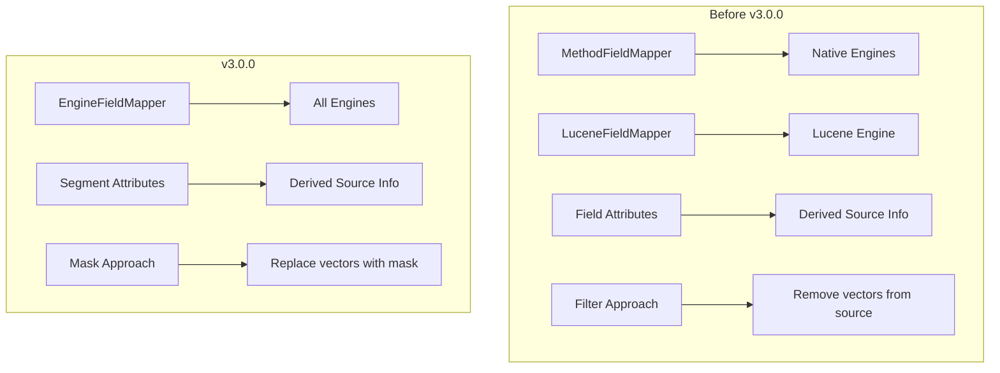
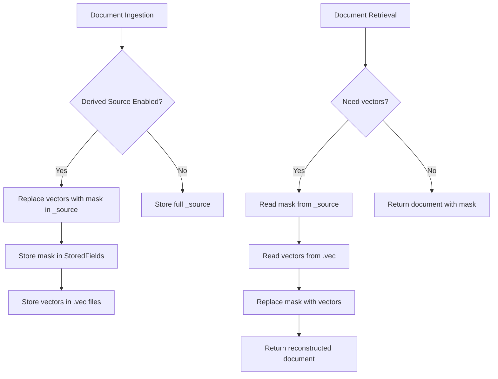

---
tags:
  - domain/search
  - component/server
  - indexing
  - k-nn
---
# k-NN Derived Source & Codec Refactoring

## Summary

OpenSearch 3.0.0 introduces significant refactoring to the k-NN plugin's derived source handling and codec implementation. These changes improve storage efficiency, simplify the codebase architecture, and remove deprecated features as part of the major version upgrade. The refactoring includes migrating derived source from a filter-based to a mask-based approach, consolidating field mappers, introducing a backwards_codecs package for legacy codec management, and removing deprecated settings and NMSLIB support for new index creation.

## Details

### What's New in v3.0.0

#### Derived Source Improvements

The derived source feature for k-NN vectors underwent two major refactoring phases:

1. **Segment Attribute Migration** (PR #2606): Switched from storing derived source information in field attributes to segment attributes. This simplifies mapper logic and provides access to nested scope information via the mapper service.

2. **Filter to Mask Migration** (PR #2612): Changed the approach from filtering vector fields out of source to replacing them with a smaller mask representation. When vectors need to be retrieved, the mask is replaced with actual vectors from the FlatVectorsFormat files (.vec). This makes handling nested documents significantly easier.

#### Codec Refactoring

The codec management system was restructured to follow Lucene's patterns:

- Introduced `backwards_codecs` package for read-only legacy codecs
- Removed old codecs no longer supported in OpenSearch 3.0
- Simplified `KNNCodecVersion` class to track only the latest version
- Removed `KNNFormatFacade` in favor of direct constructor calls

#### Field Mapper Consolidation

Merged `MethodFieldMapper` and `LuceneFieldMapper` into a unified `EngineFieldMapper`:

- Reduces code duplication between native engines (FAISS/NMSLIB) and Lucene
- Changed default value for docValues to reduce storage overhead
- Creates cleaner architecture with three mapper types:
  - `EngineFieldMapper`: Full engine specifications
  - `ModelFieldMapper`: Pre-trained model configurations
  - `FlatFieldMapper`: Non-ANN indexing

#### Breaking Changes

Several deprecated features were removed:

| Removed Setting | Migration Path |
|-----------------|----------------|
| `knn.plugin.enabled` | Plugin is always enabled when installed |
| `index.knn.algo_param.ef_construction` | Use mapping-level parameters |
| `index.knn.algo_param.m` | Use mapping-level parameters |
| `index.knn.space_type` | Use mapping-level `space_type` |
| NMSLIB new index creation | Use FAISS or Lucene engine |

### Technical Changes

#### Architecture Changes



#### Derived Source Data Flow



#### New Components

| Component | Description |
|-----------|-------------|
| `backwards_codecs` package | Contains read-only legacy codecs for BWC |
| `KNN9120Codec` | Backwards compatible codec for pre-3.0 segments |
| `EngineFieldMapper` | Unified field mapper for all k-NN engines |
| `KNN10010DerivedSourceStoredFieldsFormat` | New stored fields format with mask support |

### Migration Notes

#### For Users with NMSLIB Indices

Existing NMSLIB indices will continue to work for reading and searching. However, new index creation with NMSLIB is blocked. To migrate:

1. Create a new index using FAISS or Lucene engine
2. Reindex data from the NMSLIB index to the new index
3. Delete the old NMSLIB index

#### For Users with Deprecated Settings

Remove the following settings from your index configurations:
- `index.knn.algo_param.ef_construction`
- `index.knn.algo_param.m`
- `index.knn.space_type`

Use mapping-level parameters instead:

```json
{
  "mappings": {
    "properties": {
      "my_vector": {
        "type": "knn_vector",
        "dimension": 128,
        "method": {
          "name": "hnsw",
          "space_type": "l2",
          "engine": "faiss",
          "parameters": {
            "ef_construction": 256,
            "m": 16
          }
        }
      }
    }
  }
}
```

## Limitations

- NMSLIB engine cannot be used for new index creation (existing indices remain readable)
- Derived source mask approach requires segment migration during merges for pre-3.0 segments
- Operation-based recovery may be slower when derived source is enabled

## References

### Documentation
- [Documentation: k-NN vector field type](https://docs.opensearch.org/3.0/field-types/supported-field-types/knn-vector/)
- [Documentation: Breaking changes](https://docs.opensearch.org/3.0/breaking-changes/)

### Blog Posts
- [Blog: Save up to 2x on storage with derived source](https://opensearch.org/blog/save-up-to-2x-on-storage-with-derived-source/)

### Pull Requests
| PR | Description |
|----|-------------|
| [#2606](https://github.com/opensearch-project/k-NN/pull/2606) | Switch derived source from field attributes to segment attribute |
| [#2612](https://github.com/opensearch-project/k-NN/pull/2612) | Migrate derived source from filter to mask |
| [#2646](https://github.com/opensearch-project/k-NN/pull/2646) | Consolidate MethodFieldMapper and LuceneFieldMapper into EngineFieldMapper |
| [#2541](https://github.com/opensearch-project/k-NN/pull/2541) | Small Refactor Post Lucene 10.0.1 upgrade |
| [#2546](https://github.com/opensearch-project/k-NN/pull/2546) | Refactor codec to leverage backwards_codecs |
| [#2573](https://github.com/opensearch-project/k-NN/pull/2573) | Blocking Index Creation using NMSLIB |
| [#2575](https://github.com/opensearch-project/k-NN/pull/2575) | Improve Streaming Compatibility Issue for MethodComponentContext |
| [#2564](https://github.com/opensearch-project/k-NN/pull/2564) | 3.0.0 Breaking Changes For KNN |

### Issues (Design / RFC)
- [Issue #2377](https://github.com/opensearch-project/k-NN/issues/2377): RFC - Derived Source for Vectors
- [Issue #2539](https://github.com/opensearch-project/k-NN/issues/2539): Introduce backwards_codecs to manage older codecs
- [Issue #2631](https://github.com/opensearch-project/k-NN/issues/2631): Merge MethodFieldMapper and LuceneFieldMapper into EngineFieldMapper
- [Issue #2640](https://github.com/opensearch-project/k-NN/issues/2640): Remove doc values for lucene engine

## Related Feature Report

- Full feature documentation
