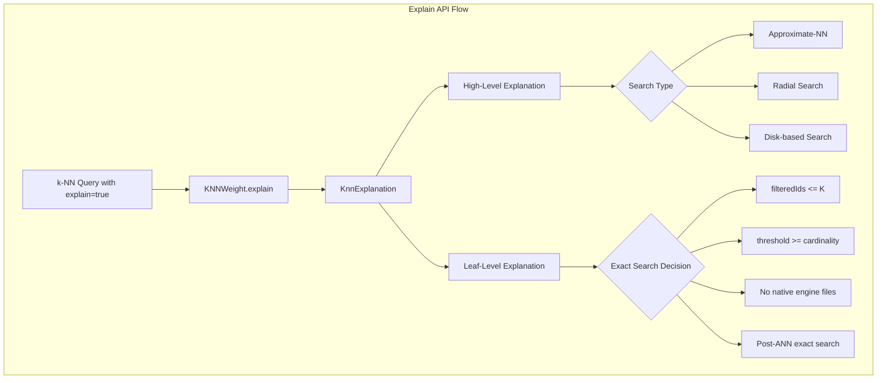

---
tags:
  - k-nn
  - performance
  - search
---

# Explain API Support

## Summary

OpenSearch 3.0.0 adds Explain API support for k-NN queries using the Faiss engine. Previously, the Explain API returned a generic "No Explanation" message for k-NN queries. This enhancement provides detailed scoring explanations for Exact, Approximate-NN (ANN), Radial, and Disk-based k-NN searches, helping users understand how scores are calculated and normalized.

## Details

### What's New in v3.0.0

The k-NN plugin now implements proper explain functionality that reveals:
- The type of k-NN search executed (ANN, Exact, Radial, Disk-based)
- Score translation formulas based on space type
- Raw scores returned from the Faiss library
- Filter-related search decisions (why exact search was chosen over ANN)

### Technical Changes

#### Architecture Changes



#### New Components

| Component | Description |
|-----------|-------------|
| `KnnExplanation` | Captures k-NN explain query details including ANN results per leaf, raw scores, and scorer cache |
| `SpaceType.explainScoreTranslation()` | Returns the score translation formula for each space type |

#### New Configuration

No new configuration settings are required. The feature is enabled by using the standard `explain=true` parameter.

#### API Changes

The Explain API now returns detailed k-NN scoring information:

```json
{
  "_explanation": {
    "value": 0.98039204,
    "description": "the type of knn search executed was Approximate-NN",
    "details": [
      {
        "value": 0.98039204,
        "description": "the type of knn search executed at leaf was Approximate-NN with vectorDataType = FLOAT, spaceType = l2 where score is computed as `1 / (1 + rawScore)` from:",
        "details": [
          {
            "value": 0.020000057,
            "description": "rawScore, returned from FAISS library",
            "details": []
          }
        ]
      }
    ]
  }
}
```

### Usage Example

```json
GET my-knn-index/_search?explain=true
{
  "query": {
    "knn": {
      "my_vector": {
        "vector": [2, 3, 5, 7],
        "k": 2
      }
    }
  }
}
```

Or with explain in the request body:

```json
GET my-knn-index/_search
{
  "query": {
    "knn": {
      "my_vector": {
        "vector": [2, 3, 5, 7],
        "k": 2
      }
    }
  },
  "explain": true
}
```

### Supported Search Types

| Search Type | Explanation Details |
|-------------|---------------------|
| Approximate-NN | Shows ANN search with raw score and score translation formula |
| Exact Search | Explains why exact search was chosen (filtered IDs, threshold, no engine files) |
| Radial Search | Shows radius value and search type at leaf level |
| Disk-based Search | Shows first pass k, vector dimension, oversample factor, and rescoring status |

### Migration Notes

No migration required. This is a new feature that enhances existing functionality without breaking changes.

## Limitations

- Explain for k-NN search with the Lucene engine does not return detailed explanations like Faiss
- Explain for k-NN search with nested fields does not return detailed explanations
- The explain operation is expensive in terms of resources and time; use sparingly in production

## References

### Documentation
- [k-NN query explain documentation](https://docs.opensearch.org/3.0/query-dsl/specialized/k-nn/k-nn-explain/): Official documentation
- [Explain API documentation](https://docs.opensearch.org/3.0/api-reference/search-apis/explain/): General Explain API reference

### Pull Requests
| PR | Description |
|----|-------------|
| [#2403](https://github.com/opensearch-project/k-NN/pull/2403) | Added Explain API support for Exact/ANN/Radial/Disk based KNN search on Faiss Engine |

### Issues (Design / RFC)
- [Issue #875](https://github.com/opensearch-project/k-NN/issues/875): Original feature request - Explain API not compatible with k-NN queries

## Related Feature Report

- [Full feature documentation](../../../../features/k-nn/explain-api.md)
