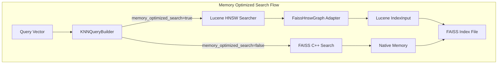

# Lucene On Faiss (Memory Optimized Search)

## Summary

OpenSearch v3.0.0 introduces a new memory-optimized search mode for FAISS HNSW indexes called "Lucene-on-Faiss". This hybrid approach enables vector search on FAISS indexes in memory-constrained environments by combining Lucene's efficient HNSW search algorithm with FAISS's high-performance index format. Users can enable this feature via the `index.knn.memory_optimized_search` index setting.

## Details

### What's New in v3.0.0

The Lucene-on-Faiss feature addresses a fundamental limitation of FAISS: the requirement to load entire vector indexes into memory. By implementing partial loading, OpenSearch can now run vector searches on FAISS indexes without loading all data into memory upfront.

Key capabilities:
- Run vector search on FAISS HNSW indexes under memory-constrained environments
- Partial loading of FAISS index sections on demand
- Transparent integration with existing FAISS indexes
- Support for FP32, FP16, and scalar quantized (8-bit) vectors

### Technical Changes

#### Architecture Changes



#### New Components

| Component | Description |
|-----------|-------------|
| `FaissIndex` | Base class for parsing FAISS index file sections |
| `FaissHNSW` | Represents FAISS HNSW graph structure with partial loading |
| `FaissHnswGraph` | Lucene HnswGraph adapter wrapping FAISS HNSW |
| `FaissMemoryOptimizedSearcher` | VectorSearcher implementation for FAISS indexes |
| `VectorSearcherFactory` | Factory interface for creating memory-optimized searchers |
| `MemoryOptimizedSearchSupportSpec` | Determines if a field supports memory-optimized search |

#### New Configuration

| Setting | Description | Default |
|---------|-------------|---------|
| `index.knn.memory_optimized_search` | Enable memory-optimized search mode for FAISS indexes | `false` |

### Usage Example

```json
PUT /my-index
{
  "settings": {
    "index.knn": true,
    "index.knn.memory_optimized_search": true
  },
  "mappings": {
    "properties": {
      "my_vector": {
        "type": "knn_vector",
        "dimension": 768,
        "method": {
          "name": "hnsw",
          "engine": "faiss",
          "space_type": "l2"
        }
      }
    }
  }
}
```

Alternatively, use the `on_disk` mode with `1x` compression:

```json
PUT /my-index
{
  "mappings": {
    "properties": {
      "my_vector": {
        "type": "knn_vector",
        "dimension": 768,
        "mode": "on_disk",
        "compression_level": "1x"
      }
    }
  }
}
```

### How It Works

1. **Index Loading**: Instead of loading the entire FAISS index into memory, the system marks section offsets and skips to the next section
2. **Search Execution**: When a search is triggered, Lucene's `HnswGraphSearcher` navigates the FAISS HNSW graph via the `FaissHnswGraph` adapter
3. **On-Demand Loading**: Vector data and neighbor lists are fetched via Lucene's `IndexInput` as needed during search
4. **Score Computation**: Distance calculations use FAISS's optimized SIMD operations where available

### Migration Notes

- Existing FAISS indexes work without reindexing
- Enable the setting on new or existing indexes
- Performance may vary based on storage I/O characteristics

## Limitations

- Supported only for FAISS engine with HNSW algorithm
- Training-based methods (IVF, PQ) are not yet supported
- Quantization via `QuantizationConfig` is not supported with memory-optimized search
- Only FLOAT and BYTE vector data types are supported
- Only L2 and INNER_PRODUCT space types are supported
- Results may differ slightly from full-memory FAISS search due to Lucene's early termination logic

## References

### Documentation
- [Documentation: Memory-optimized vectors](https://docs.opensearch.org/3.0/field-types/supported-field-types/knn-memory-optimized/)

### Blog Posts
- [Blog: Lucene-on-Faiss](https://opensearch.org/blog/lucene-on-faiss-powering-opensearchs-high-performance-memory-efficient-vector-search/)

### Pull Requests
| PR | Description |
|----|-------------|
| [#2630](https://github.com/opensearch-project/k-NN/pull/2630) | Main implementation combining 10 sub-PRs |
| [#2581](https://github.com/opensearch-project/k-NN/pull/2581) | Building blocks for memory optimized search |
| [#2590](https://github.com/opensearch-project/k-NN/pull/2590) | IxMp section loading logic |
| [#2594](https://github.com/opensearch-project/k-NN/pull/2594) | FaissHNSW graph implementation |
| [#2598](https://github.com/opensearch-project/k-NN/pull/2598) | FAISS float flat index |
| [#2604](https://github.com/opensearch-project/k-NN/pull/2604) | FaissIndexScalarQuantizedFlat |
| [#2618](https://github.com/opensearch-project/k-NN/pull/2618) | Byte index, FP16 index decoding |
| [#2608](https://github.com/opensearch-project/k-NN/pull/2608) | VectorReader integration |
| [#2616](https://github.com/opensearch-project/k-NN/pull/2616) | Index setting implementation |
| [#2621](https://github.com/opensearch-project/k-NN/pull/2621) | CAGRA index partial loading |
| [#2609](https://github.com/opensearch-project/k-NN/pull/2609) | Monotonic integer encoding for HNSW |

### Issues (Design / RFC)
- [RFC Issue #2401](https://github.com/opensearch-project/k-NN/issues/2401): Partial loading with FAISS engine

## Related Feature Report

- [Full feature documentation](../../../../features/k-nn/lucene-on-faiss.md)
